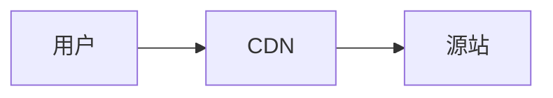

# Chirping Astro 写作速查表

> **主题源站：<https://aneejian.com/chirping-astro>**
>
> 源站是主题作者部署的完整演示站。本站删除的那 17 篇演示文章全都在上面，**带实际渲染效果**。
> 下面每一节末尾都附了对应的源站文章链接 —— 想看更细的写法就直接点过去。
>
> 本文件放在 `docs/`，不参与站点构建，纯本地参考。

---

## 0. 常用命令

| 命令              | 作用                                              |
| ----------------- | ------------------------------------------------- |
| `bun install`     | 装依赖（改动 `package.json` 后要重跑）            |
| `bun run dev`     | 本地预览 `http://localhost:4321`，热重载          |
| `bun run build`   | 生产构建到 `dist/`，**同时生成搜索索引**          |
| `bun run preview` | 预览 `dist/` 的构建结果（**验证搜索只能用这个**） |
| `bun run format`  | Prettier 格式化（推代码前跑一次，避免 CI 报红）   |
| `bun run lint`    | ESLint 检查                                       |

`.env` **不热重载** —— 改完必须重启 `bun run dev`。

**构建时的 Pagefind 提示不用管。** `bun run build` 会打印两遍：

```
Note: Pagefind doesn't support stemming for the language zh-cn.
```

中文没有词形变化，本来就不需要词干提取（stemming 是给英文这类有词形变化的语言用的），
Pagefind 对中文用的是**分词**，搜索完全正常；打印两遍也是它的正常输出。
真想让它闭嘴，可以在 `pagefind` 命令后加 `--quiet` —— 代价是索引统计（索引了多少页面）会一起被隐藏。
**不要用 `--force-language` 消除它** —— 那会把整站强制成单一语言索引，中英双语站里中文搜索会基本失效。

---

## 1. 新建一篇文章

路径：`src/content/posts/<语言>/<文件名>.md`

语言**由目录名推断**（`posts/zh/` → 中文，`posts/en/` → 英文），**不要手写 `lang` 字段**。

文件名就是 URL 里的 slug。`2026-09-13-hello.md` → `/posts/2026-09-13-hello/`。

最小可用模板：

```markdown
---
title: '文章标题'
description: '一句话摘要。会用在搜索结果、社交卡片和 RSS 里，别省。'
pubDate: 2026-09-13
tags: [标签A, 标签B]
categories: [分类名]
---

正文从这里开始。
```

> 源站参考：<https://aneejian.com/chirping-astro/posts/frontmatter-reference/>

---

## 2. Frontmatter 全字段

### 必填 3 个

| 字段          | 规则                                       |
| ------------- | ------------------------------------------ |
| `title`       | 1–140 字符。用作 `<title>`、OG 标题、H1    |
| `description` | 1–280 字符。用作 meta description、OG、RSS |
| `pubDate`     | 任何能被 ISO 解析的日期，如 `2026-09-13`   |

> `src/content/pages/` 下的页面（about、privacy）**`pubDate` 可选**。

### 可选

| 字段                    | 默认            | 作用                                                                                                |
| ----------------------- | --------------- | --------------------------------------------------------------------------------------------------- |
| `updatedDate`           | —               | 有意义的修改后填。控制文章头部的「Updated」行、RSS `<updated>`、OG `article:modified_time`、sitemap |
| `tags`                  | `[]`            | 驱动 `/tags/...` 索引页                                                                             |
| `categories`            | `[]`            | 驱动 `/categories/...` 索引页                                                                       |
| `draft`                 | `false`         | `true` = dev 可见，**生产构建、sitemap、RSS 全部排除**                                              |
| `unlisted`              | `false`         | `true` = 正常构建部署、URL 可访问，但**从首页/归档/标签/分类/RSS/sitemap 全部隐藏**                 |
| `unlistedHideFromSeo`   | 跟随 `unlisted` | 单独控制 `<meta name="robots" content="noindex, nofollow">`                                         |
| `heroImage`             | —               | 封面图，见第 8 节                                                                                   |
| `heroImageAlt`          | —               | 封面图 alt 文本，**建议每次都写**                                                                   |
| `showFeaturedImage`     | 站点默认        | 单篇覆盖 `SITE.showFeaturedImages`，`false` 则不显示封面                                            |
| `dynamicPostCardHeight` | 站点默认        | 列表卡片高度是否自适应                                                                              |
| `canonicalURL`          | 自动生成        | 覆盖 `<link rel="canonical">`。转载别处已发过的文章时用                                             |
| `comments`              | 跟随站点        | `false` 关闭单篇评论（参考类文章建议关）                                                            |
| `toc`                   | `true`          | `false` 隐藏右侧目录（照片集、短公告适合关）                                                        |
| `pinned`                | `false`         | `true` = 置顶，慎用                                                                                 |
| `math`                  | `false`         | `true` 才启用 KaTeX，见第 7 节                                                                      |
| `mermaid`               | `false`         | `true` 才启用 Mermaid，见第 6 节                                                                    |
| `translationKey`        | 文件名          | 关联不同语言的同一篇文章                                                                            |

### 常见校验报错

| 报错                              | 原因                             |
| --------------------------------- | -------------------------------- |
| `pubDate: Required`               | 忘了写 `pubDate`，或者拼错了     |
| `description: Too long (max 280)` | 摘要超过 280 字符                |
| `heroImage: Invalid URL`          | 外链图片 URL 格式不对            |
| `Cannot find module '...'`        | MDX 里 import 组件的相对路径写错 |

> 源站参考：<https://aneejian.com/chirping-astro/posts/frontmatter-reference/>

---

## 3. `draft` 还是 `unlisted`？

两个字段解决不同问题，别混：

|                             | `draft: true`    | `unlisted: true` |
| --------------------------- | ---------------- | ---------------- |
| `bun run dev` 里可见        | ✅               | ✅               |
| 生产构建会生成 URL          | ❌               | ✅               |
| 能通过直链访问              | ❌               | ✅               |
| 从列表 / RSS / sitemap 隐藏 | ✅               | ✅               |
| 带 `noindex`                | 不适用（没 URL） | ✅（默认）       |

**还没写完 → 用 `draft`。写好了但只想给特定人看 → 用 `unlisted`。**

> ⚠️ `unlisted` 是**靠隐蔽性保护，不是访问控制**。任何人拿到 URL 都能看。真要私密就别放进仓库。

> 源站参考：<https://aneejian.com/chirping-astro/posts/unlisted-posts/>

---

## 4. 代码块（Expressive Code）

基础写法就是三反引号 + 语言标识。常用修饰符：

`````markdown
````ts title="src/utils/greet.ts"          ← 带窗口标题栏
```bash frame="terminal"                   ← 终端样式（自动识别，也可手动指定）
```bash frame="code"                       ← 强制代码样式
```ts {3-5}                                ← 高亮 3–5 行
```ts ins={4-6}                            ← 标记为新增（绿色）
```ts del={2}                              ← 标记为删除（红色）
```ts mark="useTranslations"               ← 高亮所有出现该字符串的行
```diff                                   ← +/− 自动着色
```ts collapse={1-6}                       ← 折叠 1–6 行，点击展开
```ts wrap                                 ← 长行软换行（不横向滚动）
```ashtml                                  ← 块内原始 HTML 直接渲染，不当代码高亮
````
`````

`````

可以叠加使用：

````markdown
```ts title="src/utils/seo.ts" ins={5-7} mark="locale" {2}

```
`````

其他：

- 每个代码块自带右上角**复制按钮**（文案在 `src/i18n/ui.ts` 的 `code.copy` / `code.copied`）
- **默认不显示行号**。需要的话装 `@expressive-code/plugin-line-numbers` 并在 `astro.config.mjs` 注册
- 换配色改 `astro.config.mjs` 里 `expressiveCode.themes`，可选任意 [Shiki 主题](https://shiki.style/themes)，**必须同时列出明暗两套**

> 源站参考：<https://aneejian.com/chirping-astro/posts/code-blocks-and-syntax-highlighting/>

---

## 5. 告警框 `alert`

用 `alert` 作为代码块语言标识：

````markdown
```alert
type: success
style: soft
icon: lucide:check-circle
title: 部署完成
description: 版本 2.1.0 已上线。
```
````

全部可用的 key：

| key           | 可选值                                                                      |
| ------------- | --------------------------------------------------------------------------- |
| `type`        | `info` / `success` / `warning` / `error`                                    |
| `style`       | `soft` / `outline` / `dash`（不写就是默认实心）                             |
| `direction`   | `vertical` / `horizontal` / `responsive`（响应式：手机竖排、`sm` 以上横排） |
| `icon`        | 不写 = 按 `type` 自动；`lucide:bell` = 自定义；`none` = 不要图标            |
| `title`       | 可选标题                                                                    |
| `description` | 可选描述                                                                    |
| `class`       | 追加任意 Tailwind / daisyUI 类，如 `shadow-md`                              |

**省略 `description` 时，所有非 key 行会自动拼成描述文本**，多行也行。

`.md` 和 `.mdx` 都能用。

> 源站参考（含全部变体的实际效果）：<https://aneejian.com/chirping-astro/posts/alerts-all-variants/>

---

## 6. Mermaid 图

两步：

1. frontmatter 加 `mermaid: true`
2. 正文里用 `mermaid` 代码块

````markdown
---
title: 我的架构图
mermaid: true
---


````

**为什么要那个开关**：Mermaid 客户端库只在标了 `mermaid: true` 的页面加载，其他页面零 JS。不写开关会显示原始代码。

支持 flowchart / sequenceDiagram / stateDiagram-v2 / gantt / classDiagram / gitGraph 等全部 Mermaid 语法。

> 源站参考：<https://aneejian.com/chirping-astro/posts/mermaid-diagrams/>

---

## 7. 数学公式（KaTeX）

frontmatter 加 `math: true`，然后在正文里写：

- **行内**：`$a^2 + b^2 = c^2$`
- **块级**：独占一行，前后**必须留空行**

```markdown
$$
\int_{-\infty}^{\infty} e^{-x^2}\, dx = \sqrt{\pi}
$$
```

三个坑：

- 块级 `$$` 前后没空行 → Markdown 会吞掉定界符
- 想打**字面美元符号**用 `\$`（如 `\$5.00`）
- MDX 里 `$` 后面紧跟 `{` 会被当成 JS 表达式，需要写 `\{`

样式表（`katex.min.css`，约 29 kB）**只在标了 `math: true` 的页面加载**。忘了加标志 → 页面直接显示原始 `$x^2$` 文本。

> 源站参考：<https://aneejian.com/chirping-astro/posts/latex-math-with-katex/>

---

## 8. 图片

三种存法，**默认用第 1 种**：

### 1）导入资源（推荐）

文件放 `src/assets/images/posts/<文章标识>/`，frontmatter 里写**相对 markdown 文件**的路径：

```markdown
---
heroImage: ../../../assets/images/posts/my-post/cover.jpg
heroImageAlt: 黄昏时分海浪拍打礁石的长曝光照片
---
```

走 Astro 图片管线：构建时校验、自动推断尺寸、输出 WebP + 响应式 `srcset`。

### 2）`public/` 路径

```markdown
---
heroImage: /images/cover.jpg
---
```

零配置，但**完全不优化** —— 浏览器拿到什么就是什么。适合需要固定 URL 的东西（favicon、OG 默认图）。

### 3）外链 URL

```markdown
---
heroImage: https://example.com/cover.jpg
---
```

构建时会抓取并转成 WebP。但**域名必须在 `astro.config.mjs` 的 `image.remotePatterns` 白名单里**，否则构建直接失败。默认已放行 Unsplash、GitHub user content、jsDelivr、Cloudinary、Cloudflare Images。

### MDX 里插入内联图

```markdown
import { Image } from 'astro:assets';
import img1 from '../../../assets/images/posts/my-post/a.jpg';

<Image src={img1} alt="描述" widths={[400, 800, 1200]} />
```

带图注：

```markdown
<figure>
  <Image src={img1} alt="描述" widths={[400, 800]} />
  <figcaption>图片来源说明</figcaption>
</figure>
```

并排两张（MDX 里可以直接用 Tailwind 类）：

```markdown
<div class="grid gap-3 sm:grid-cols-2">
  <Image src={img1} alt="左" widths={[400, 600]} class="rounded-lg" />
  <Image src={img2} alt="右" widths={[400, 600]} class="rounded-lg" />
</div>
```

### 嵌入视频

```markdown
<VideoEmbed platform="youtube" id="视频ID" title="标题" caption="可选图注" />
<VideoEmbed platform="vimeo" id="76979871" />
<VideoEmbed src="https://任意嵌入地址" title="标题" />
```

YouTube 走 `youtube-nocookie.com`，点击播放前不写追踪 cookie。

### alt 文本

`heroImageAlt` 技术上可选，**别当它可选**：

- 装饰性图片 → 空字符串 `heroImageAlt: ""`
- 内容图片 → 描述图片**传达的信息**，不是描述文件
- 别写「图片：……」开头，读屏软件本来就会念

> 源站参考：<https://aneejian.com/chirping-astro/posts/featured-images-and-media/>

---

## 9. 排版与 Markdown 元素

都是标准写法，直接用：

| 元素     | 写法                                              |
| -------- | ------------------------------------------------- |
| 键盘按键 | `<kbd>Cmd</kbd>` + `<kbd>K</kbd>`                 |
| 脚注     | 正文 `[^1]`，末尾 `[^1]: 脚注内容`                |
| 定义列表 | 第一行写术语，第二行以 `: ` 开头写定义            |
| 任务列表 | `- [x] 已完成` / `- [ ] 未完成`                   |
| 表格对齐 | 分隔行写 `:---` / `:---:` / `---:`                |
| 外链     | 自动加 `rel="nofollow noopener"` 并在新标签页打开 |

正文最大宽度由 `--width-prose`（50rem）控制，正文用 **Source Sans 3**，代码用 **JetBrains Mono**。

> 源站参考（完整排版样张，改字体后拿它对照检查）：<https://aneejian.com/chirping-astro/posts/typography-and-markdown/>

---

## 10. MDX 专属：`<Callout>` 组件

想在 Markdown 里嵌组件就把文件后缀改成 `.mdx`：

```markdown
---
title: 示例
---

import Callout from '../../../components/Callout.astro';

<Callout type="info" title="提示">
  这里可以写 **Markdown**，也能放[链接](/)，甚至嵌套组件。
</Callout>
```

`type` 四种：`info` / `success` / `warning` / `error`。

其他能力：

- **JS 表达式**：`{new Date().toDateString()}`、`{2 + 2}` 会在构建时求值
- **文件顶部定义变量**：`export const release = 'v6.0.0';` 然后在正文里 `{release}`
- **导入任意组件**：从 `src/content/posts/en/foo.mdx` 到组件的相对路径是 `../../../components/Xxx.astro`

**`.md` 还是 `.mdx`**：只需要标准 Markdown → 用 `.md`；要 import 组件或写 JS 表达式 → 用 `.mdx`。两种可以混放在同一目录。

> 源站参考：<https://aneejian.com/chirping-astro/posts/mdx-components-and-callouts/>

---

## 11. 让某块内容不进搜索索引

搜索用 Pagefind，默认索引 `<main>` 里的全部内容。侧边栏、页脚、右侧栏主题已经排除掉了。

```markdown
<aside data-pagefind-ignore>这段不参与搜索</aside>
<article data-pagefind-body>只有这里进索引</article>
```

> 源站参考：<https://aneejian.com/chirping-astro/posts/search-with-pagefind/>

---

## 12. 评论（Giscus）

当前 `.env` 里 `PUBLIC_GISCUS_ENABLED=false`，全站关闭。

要开启：访问https://github.com/apps/giscus并授予应用访问用于存放讨论内容的仓库的权限。去 <https://giscus.app> 生成 4 个值填进 `.env`，把开关改成 `true`，重启 dev。

- 仓库必须是**公开**的，且开了 Discussions
- 映射方式选 **`pathname`**（这样中英版本各用各的评论区）
- 分类建议用 announcement 类型，防止读者新建讨论

单篇关闭：frontmatter 写 `comments: false`。

**填错也不会白屏** —— 主题会检测 `xxx` / `your-handle/your-repo` 这类占位符，显示一个友好的配置引导卡片。

> 源站参考：<https://aneejian.com/chirping-astro/posts/comments-with-giscus/>

---

## 13. 改配色和尺寸

单文件入口：`src/styles/global.css`。daisyUI 主题 `chirpy-light` / `chirpy-dark` 都用 OKLCH 写在这。

常用布局令牌：

| 令牌              | 默认      | 控制                                                                  |
| ----------------- | --------- | --------------------------------------------------------------------- |
| `--width-sidebar` | `18rem`   | 左侧栏宽度                                                            |
| `--width-panel`   | `14rem`   | 右侧「热门标签」栏宽度                                                |
| `--height-topbar` | `3.25rem` | 顶栏高度                                                              |
| `--width-prose`   | `50rem`   | 正文最大宽度                                                          |
| `--color-primary` | OKLCH     | 主色（**改了记得同步 `src/utils/og-image.ts` 里 OG 图的硬编码色值**） |

> 源站参考：<https://aneejian.com/chirping-astro/posts/theming-and-dark-mode/>

---

## 14. 头像与 favicon

**头像**：文件放 `src/assets/images/site/`，在 `src/config.ts` 里 import 后赋给 `SITE.author.avatar`（传导入对象，**不要传 `.src`**），这样才走图片优化。

也可以用字符串路径（`/images/avatar.png`）或远程 URL，但那两种不优化。

**favicon**：在 `src/layouts/BaseLayout.astro` 里 import，`<head>` 中链接。**保持文件名 `favicon.svg` 不变**就不需要改代码。

> 源站参考：<https://aneejian.com/chirping-astro/posts/customize-avatar-and-favicon/>

---

## 15. 社交分享卡片（OG 图）

**默认全自动**：构建时给每篇**没设 `heroImage`** 的文章生成一张 1200×630 的 PNG，自动接到 `og:image` 和 `twitter:image`。设了 `heroImage` 的文章用封面图，生成的那张只是兜底。

- 开关：`src/config.ts` 里的 `autoOgImage`
- 模板：`src/utils/og-image.ts`，颜色是硬编码的十六进制
- 耗时：每张约 50–100ms

**默认分享图**是 `src/assets/images/site/og-default.png` —— 这个文件里用 `<text>` 把主题作者的名字烤进图里了，**必须换掉**。

> 源站参考：<https://aneejian.com/chirping-astro/posts/automatic-og-images/>

---

## 16. 多语言

当前配置：**中文在根路径**（URL 无前缀），英文在 `/en/`，法文已移除。

- **只发一种语言** → `src/config.ts` 里设 `multilingual: false`，语言切换器消失，hreflang 标签不再输出
- **只翻译部分文章** → 保持开启即可。主题会检测哪些文章真有对应翻译，没有的话**该页面的切换器直接隐藏**，不会让人点进 404
- **配对翻译** → 两篇不同语言的文章写相同的 `translationKey`
- **界面文案** → 全在 `src/i18n/ui.ts`，TypeScript 强制每种语言键值齐全，漏一个就构建失败

> 源站参考：<https://aneejian.com/chirping-astro/posts/i18n-bilingual-content/>

---

## 附：本速查表覆盖了哪些已删除的演示文章

| 已删除的演示文章                               | 对应本表章节 |
| ---------------------------------------------- | ------------ |
| `welcome.md`                                   | 0            |
| `frontmatter-reference.md`                     | 1、2         |
| `unlisted-posts.md`、`unlisted-sample-post.md` | 3            |
| `code-blocks-and-syntax-highlighting.md`       | 4            |
| `alerts-all-variants.md`                       | 5            |
| `mermaid-diagrams.md`                          | 6            |
| `latex-math-with-katex.md`                     | 7            |
| `featured-images-and-media.mdx`                | 8            |
| `typography-and-markdown.mdx`                  | 9            |
| `mdx-components-and-callouts.mdx`              | 10           |
| `search-with-pagefind.md`                      | 11           |
| `comments-with-giscus.md`                      | 12           |
| `theming-and-dark-mode.md`                     | 13           |
| `customize-avatar-and-favicon.md`              | 14           |
| `automatic-og-images.md`                       | 15           |
| `i18n-bilingual-content.md`                    | 16           |

**所有内容在源站都能查到，且带实际渲染效果：<https://aneejian.com/chirping-astro>**
