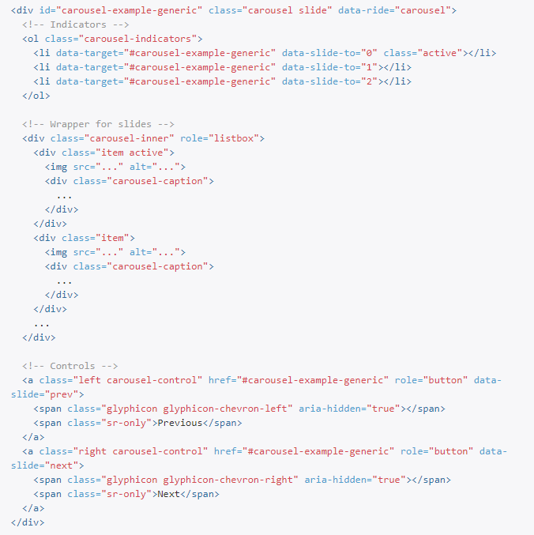
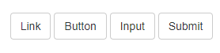
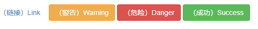

## 一、什么是 Bootstrap

`Bootstrap` 是一个前端开发框架。自定义了很多 `CSS` 样式和 `JavaScript` 插件，使用这些样式和插件可以快速做出页面。只要有 `CSS` 与 `HTML` 基础就可以使用。`Bootstrap` 有一个特点是响应式布局，同一个页面同时支持 PC 和移动端，浏览器兼容性也十分不错。

## 二、使用 Bootstrap

## 1、基本模板（官方文档复制）

```html
<!DOCTYPE html>
<html lang="zh-CN">
  <head>
    <meta charset="utf-8" />
    <meta http-equiv="X-UA-Compatible" content="IE=edge" />
    <meta name="viewport" content="width=device-width, initial-scale=1" />
    <!-- 上述3个meta标签*必须*放在最前面，任何其他内容都*必须*跟随其后！ -->
    <title>Bootstrap 101 Template</title>
    <link
      href="https://cdn.jsdelivr.net/npm/bootstrap@3.3.7/dist/css/bootstrap.min.css"
      rel="stylesheet"
    />
    <!-- HTML5 shim 和 Respond.js 是为了让 IE8 支持 HTML5 元素和媒体查询（media queries）功能 -->
    <!-- 警告：通过 file:// 协议（就是直接将 html 页面拖拽到浏览器中）访问页面时 Respond.js 不起作用 -->
    <!--[if lt IE 9]>
      <script src="https://cdn.jsdelivr.net/npm/html5shiv@3.7.3/dist/html5shiv.min.js"></script>
      <script src="https://cdn.jsdelivr.net/npm/respond.js@1.4.2/dest/respond.min.js"></script>
    <![endif]-->
  </head>
  <body>
    <!-- 代码写在这个位置 -->

    <!-- jQuery (Bootstrap 的所有 JavaScript 插件都依赖 jQuery，所以必须放在前边) -->
    <script src="https://cdn.jsdelivr.net/npm/jquery@1.12.4/dist/jquery.min.js"></script>
    <!-- 加载 Bootstrap 的所有 JavaScript 插件。你也可以根据需要只加载单个插件。 -->
    <script src="https://cdn.jsdelivr.net/npm/bootstrap@3.3.7/dist/js/bootstrap.min.js"></script>
  </body>
</html>
```

### 2、使用官方插件

基本模板有了，怎么用呢？`CRM`（Copy Run Modify）,从官网复制实例到本地，运行正常就修改。做一个好看的轮播图用原生 `JS` 还是要花些时间，`Bootstrap` 官网的 JS 插件不错，复制过来

通过注释可以看出图片应该是在 `Wrapper for slides` 与 `Controls` 之间。两个结构相似的代码片段，删掉其中根据页面变化可以看出下面的结构就是放置图片的地方。添加一段代码（如下）就可以多一个图片。

```html
<div class="item">
  
  <!-- 修改src添加图片 -->
  <div class="carousel-caption">...</div>
</div>
```

只能添加三个图片？通过删除与添加会发现下面代码片段（也就是 `Indicators` 部分）是控制图片数量的，与 `Wrappper fo slids` 是对应的。添加一个 `li`，就可以多添加一个 `items` 也就是添加图片。

```html
<li data-target="#carousel-example-generic" data-slide-to="2"></li>
```


通过复制，删除就可以轻松的使用官网的插件。

### 3、使用预定义样式

在[Bootstrap ３官方文档](https://v3.bootcss.com/css/)中找到”全局 CSS 样式”，可以看到很 `Bootstrap` 预设的很多样式。以按钮为例：

```html
<a class="btn btn-default" href="#" role="button">Link</a>
<button class="btn btn-default" type="submit">Button</button>
<input class="btn btn-default" type="button" value="Input" />
<input class="btn btn-default" type="submit" value="Submit" />
```

页面中的按钮通常是以这些标签做的，默认的样式都不怎么好看。引入了 `Bootstrap` 后直接给这些标签添加 class 名如：`btn` 、`btn-default`之类的就会发现样式变成 `Bootstrap` 预定义的样式。



```html
<!--  -->
<a class="btn btn-link" href="#" role="button">（链接）Link</a>
<button class="btn btn-warning" type="submit">（警告）Warning</button>
<input class="btn btn-danger" type="button" value="（危险）Danger" />
<input class="btn btn-success" type="submit" value="（成功）Success" />
```

可以看出，`Bootstrap` 就是通过控制样式依靠添加或者删除类名来增加或删除预设样式。



## 三、Bootstrap 栅格系统

前面说到，响应式布局是 `Bootstrap` 的一个特色，那么怎么做到呢？`Bootstrap` 在页面中创建行，每一行分为 12 列（有行有列，不就可以看作是栅格吗）。可以指定元素在不同分辨率下占几列。例：

```html
<div
  class="col-lg-1 col-md-3 col-sm-6 col-xs-12"
  style="height: 20px;background-color: pink;"
></div>
<!--
	col-lg-1代表在宽度 >= 1200px的屏幕，通常来说是台式机显示器下占1个格子。也就是1/12行；
	col-md-3代表在宽度 <= 992px的屏幕，通常来说是笔记本显示器下占3个格子。也就是1/4行；
	col-sm-6代表宽度 >= 768px的屏幕，通常来说是平板的屏幕下占6个格子。也就是一行的一半；
	col-xs-12代表宽度 < 768px的屏幕，通常来说是手机屏幕下占12个格子。也就是一行；
	如果将col-lg-1去掉，那么当屏幕宽度大于768px后，无论屏幕多宽永远都只能占屏幕的一半
-->
```

如果一行没有占满，元素会右对齐，想让它居中怎么办？用偏移。

```html
<div class="col-md-6 col-md-offset-3" style="height: 20px;background-color: pink;"></div>
<!-- 左右都会有3个格子，这样就是居中效果 -->
```

## 总结

`Bootstrap` 是一个入门（复制粘贴）容易，不过想完全驾驭还是需要一定水平的。网上不少人认为 Bootstrap 主要用于快速制作网页，面对项目中的设计稿通常不太适合用 `Bootstrap`。闲时学习 `Bootstrap` 的设计思想和代码分类方式对前端水平提升是非常不错的。
