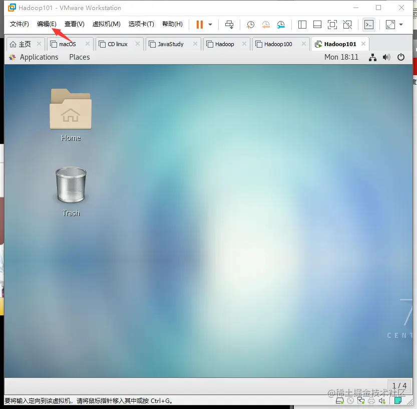
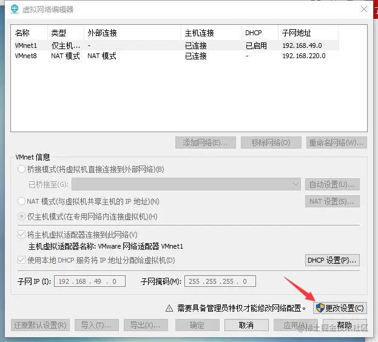
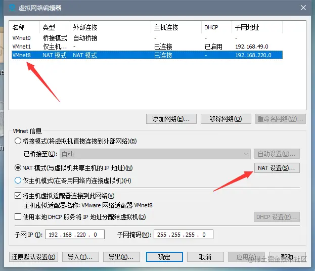
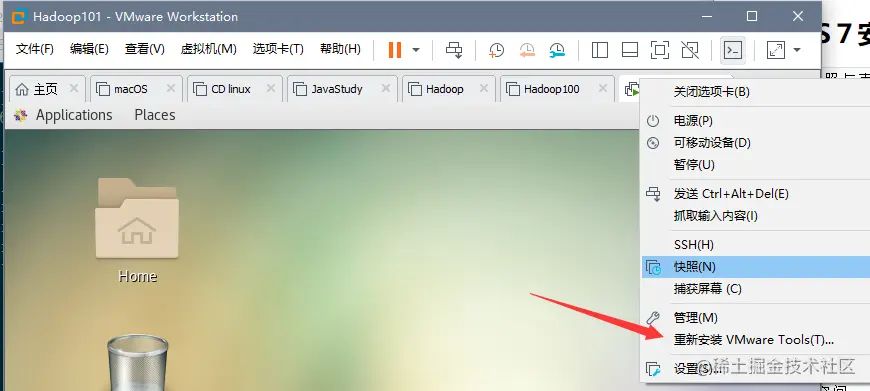

# 一、简单修改系统设置

为了以后方便,先简单配置下系统。  
(1)关闭防火墙

```shell
firewall-cmd -–state # 查看防火墙状态
systemctl stop firewalld.service # 停止防火墙服务
systemctl disable firewalld.service # 关闭防火墙
```

(2)关闭SELinux

```shell
vim /etc/selinux/config # 用VIM修改SELinux配置
SELINUX=enforcing  # 找到这一行等号后改为disabled
```

(3)修改网卡配置  
我使用的是NAT方式,要上网需要配置一下  选择下拉菜单中的`虚拟网络编辑器`。

 点击`更改设置`。 点击`NAT设置`后将新弹出窗口中的网关地址记录下来。然后打开终端输入:

```shell
vim /etc/sysconfig/network-scripts/ifcfg-ens33
```

在命令模式下按快捷键`ggdG`删除所有内容,复制下面的内容粘贴进去(Linux粘贴是`Shift`+`INS`)。

```shell
DEVICE=ens33              # 网卡的设备名称为ens33
NAME=ens33                # 网卡名称
TYPE=Ethernet             # 类型为以太网
BOOTPROTO=static          # ip获取方式改为静态
ONBOOT=yes                # 开机启动网络
IPADDR=192.168.220.50    # 手动分配IP地址,要和刚刚记录的网关地址在一个网段
NETMASK=255.255.255.0     # 子网掩码
GATEWAY=192.168.220.2     # 网关，设置成刚刚记录的ip
DNS1=114.114.114.114      # DNS1
DNS2=8.8.8.8              # DNS2
```

保存退出后重启网卡。

```shell
systemctl restart network # 重启网卡
ping http://www.baidu.com # 测试是否能访问外网
```

(4)修改HOSTS文件

修改HOSTS文件(host相当于一个名单,设置某个域名跳转到指定的ip。相当于加快域名解析,也可以以此达到屏蔽的效果)。修改host是为了方便以后集群。

```shell
vim /etc/hosts # hosts文件
```

在最后一行添加ip和主机名:

```shell
# ip           主机名
192.168.220.50 hadoop0
```

添加的这条记录是当前机器的IP(与网关在同一个网段),以后集群里添加机器就先将那台机器的IP改为与NAT网关同一网段的IP,接着在host文件里添加那台机器的IP和主机名。当然,主机名要和IP一致,不然改HOST就没什么意义了。修改主机名如下:

```shell
hostnamectl set-hostname hadoop0 # 修改主机名为hadoop0
bash # 打开bash窗口看到效果
```

(5)拍摄快照与克隆  
这个时候应该拍摄一个快照,如果出问题了恢复到这个地方可以少配置一些。想创建新的虚拟机直接克隆这个快照就好了,不过克隆的快照需要更改网卡配置文件,将IP改为NAT网卡地址同一个网段的IP。主机名也要改,然后将改好的IP和主机名添加到第一台机器的HOST文件就好了。  
在克隆时有两个选项,一个是`创建链接克隆`,一个是`创建完整克隆`。链接克隆就好了,它不会因为修改克隆后的机器而被克隆的机器也被更改。克隆出来的机器修改的配置与被克隆的机器不同,会按照后后面覆盖上来的配置。差别不太大,但是链接克隆节省硬盘空间。

# 二、安装JDK

(1)下载JDK  
点击[JDK 8下载链接](https://www.oracle.com/cn/java/technologies/javase/javase-jdk8-downloads.html),选择`Linux x64` 文件名以`.tar.gz`结尾的文件。我试过JDK14,但是有一些奇怪的问题,所以还是建议用JDK8。下载完以后拖入虚拟机中。  默认情况箭头指的地方显示的是安装工具,安装好后Wlindows上的文件可以直接拖进虚拟机中。使用Xshell连接的虚拟机的话也可以直接拖动到虚拟机中。  
(2)安装JDK  
CentOS 7自带JDK 1.8,先将其卸载再安装。

```shell
rpm -qa | grep java | xargs sudo rpm -e --nodeps # xargs可以将一个命令的输出传递给另一个命令
# --nodeps 就是不考虑依赖关系,强制卸载
```

然后到存放着JDK压缩包的目录下:

```shell
tar -zxvf jdk-8u251-linux-i586.tar.gz # 解压到当前目录，-C可以指定目录
```

解压完成后还要添加环境变量。

```shell
sudo vim /etc/profile                      # 修改配置文件，在最底部加入下面三句话

# JAVA_HOME                                # 注释，方便一眼看出这两行代码的作用
export JAVA_HOME=/opt/module/jdk1.8.0_251  # = 号后写JDK所解压的目录
export PATH=$PATH:$JAVA_HOME/bin # 修改PATH路径

source /etc/profile                        # 执行配置文件中的命令
```

环境变量修改完测试：

```shell
echo $JAVA_HOME # 确认一下你没有赋错值（值为JDK解压的路径）
java -version   # 返回JDK版本

-bash: /opt/module/jdk1.8.0_251/bin/java: /lib/ld-linux.so.2:
bad ELF interpreter: No such file or directory # 如果出现这个，说明你虚拟机64位的系统下载的JDK却是32位的
sudo yum install -y glibc.i686 # 安装32位glibc解决

```

# 三、安装Hadoop

将Hadopp拖到虚拟机中然后解压。接着加入到环境变量。

```shell
tar -zxvf hadoop-3.2.1.tar.gz                    # 解压到当前目录

sudo vim /etc/profile                            # 修改配置文件，在最底部加入下面三句话

#HADOOP_HOME
export HADOOP_HOME=/opt/module/hadoop-3.2.1
export PATH=$PATH:$HADOOP_HOME/bin:$HADOOP_HOME/sbin

source /etc/profile                              # 执行配置文件中的命令
```

安装完后测试：

```shell
hadoop version
hadoop-daemon.sh            # 两个命令都没有显示command not found 就说明环境变量配置对了
```
