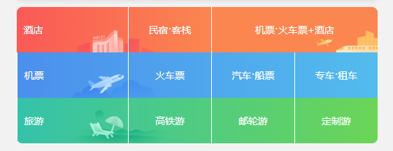

## 一、`flex` 基本概念与常见属性

刚接触 `flex`时，看到网上的各种视频或者文档教程，都略显冗长，因为一时半会儿压根不可能接受那么多东西，所以建议先将 `flex` 的概念做个大致了解，然后找案例跟着敲。


我尽量说的通俗易懂，将一个标签 `display` 的值改为 `flex` 后，该容器就成了一个弹性盒子 `container` 。在 `container` 里面的子标签就成了 `item` (子项)。这个盒子默认情况下有两个轴，一个是 `cross axis` (主轴)，一个是 `cross axis` (一般称为交叉轴，为了方便这里叫它侧轴)。主轴默认是从左到右，侧轴从上到下。轴开始和结束被称为 `cross start` 和 `cross end` 所有子项默认情况下都是沿着主轴排列，单个子项所占据主轴的空间叫做 `main size` ，占据侧轴的空间叫做 `cross size` 。利用 `flex` 可以十分快捷并且灵活的布局。常见属性如下:

```css
/* 父容器常用属性 */
flex-direction: row; /* 决定主轴方向，默认横向从左到右 */
flex-wrap: nowrap; /* 决定容器内子项是否换行，默认不换行 */
flex-flow: row nowrap; /* 前两个属性的简写 */
justify-content: flex-start; /* 定义子项在主轴的对齐方式,默认为左对齐 */
align-content: stretch; /* 定义多根轴线的对齐方式，如果只有一根轴线，改属性无效 */
align-items: stretch; /* 定义子项在侧轴上的对齐方式，默认项目未设置高度时将占满整								  			个容器的高度 */
```

```css
/* 子项目常用属性 */
    flex: none					 /* 将容器分成几份，该项所占的份数 */
    order: 0;					 /* 定义子项排列顺序,数值越小排列越靠前 */
```

### 注意事项：

- 不控制子项的大小时，子项会根据父容器的大小撑满父容器。

- 父容器内只有在普通流的元素才会成为子项，并非所有元素都是子项。

- 使用 `flex` 后，`float`、`clear`以及 `vertical-align` 属性将会失效

- 可以将子项的 `display` 值改为 `flex` (嵌套)

- 如果元素标签的子级用的是 flex 布局，当前元素的上一级（也就是当前元素的父级）不能使用`positon: absolute/fixed`

- `flex`在移动端兼容性非常好，PC 端最多只能兼容到 IE 9

  以上内容，任何人第一次看都不可能有什么顿悟的感觉，毕竟理论是千篇一律的。鲁迅先生曾经说过:”碗酸辣汤，耳闻口讲的，总不如亲自呷一口的明白 。“

## 二、简单案例（只包含核心代码，通常需加上宽高颜色看效果）

#### 1、水平垂直居中

```html
<div class="container">
  <div></div>
</div>
```

```css
.container {
  display: flex; /*父容器改为弹性盒子flexbox*/
  justify-content: center; /* 元素在主轴方向居中对齐 */
  align-items: center; /* 元素在侧轴方向居中对齐 */
} /* 只有一个子元素，所以里面的div就绝对居中container */
```

#### 2、导航栏

```html
<ul class="container">
  <li class="item">前端</li>
  <li class="item">DBA</li>
  <li class="item">大数据</li>
</ul>
```

```css
.container {
  display: flex; /* flex容器内的元素默认不换行 */
}
```

#### 3、`flex` 实现栅格布局

```html
<div class="container">
  <div class="item"></div>
  <!-- 一个div代表一个栅格 -->
  <div class="item"></div>
  <div class="item"></div>
</div>
```

```css
/* 基础部分 */
.container {
  display: flex;
}
.item {
  flex: 1; /* 容器内元素平均分配空间 */
}
```

上面的代码是平均分布不换行的，可以将父容器指定宽度后将 `flex-wrap` 属性更改为 `wrap` ，并且指定子项的宽度即可做成一个栅格。如下图。



## 总结：

`flex`布局核心就是将元素 `display` 属性值改为 `flex` 后,通过调整主轴、侧轴的方向以及子项的位置和排列方式等来布局。掌握了常用属性后 `flex` 会改变你对布局的看法，其实掌握 `flex` 费时间的主要在于记属性。硬生生的记十几个属性实在是枯燥，所以这里推荐一个网站——[FLEXBOX FROGGY](https://flexboxfroggy.com/#zh-cn)通过游戏的方式可以很快的记住。通关后可以用 `flex` 仿做个移动端页面( `flex` 在移动端非常流行)，我仿做过一个携程页面）可以参考下（[点这儿去](https://github.com/huiboxes/ctrip.m)）。
