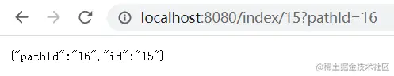
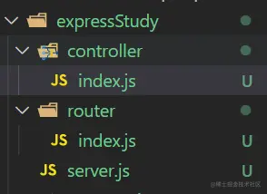

## 介绍

Express以它的简单、易用，可以快速创建强大Api而闻名。本文章是我学习它所做的笔记，包括基础用法和技巧。[Express官网文档](https://www.expressjs.com.cn/guide/routing.html)。

## 基础

```javascript
const express = require('express');

const app = express();
const port = 8080;

app.use('/', (req, res) => {
  // 当访问根目录 '/' 时会返回 'hello world'
  res.send('hello world');
});

/**
 * 访问 '/api' 时该回调不会执行
 * 因为它前面的 '/api' 中的 '/' 被会上面匹配
 */
app.use('/api', (req, res) => {
  res.send('hello api');
});

app.listen(port, () => {
  console.log(`running on port ${port}`);
});
```

`app.use`是使用中间件的方法，里面的回调函数被称为中间件。

## 中间件

### 基础

```javascript
app.use(
  '/api',
  (req, res, next) => {
    console.log(0);
    next(); // 前面的函数执行完以后,只有执行next，下一个中间件才能执行
  },
  (req, res, next) => {
    console.log(1);
    next();
  },
  (req, res) => {
    console.log(2);
  },
);
```

下面是与上面等价的代码:

```javascript
const middleware = [
  (req, res, next) => {
    console.log(0);
    next();
  },
  (req, res, next) => {
    console.log(1);
    next();
  },
  (req, res) => {
    console.log(2);
  },
];

app.use('/api', middleware);
```

Express 根据访问的url匹配对应的函数。有多个函数的话就按照书写的顺序执行，就像将函数放入了队列中。

## 路由

### 基础用法

路由也叫路由中间件。路由中间件写什么路径就匹配什么（可以是正则），和use不同。

```javascript
router.get('/index', (req, res) => {
  // 'index' 可以是正则
  res.send('<h1>index page.</h1>');
});
```

通过上面的方法可以猜测出来，除了`get`，应该还存在着`post`、`put`之类的方法。通过跳转到定义，发现果然如此，下面是源码中的接口：

```javascript
export interface IRouterMatcher<
    T,
    Method extends 'all' | 'get' | 'post' | 'put' | 'delete' | 'patch' | 'options' | 'head' = any
>
```

就算不会`TypeScript`也可以猜出来，有多个对应着请求方式的方法，除了那个all。这个all方法也可以望词生意，匹配所有HTTP请求的方式。通常使用来加中间件的，如下：

```javascript
app.all('/auth', function (req, res, next) {
  // 对任何访问auth接口的请求进行权限校验
  next(); // 继续执行下面的代码
});
```

### 拆分文件

通常来说一个应用的接口是较多的，如果全写在一个文件，不方便维护。可以路由部分拆出来，方法如下，下面是主文件(/server.js)：

```javascript
const express = require('express');

const app = express();
const router = require('./router'); // 路由文件在同级目录的router文件夹下 /router/index.js
const port = 8080;

app.use(router); // 没写路径使用中间件会处理所有请求，但是不会影响其它的路由路径。

app.listen(port, () => {
  console.log(`running on port ${port}`);
});
```

下面是路由文件(/router/index.js)：

```javascript
const express = require('express');

const router = express();

router.get('/index', (req, res) => {
  res.send('<h1>index page.</h1>');
});

module.exports = router;
```

### 获取前端传来的参数

有两种方式：

- 通过`req.query`
- 通过`req.params`

```javascript
router.get('/index/:id', (req, res) => {
  const query = req.query;
  const params = req.params;
  res.json({ ...query, ...params }); // 以json返回query与params中的所有属性
});
```

下面是上面代码请求url后的效果： 

## 拆分出控制器

当路由开始多起来后会发现代码看起来挺不方便的，可以拆分出`controller`（就是将路由对应的方法拆分出去），如下：

```javascript
// 路由文件
const express = require('express');

const router = express();
const { list } = require('../controller');

router.get('/list', list);
```

`controller`如下：

```javascript
const list = (req, res, next) => {
  res.json([
    { name: 'bob', age: 18 },
    { name: 'jerry', age: 19 },
  ]);
};

exports.list = list;
```

当前目录结构如下：


