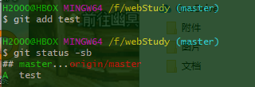
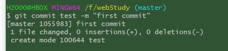
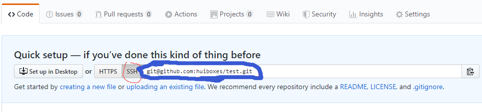

**声明：本文以实际使用的角度出发，因为短时间内是不太好理解的，使用一定时间后自然就理解了，刚开始比较无趣，只有背命令。纸上得来终觉浅，绝知此事要躬行。**

## Github是什么？

Github是一个代码托管平台，可以通过此平台找到许多开源项目，可以共享自己的开源项目与他人共同开发、完善，由于只支持Git的版本库格式进行托管，所以名为Github。

## Git是什么？工作流程是什么？

Git是一个开源的分布式版本控制系统。了解工作流程首先要知道四个东西：

- Workspace：工作区

- index/Stage：暂存区

- Repository：仓库区

- Remote：远程仓库

  工作流程如下：在工作区中修改某些文件 → 对修改后的文件进行快照，然后保存到暂存区(add) → 提交更新，将保存在暂存区域的文件快照永久转储到Git目录中(仓库)(commit) → 将本地仓库push到远程仓库(push)

## 一、准备工作

1.安装Git Bash：在 [https://gitforwindows.org/](https://gitforwindows.org/) 下载，然后一直下一步就好。

2.注册Github账户：点这里进入[官网](https://github.com),英语不好的建议用chrome，翻译挺好用的。注册时全部默认下一步即可，注册完账号就创建一个新仓库，别的都不管，直接默认的选项点下一步即可，等后面没事了一定要有空就打开看看，每个都按一下，摸索一下(不要删除仓库和账号就好)。

## 二、配置Git Bash：

在命令行依次在输入下面的内容，输一行，按一次回车。

```shell
git config --global user.name "huibox"				  #上传用户的称呼
git config --global user.email "huiboxes@gmail.com"	  #上传用户的邮箱
git config --global push.default simple				  #更改push方式
git config --global core.quotepath false			  #防止文件名变成数字
git config --global core.editor "vim"				  #使用vim编辑提交信息
```

在任何地方只需要右击鼠标，然后选Git Bash here即可打开一个命令行界面，默认情况打开后就处于当前文件所在位置。命令行内可以运行简单的Linux命令。

## 三、配置Github

### 1、获取SSH公钥

```shell
rm -rf ~/.ssh/*										  #单击鼠标右键点击Git Bash here后输入
```

千万不能输错，不然就可能要重装系统了，回车后输入

```shell
ssh-keygen -t rsa -b 4096 -c "huiboxes@gmail.com"     #生成ssh key
```

按三次回车，得到ssh key。直接按，这个环节不会有任何错误。

```shell
cat ~/.ssh/id_rsa.pub 								  #屏幕上输出ssh公钥
```

将打印出的内容全部复制下来，在bash终端下复制快捷键为`ctrl+insert`。在根目录下的.ssh目录中有两个文件，id_rsa是私钥，不要给任何人。

### 2、在Github添加公钥

打开[https://github.com/settings/keys](https://github.com/settings/keys) 。点击`New SSH key`按钮，`title`随便输入什么，在`key`下的表单内粘贴刚刚复制的内容，点`Add SSH key`。

### 3、测试是否已对接

```shell
ssh -T git@github.com								   #打开Git Bash后输入
```

如果提示输入yes/no就输入yes，只要没有看到一串包含successfully的英文，就要重第一步重新弄。

- 如果把key从电脑上删除了，重新生成一个就好了，替换之前的key。

- 一个电脑只需要一个key。

- 其他设备如果想的key上传到Github可以和之前的 key共存在Github上

- 一个key可以访问所有的仓库。

## 四、使用Git

### 1、本地仓库的使用(跟着敲会有奇效)

在你认为合适的盘符下创建一个文件夹，进入该文件夹右击鼠标点Git Bash here。然后输入`git init`**初始化**本地仓库，这个文件夹就成了工作区。使用命令行就简单多了，如下：

```shell
cd /f								#进入f盘（路径随意）
mkdir fileName						#在当前目录创建名为"fileName"的文件夹（名字叫什么都可以）
cd    fileName						#进入fileName目录
git init							#初始化本地仓库
```

fileName文件夹内会多出一个名为`.git`的隐藏文件夹，对该文件夹下内容的任何改动都会被git记录，不要动这个隐藏文件。

```shell
touch test							#创建名为test的空文件=windows右键创建没有后缀名的文件
git status -sb						#查看当前目录文件状态
```


可以看到所创建的文件名前会有两个`??`。因为你还没有对该文件进行过git操作，git不知道你后面会怎样对待这些文件的变动（增加、删除、更改都是变动）。



使用`git add 你创建的文件名`将某个文件**添加**到**暂存区**，使用`git add .`将当前目录里面所有的变动都加到暂存区。再次使用`git status -sb`会看到`??`变成了A(即Add添加)。



使用`git commit 你创建的文件名 -m "注释信息，方便以后查看"`将某个文件**提交**到**本地仓库**，使用`git commit . -m "注释"`将当前目录里文件都提交到本地仓库。这时再使用`git status -sb`会发现A变成了`M`(即Modified修改)。

### 2、将本地仓库上传到Github

在文章开头就提到过在Github创建一个仓库，就是为了这一步。进入仓库首页复制你的仓库地址。



选这个SSH因为用HTTPS的话以后每次更新都要输入密码。之前上传SSH公钥就是为了用SSH。接下来依次在命令行输入下面的内容。

```shell
git remote add origin git@github.com:huiboxes/test.git	#可以在github复制然后在命令行粘贴
git push -u origin master
```

刷新Github你会发现你的仓库上传上去了。

### 3、将Github上的仓库克隆到本地

找到一个觉得不错的开源仓库或者自己创建个新仓库，打开仓库首页单击`Clone or download`复制SSH地址，进入一个你想作为存放工作区的文件夹输入

```shell
git clone 粘贴刚刚复制的地址
```

运行完后会发现文件夹内多出一个与你github上仓库同名的文件夹。将工作区内的变更(增加、删除、改动都是变更)上传到Github的话，只需加上`git pull` 与`git push`。完整流程如下：

**git add → git commit → git pull → git push**
