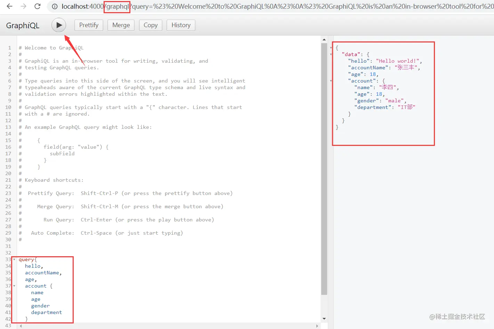
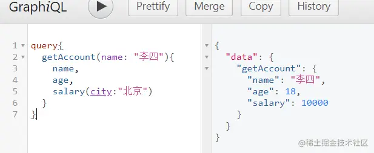

## 基础

GraphQL是Facebook开发的一种数据查询语言，很多人希望它能代替REST Api（REST ful：Representational State Transfer表属性状态转移。定义URI，通过API来取得资源。一种接口风格，所有语言都可以遵循这种风格。）。

GraphQL即是一种用于API的查询语言也是一个满足数据查询的运行时。GraphQL可以通过自定义对象按需获取需要的数据。

特点：

- 请求需要的数据，不多不少（一张表中多个字段，只请求一个字段）。
- 获取多个资源，自用一个请求。
- 描述所有可能类型的系统。便于维护，根据需求平滑演进，添加或者隐藏字段。

Graph QL使用类型区分资源，下面是示例代码：

```js
var express = require('express')
var graphqlHTTP = require('express-graphql')
var { buildSchema } = require('graphql')
​
// 定义schema，查询和类型(查询规则)。
var schema = buildSchema(`  
    type Account{     # 自定义参数类型，对应Query中account的类型
        name: String
        age: Int,
        gender: String,
        department: String
    }
    
    type Query{    
        hello: String,
        accountName: String,
        age: Int,
        account: Account
    }
`)
​
// 定义查询所对应的resolver，也就是查询对应的处理器
var root = {
    hello: () => { // 与schema中的字段对应
        return 'Hello world!'
    },
    accountName: () => {
        return '张三丰'
    },
    age: () => {
        return 18
    },
    account: () => {
        return {
            name: '李四',
            age: '18', // 类型与上面声明的不同，如果可以转换，GraphQL会自动转换。无法转换时会报错。
            gender: 'male',
            department: 'IT部',
        }
    },
}
​
var app = express()
app.use('/graphql',graphqlHTTP({
    schema: schema,
    rootValue: root,
    graphiql: true // 是否开启graphiql调试工具，项目上线时应该关掉
}))
​
app.listen(4000)
```

浏览器中使用graphiql调试截图： 

## 基本参数类型

- 基本类型（再shema声明的时候直接使用）

  - String
  - Int
  - Float
  - Boolean
  - ID

- 数组

  - \[int\] 整数型数组，其它类型也有对应的类型（`[type]`）。

## 参数传递

与TS的函数类似，可以传递参数，需要声明类型。

```js
// ！表示该参数必传
type Query{
    rollDice(numDice: Int!,numSides: Int): [Int]
}
```

示例代码：

```js
var schema = buildSchema(`
    type Query {
    getClassMates(classNo: Int!): [String]
  }
`)
​
// 定义查询对应的处理器
var root = {
  getClassMates({ classNo }) {  // 对象方法，JS的语法糖。
    const obj = {
      // 模拟数据库
      31: ['张三', '李四', '王五'],
      61: ['赵六', '陈七', '老八'],
    }
    return obj[classNo]
  },
}
```

## 自定义类型

第一段示例代码中有自定义类型：

```js
var schema = buildSchema(`  
    type Account{    
        name: String
        age: Int,
        gender: String,
        department: String,
        salary(city: String): Int
    }
​
    type Query{
        getAccount(name: String): Account
    }
`)
​
var root = {
  getAccount({ name }) {
      return {
          name: '李四',
          age: '18',
          gender: 'male',
          department: 'IT部',
          salary({ city }) {
          if (city === '北京' || city === '上海') {
                return 10000
          } else {
              return 3000
          }
      }
   }
}
```

浏览器中使用graphiql调试截图：



## 每个schema必须得有一个Query，无论是否用的上

如果schema中没有query，那么将会如下报错：`Query root type must be provided`。

## 修改数据

查询使用query，对数据的修改使用mutation。下面是示例代码：

```js
// 定义schema，查询和类型
var schema = buildSchema(`
  input AccountInput{  
    name: String
    age: Int
    gender: String
    department: String
  }
​
  type Account{
    name: String
    age: Int
    gender: String
    department: String
  }
​
  type Mutation{
    createAccount(input: AccountInput): Account
    updateAccount(id: ID!,input: AccountInput): Account
  }
​
  type Query{
    accounts: [Account]
  }
`)
​
const fakeDB = {}
​
// 定义查询对应的处理器
var root = {
  accounts() {
    return Object.values(fakeDB)
  },
  createAccount({ input }) {
    // 相当于数据库的保存
    fakeDB[input.name] = input
    // 返回保存结果
    return fakeDB[input.name]
  },
  updateAccount({ id, input }) {
    // 相当于数据库的更新
    const updateAccount = Object.assign({}, fakeDB[id], input)
    fakeDB[id] = updateAccount
    // 返回保存结果
    return updateAccount
  },
}
```

graphiql中调试的语句：

```js
// 一段一段的运行代码，运行前将其它代码注释，在graphiql中的注释为 #
mutation{ # 新增操作
  createAccount(input:{
    name: "李四",
    age: 19,
    gender: "女",
    department: "IT"
  })
  {     # 第二个对象表示返回类型
    name
    age
    gender
    department
  }
}
​
query{ # 查询所有account
  accounts {
    name
    age
    gender
    department
  }
}
​
mutation{   # 修改操作
  updateAccount(id: "张三",input:{
    age: 18
  }){   # 第二个对象表示返回类型
    age
  }
}
```

以上是graphql的增、改、查的用法，删除操作也可以根据上面的例子推出来。

## 权限认证

对包含`/graphql`的url加以限制。

```js
const middleware = (req, res, next) => {
  if (
    req.url.indexOf('/graphql') !== -1 &&
    ...
  ) {
    res.json({
      error: '没有权限访问这个接口',
    })
    return
  }
  next()
}
app.use(middleware)
```

## Constructing Types

### 使用GraphQLObjectType定义type（类型）。

```js
var schema = buildSchema(`
  input AccountInput{  
    name: String
    age: Int
    gender: String
    department: String
  }
`)
// 使用GraphQLObjectType定义type，好处是可以更加准确的知道是哪儿出的错
var AccountType = new graphql.GraphQLOBjectType({
  name: 'Account',
  fields: {
    name: { type: graphql.GraphQLString },
    age: { type: graphql.GraphQLInt },
    gender: { type: graphql.GraphQLString },
    department: { type: graphql.GraphQLString },
  },
})
​
```

### 使用GraphQLObjectType定义query（查询）

```js
var schema = buildSchema(`
  type Query{
    accounts: [Account]
  }
`)
​
// 使用GraphQLObjectType定义query
var queryType = new graphql.GraphQLObjectType({
  name: 'Query',
  fields: {
    account: {
      type: AccountType,
      args: {
        username: { type: graphql.GraphQLString }
      },
      resolve(_,{username}){
        return{
          name: username,
          gender: 'man',
          age: 18,
          department: 'IT'
        }
      }
    }
  }
})
```

### 创建schema

```js
var schema = new graphql.GraphQLSchema({ query: queryType });
```

使用Constructing Types可以明显感觉代码变多了， 但是这样的好处是代码的可维护性更高。

## 与数据库结合

上面的代码中，将mutation对应处理器中对对象的操作改为对数据库的操作即可。
