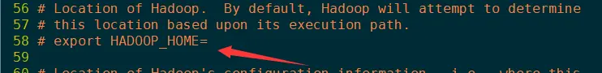
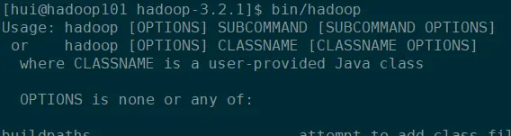
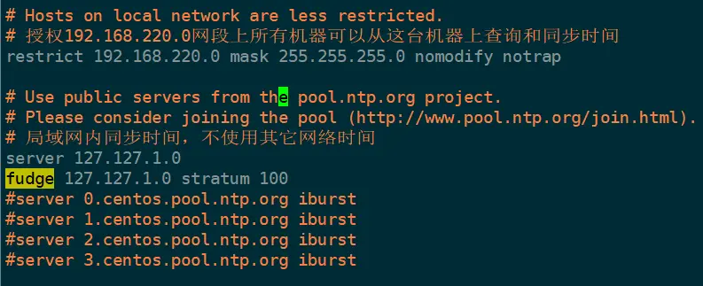
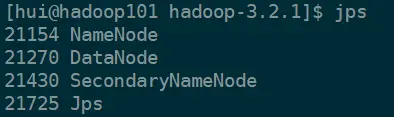

## 在hadoop-env.sh文件中添加JDK路径

```
cd /opt/module/hadoop-3.2.1/  # 进入Hadoop的目录
vim etc/hadoop/hadoop-env.sh  # 修改环境
:/java\c                      # 搜索Java，\c是不区分大小写
```



找到这一行后在下面加上JDK路径：


测试：



```
mkdir input
cp etc/hadoop/*.xml input
bin/hadoop jar share/hadoop/mapreduce/hadoop-mapreduce-examples-3.2.1.jar grep input ouput 'dfs[a-z,]+'
```


说明Hadoop能正常运行本地模式，也就是环境配置好了，相当于Hadoop的Hello World。运行模式主要用来debug。接下来配置伪分布式环境。伪分布式是只在一个节点上，运行三大组件。

## 配置SSH无密登录

```
ssh-keygen -t rsa       # 所有机器都要生成公私钥对。
ssh-copy-id hadoop101   # 所有机器将公钥拷贝给Hadoop101,包括101本身
```

hadoop101会将所有公钥放入`authorized_keys`文件中。`authorized_keys`中存有其它主机的公钥，其他主机就可以无密访问存放`authorized_keys`文件的主机。

```
scp ~/.ssh/authorized_keys hadoop102:~/.ssh/
scp ~/.ssh/authorized_keys hadoop103:~/.ssh/
```

现在hadoop101有所有机器的公钥了，直接将`authorized_keys`文件拷贝到其它主机就很方便的访问发送过公钥的机器。  
如果启动集群时报以下错误说明免密码登录没配置好

> Permission denied (publickey,gssapi-keyex,gssapi-with-mic,password).

## 配置时间同步

```
rpm -qa | grep ntp
没有的话就安装
sudo yum install -y ntp
```

修改配置文件如下图

```
sudo vim /etc/ntp.conf
```



让硬件时间与系统时间一起同步

```
sudo vim /etc/sysconfig/ntpd
SYNC_HWCLOCK=yes                            # 添加这句
```

开启ntpd

```
chkconfig ntpd on 将ntpd永久开启
systemctl start ntpd.service                # 启动ntpd
systemctl status ntpd.service               # 查看ntpd状态
```

所有机器上设置定时同步

```
crontab -e                                  # 编辑定时任务
0-59/10 * * * * /usr/sbin/ntpdate hadoop101 # 每10分钟和hadoop101同步一次时钟,所有机器都加上这一句
```

## 修改core-site.xml文件

```
cd etc/hadoop
vim core-site.xml


<configuration>
<!-- 指定HDFS中NameNode的地址 -->
    <property>
        <name>fs.defaultFS</name>
        <value>hdfs://hadoop101:8020</value>
    </property>


<!-- 指定Hadoop运行时产生文件的存储目录 -->
    <property>
        <name>hadoop.tmp.dir</name>
        <value>/opt/module/hadoop-</value>
    </property>
</configuration>
```

## 修改hdfs-site.xml文件

```
vim hdfs-site.xml

<name>dfs.replication</name>
<value>1</value>
单一节点至多存储一份副本
```

## 格式化HDFS

第一次启动必须要先格式化HDFS，以后不要格式化。HDFS需要通过格式化的过程来创建元数据的目录。

> bin/hdfs namenode -format

## 启动集群

> sbin/start-dfs.sh

`jps`查看进程


