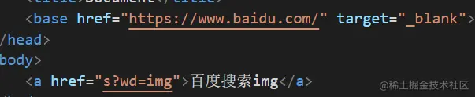
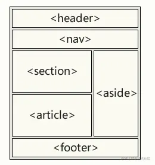
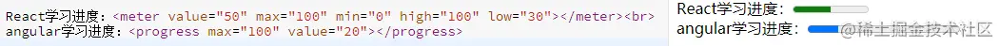

## 常用

个人认为HTML5更加看重语义，掌握HTML5可以快速明白某段代码的作用。

- `<!-- -->`注释
- `<html>` 根元素，向浏览器说明这是HTML文档
- `<head>` 页面元信息、编码、SEO
  - `<base>` 动词意思是以......为基准，用法如下：  浏览器会自动将`a`、`img`等含有的`url`拼接上`base`中的`url`。图中的超链接点击后会跳转到`https://www.baidu.com/s?wd=img`，可以用`target`属性控制控制打开位置。
  - `<meta>` 指定编码或者视口。
  - `<link>` 请求`href`中的`url`（CSS、JSONP），无刷新。
  - `<script>` 请求脚本文件或者在标签中写脚本。
  - `<title>` 网页标题。
  - `<style>` 标签中写CSS样式，无刷新。
- `<body>` 页面主要内容写在这里面，保证页面加载速度可以将`<script>`放在`<body/>`前，自带8px外边距。
- `<h1>~<h6>` 文档标题，从大到小。`<h1>`会优先被爬虫抓取，最好不频繁使用，块级元素。
- `<p>` 段落标签，块级元素。
- `<br>` 表示一个换行符。
- `<hr/>` 水平线，块级元素。
- `<div>` 无意义，如同书架的作用，将网页内容分批、归类处理，块级元素。
- `<span>` 无意义，内联元素。
- `<a>` 超链接，跳转到指定的`url`，可以跳转到指定锚点,页面会刷新，内联元素。使用`download="url"`浏览器会下载文件。
- `<ol>、<ul>` 有序列表和无序列表，列表项用`<li>`包裹。`<dl>`为自定义列表，子元素用`<dt>（标题）、<dd>（项目）`包裹。它们都是块级元素。
- `<form>` 表单，提交数据用的，不多说。
- `hidden` 属性，`true`或者`false`控制这个标签是否隐藏。
- `contenteditable` 属性，这个值为true时就可以修改该标签内的HTML。但是刷新后内容会丢失。
- `designMode`,`document.designMode=on`表示页面所有HTML可修改，默认为`off`，刷新后内容会丢失。
- `spellcheck` 给`input`、`textarea`等元素用，`true`或者`false`控制输入的内容出现拼写错误时浏览器是否提示

### 表格相关

一个有语义的表格应该如下：

```html
<!-- 为了cv有效果才用border属性，border已被废弃，不建议使用 -->
<table border="1">
  <colgroup>
    <col span="2" style="background-color: lightblue;" />
    <!-- html5只有span属性还保留 -->
    <col style="background-color: lightpink;" />
  </colgroup>
  <caption>
    表格标题
  </caption>
  <thead>
    <tr>
      <th>列标题一</th>
      <th>列标题二</th>
      <th>列标题三</th>
    </tr>
  </thead>
  <tbody>
    <tr>
      <td>XXX</td>
      <td>XXX</td>
      <td>XXX</td>
    </tr>
  </tbody>
  <tfoot>
    <tr>
      <td>XXX</td>
      <td>XXX</td>
      <td>XXX</td>
    </tr>
  </tfoot>
</table>
```

## 媒体文件

```html
<!-- 音频 -->
<audio controls>
  <source src="horse.mp3" type="audio/mpeg" />
  <source src="horse.ogg" type="audio/ogg" />
  Your browser does not support this audio format.
</audio>

<!-- 视频 -->
<!-- 菜鸟教程的例子 -->
<video width="320" height="240" controls>
  <source src="movie.mp4" type="video/mp4" />
  <source src="movie.ogg" type="video/ogg" />
  <source src="movie.webm" type="video/webm" />
  <object data="movie.mp4" width="320" height="240">
    <embed src="movie.swf" width="320" height="240" />
  </object>
</video>
```

## 文字格式化相关

|                                                                         标签                                                                         |                        作用                         |
| :--------------------------------------------------------------------------------------------------------------------------------------------------: | :-------------------------------------------------: |
|                                                                          b                                                                           |            加粗（不够语义化，但是常见）             |
|                                                                        strong                                                                        |                  加粗，更加语义化                   |
|                                                                        samll                                                                         |                        变小                         |
|                                                                         code                                                                         |                 变小，介绍代码时用                  |
|                                                                         kbd                                                                          |              变小，表示键盘上的键时用               |
|                                                                         samp                                                                         |                   变小，一般不用                    |
|                                                                          i                                                                           |              倾斜，可能是italic的缩写               |
|                                                                          em                                                                          |                 倾斜,emphasized缩写                 |
|                                                                        addres                                                                        |               倾斜,用于地址,块级元素                |
|                                                                         dfn                                                                          |                  倾斜，专业术语用                   |
|                                                                         var                                                                          |                 倾斜,介绍变量名时用                 |
|                                                                         cite                                                                         |              倾斜,引用参考文献的时候用              |
|                                                                      blockquote                                                                      |               倾斜，引用文本的时候用                |
|                                                                          q                                                                           |     文字两边加上 `"` ，引用短文本（单词）时用。     |
|                                                                         sub                                                                          |                        下标                         |
|                                                                         sup                                                                          |                        上标                         |
|                                                                         bdo                                                                          | 文字方向，dir属性控制`ltr`(左到右)或者`rtl`(右到左) |
|                                                                         bid                                                                          |               不继承父元素的文本方向                |
|                                                                         pre                                                                          |      应该是preview的缩写,按照编辑时的格式输出       |
|                                                                         del                                                                          |                中划线，delete的缩写                 |
|                                                                         ins                                                                          |                下划线，insert的缩写                 |
|                                                                         mark                                                                         |                    字体黄色背景                     |
|                                                                         time                                                                         |        表示时间时用这个包裹，个人觉得很鸡肋         |
| 可以看出，有很多标签功能是重复的。但是，通过合适的标签来包裹内容可以更富有语义。当看代码时，第一眼就可以大概知道是包裹的什么内容，在页面的那个部分。 |                                                     |

## 语义标签

下面的标签和`<div>`是一样的，只是有语义。借用w3school的图，一图胜千言：

 还有很多其它标签，但是我懒得写了。上面写到语义化的好处就是很好看出代码中每个地方是什么，虽然显得很专业，但是会加重看代码人的学习成本。个人一些不好的观点：反正网页中所有模块都要分成一个一个小组件，也没必要记那么多。

## 页面增强

最后加一点，因为进度条效果通常都用`CSS`实现，所以加上。

```html
React学习进度：<meter value="50" max="100" min="0" high="100" low="30">
  angular学习进度：<progress value="20" max="100"></progress>
</meter>
```

 `value`和`max`的功效很容易猜出，`high`和`low`通过修改值+运行可以看出来，它们表示一个范围，改变进度条颜色。
