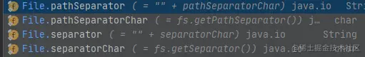

Java把电脑中的文件和文件夹封装为一个File类，开发者可以使用File类对文件进行操作。

## File类

### 静态变量



```java
// 返回系统路径分隔符
String pathSeparator = File.pathSeparator;  // Win环境是 ;

// 返回系统默认名称分割符
String separator = File.separator;  // Win环境是 /
```

其它两个是返回字符串类型的值。

### 构造方法

```java
// 可以传一个参数，传文件所在绝对路径或者相对路径。
File(String pathname)
// 传两个参数的话第一个参数是文件夹，第二个参数是文件名。
public File(String parent, String child)
```

### 常用方法

```java
File file = new File("../test.txt");
// 返回文件绝对路径
file.getAbsoluteFile();
// 返回路径名字
file.getPath();
// 返回文件名或者目录名
file.getName();
// 返回文件的长度
file.length();
// 判断传的文件或目录是否存在
file.exists();

// 如果路径不存在，下面两个方法都返回false
// 判断传的路径是否为目录
file.isDirectory();
// 判断传的路径是否为文件
file.isFile();
// 如果传的目录不存在，创建
file.mkdir();

// 创建文件或者目录可能失败，意味着可能抛出异常，所以必须要处理异常
// 如果传的文件名不存在，创建
file.createNewFile()
// 递归的创建,如同mkdir -p
file.mkdirs()

// 如果传的路径不存在或者不是目录，会抛出空指针异常
// 返回String 数组，所传路径中所有子文件或者目录
file.list()
// 返回一个File数组，表示该File目录中所有的文件或目录
file.listFiles()
```

## 过滤器

### 语法

```java
public class FileFilterImpl implements FileFilter{
	@Override
	public boolean accept(File pathname) {
		return false;
	}
}
```

- listFiles方法会对传递的目录进行遍历，获取目录的每一个文件并封装成File对象。
- listFiles方法会调用参数传递的过滤器中的accept方法。
- listFiles方法会把遍历得到的每一个File对象传递给accept方法。和Vue2里的filter（过滤器）很像。 如果accept返回true，就会把传递的File对象存入File数组。

### 用过滤器寻找目录下ejs文件

```java
public class test{

    public static void main(String[] args) throws IOException {
        File file = new File("f:\\repos\\test");
        getAllFile(file);
    }


    public static void getAllFile(File dir){
        File[] files = dir.listFiles(new FileFilter() {
            @Override
            public boolean accept(File pathname) {
                return pathname.isDirectory() || pathname.getName().toLowerCase().endsWith(".ejs");
            }
        });

        // 使用Lambda表达式优化
        // File[] files = dir.listFiles(pathname->pathname.isDirectory() || pathname.getName().toLowerCase().endsWith(".ejs"));

        for (File file : files) {
            if (file.isDirectory()){
                getAllFile(file);
            }else {
                System.out.println(file);
            }
        }
    }
}
```

还有一个过滤器是`FilenameFilter`，功能差不多。不过`accpet`方法要传两个参数，路径和文件名，例子：

```java
File[] files = dir.listFiles(new FileFilter() {
            @Override
            public boolean accept(File dir,String name) {
                return new File(dir,name).isDirectory() || name.getName().toLowerCase().endsWith(".ejs");
            }
        });
```

## IO流

把硬盘中的数据读取到内存是输入（读取），把内存中的数据写入到硬盘中式输出（写入）。数据不同，所以流分为子节输入流和字符输入流。

### 字节输出流

输出字节流的所有类的超类——`OutputStream`。抽象方法：

```java
// 关闭输出流并释放与此流有关的所有系统资源（会自动调用flush）
close()
// 刷新此输出流并强制写出所有缓冲的输出子节（把内容写入到文本）
flush()
// 将指定的子节写入此输入流
wirte()
```

将内存中的数据写入到硬盘文件——`FileOutputStream`。

```java
// 传路径或者File实例
// 第二个参数默认为false，每次写都会覆盖前一次内容。为true的话多次写入会追加。
FileOutputStream fileOutputStream = new FileOutputStream("f:\\test.txt",true);
// FileOutputStream fileOutputStream = new FileOutputStream(new File("f:\\test.txt"));

// write也可以传入的整数，Java会把转换为ASCII码
fileOutputStream.wirte("hello world".getBytes());
fileOutputStream.close();

// 输入换行
// win:     \r\n
// Linux:   /n
// mac:     /r
```

写入数据整个流程如下： Java程序 -> JVM -> OS -> OS调用写数据的方法 -> 把数据写入到文件中。

### 子节输入流

输入字节流的所有类的超类——`InputStream`。抽象方法：

```java
// 读取
read()
// 关闭流
close
```

将硬盘中文件的数据读取到内存中——`FileInputStream`。

```java
FileInputStream fileInputStream = new FileInputStream("f:\\test.txt",true);
// FileInputStream fileInputStream = new FileInputStream(new File("f:\\test.txt"));

// 读取文件中的一个子节然后返回（指针会向后移），如果读到末尾就返回-1
// fileInputStream.read()
// 显然不可能一直手动用read()，所以读文件通常如下：
int len = 0; // 接收读取的子节
while(len = fileInputStream.read() != -1){
	System.out.println(len)
}

// read可以传byte数组，数组长度多少就读取多少个子节。通常定义为1024（1Kb）或者它的整倍数
// 返回的int是有效子节个数

// int len = fileInputStream.read(new byte[1024])

byte[] bytes = new byte[1024];
int len = 0;
while((len = fileInputStream.read(bytes) != -1)){
	System.out.println(new String(bytes,0,len));
}


fileInputStream.close()

```

读取整个流程如下： Java程序 -> JVM -> OS -> OS调用读取数据的方法 -> 读取文件。

字节流读取中文时存在问题。因为中文编码每个字都是大于1个子节。

### 字符输入流

输入字符流的所有类的超类——`Reader`。抽象方法：

```java
// 读取单个字符并返回
// 传子节数组的话就是读取多个字符，将字符存入数组
read()
// 释放资源
close()
```

把硬盘中的数据以字符的方式读到内存中——`FileReader`。

```java
FileReader fr = new FileReader("f:\\test.txt");
char[] cs = new char[1024];
int len = 0;
while ((len = fr.read(cs)) != -1){
    System.out.println(new String(cs,0,len));
}
```

### 字符输出流

输出字符流的所有类的超类——`Writer`。把内存中的字符数据写入到文件中——`FileWriter`。`FileOutputStream`不`close`数据也会到文件中。但是`Writer`如果不使用`close`或者`flush`方法，数据只是在缓冲区。常用方法：

```java
// 第二个参数为true开启续写
try(FileWriter fw = new FileWriter("f:\\test1.txt",true);){
            char[] cs = {'d','e'};

            // 可以传一个整数（ASCII码），也可以传字符数组或字符串
            fw.write(97);
            fw.write("bc");
            fw.write(cs);
        }
```

## Properties

`Properties`类实现了`Map`和`Hashtable`集合。表示持久的属性集。可以保存在流中也可以从流中加载。它时唯一和IO流相结合的集合。常用方法：

```java
// 把集合中的临时数据持久化写入到硬盘中存储
store()
// 把硬盘中得到文件（键值对）读取到集合中使用
load
```

它的key和value默认都是字符串。输出：

```java
 Properties properties = new Properties();
 properties.setProperty("测试", "111");
 properties.setProperty("测试1", "111");
 // 要用字符流，因为字节流不能输出中文
 properties.store(new FileWriter("f:\\test3.txt"),"");
```

文件：


读取：

```java
Properties properties = new Properties();
properties.load(new FileReader("f:\\test3.txt"));
properties.forEach((k,v)->{
    System.out.println(k + "： " + v);
});
```

## 缓冲流

对前面的基本流的增强。分为：

- 子节缓冲流
- 字符缓冲流 一次I/O从代码经过JVM到OS再到文件，步骤很多。一次操作几个子节/字符和一次操作多个子节都要经历那道流程。使用缓冲流，在创建对象时，会创建一个数组作为缓冲区。通过缓冲区读写，减少IO次数提高读写的效率。

### 子节缓冲流输出

```java
BufferedOutputStream bufferedOutputStream = new BufferedOutputStream(new FileOutputStream("f:\\test.txt"));
bufferedOutputStream.write("测试buffer".getBytes());
bufferedOutputStream.close();
```

### 子节缓冲流输入

与输出流用法差不多，使用`BufferedReader`。常用方法里多个`readLine`方法，当读取不到下一行时会返回null。

```java
BufferedReader bufferedReader = new BufferedReader(new FileReader("f:\\test.txt"));
bufferedReader.read();
String line;
while ((line = bufferedReader.readLine()) != null){
    System.out.println(line);
}
```

## 转换流

给流指定编码方式。输出：

```java
OutputStreamWriter outputStreamWriter = new OutputStreamWriter(new FileOutputStream("f:\\test2.txt"), "utf-8");
outputStreamWriter.write("测试");
outputStreamWriter.close();
```

输入：

```java
InputStreamReader inputStreamReader = new InputStreamReader(new FileInputStream("f:\\test3.txt"), StandardCharsets.UTF_8);
int len = 0;
byte[] cs = null;
while ((len = inputStreamReader.read()) != -1){
    System.out.printf(String.valueOf((char)len));
}
inputStreamReader.close();
```

## 序列化流

要实现序列化和反序列化的类必须实现`Serializabel`接口。使用`static`修饰的属性不能被序列化，如果不想属性成静态可以使用`transient`。`transient`可以使属性不被序列化并且不加到静态区。

### 序列化

把对象以流的方式，写入到文件中保存，也叫对象的序列化。

```java
ObjectOutputStream objectOutputStream = new ObjectOutputStream(new FileOutputStream("f:\\test2.txt"));
objectOutputStream.writeObject(new Test("test",11));
objectOutputStream.close();
```

### 反序列化

把文件中保存的对象，以流的方式读取出来，就是对象的反序列化。如果序列化对象后class文件改了反序列化会失败并抛出`InvalidaClassException`异常。

```java
ObjectInputStream objectInputStream = new ObjectInputStream(new FileInputStream("f:\\person.txt"));
Object o = objectInputStream.readObject();
objectInputStream.close();
System.out.println(o);
```

## 打印流

只负责数据的输出，不负责读取。不会抛出`IOException`。

```java
PrintStream printStream = new PrintStream("f:\\te.txt");
printStream.write(97); // a,使用print方法可以原样输出
printStream.close();

// 系统的输出位置可以用setOut更改，这个方法里要传打印流
System.out.println("控制台输出");
PrintStream printStream = new PrintStream("f:\\te.txt");
System.setOut(printStream);
System.out.println("输出到打印流的目的地");
```
