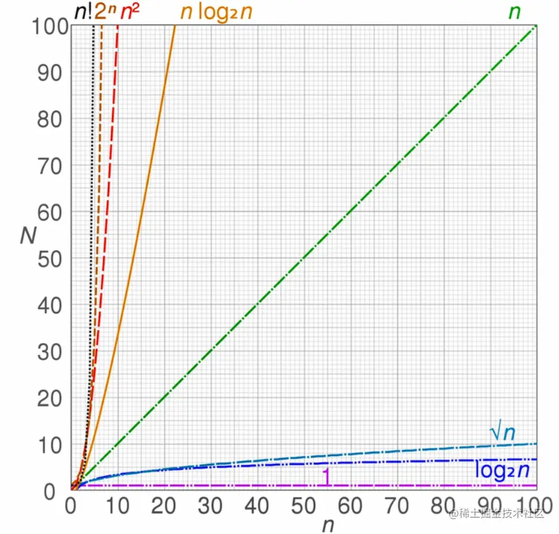

数据结构：计算机存储、组织数据的方式。算法：一系列解决问题的清晰指令，解决问题的方法。

- 程序 = 数据结构 + 算法。
- 数据结构为算法提供服务，算法围绕数据结构操作。

## 时间复杂度与空间复杂度

### 时间复杂度

- 时间复杂度就是一个函数，用大写O表示，如O(1)、O(n)、O(logN)等。
- 定性描述该算法的运行时间。

image-20211213221043632

 参数越大，时间复杂度也越高。O(1)复杂度的代码如下：

```less
let i = 0  
i + 2 // 每次执行代码时，这些代码只会执行一次，所以复杂度是O(1)
```

O(n)的代码如下：

```css
for(let i = 0; i < n; i ++){
    console.log(i)
}  // for循环里面的代码执行了n次，所以复杂度是O(n)
```

两个代码合并的话，整个的时间复杂度是O(n)。把它们相加，取最高的，因为n足够大时1可以忽略不记，所以复杂度是O(n)。

如果循环嵌套循环（两个循环），那个时间复杂度就要相乘，那么就是O(n^2)。相加时，小的被忽略，取大的。相乘时按正常乘法算。

下面是O(logN)的代码：

```css
let i = 1
while(i < n){
   console.log(i)
    i *= 2
} // 循环了log * n次，所以复杂度是O(logN)
```

### 空间复杂度

- 一个函数，用大O表示，比如O(1)、O(n)、O(n^2)等。

- 算法在运行过程中临时占用存储空间大小（内存）的度量。

空间复杂度为O(1)的代码：

```less
let i = 0
i += 1 // 只声明了单个变量，单个变量所占用的内存永远是1，恒定的内存。
```

空间复杂度为O(n)的代码：

```css
const list = []
for(let i = 0; i < n; i ++){
    list.push(i)
} // 声明了一个数组，往里面加了n个值，占用了n个内存单元，所以空间复杂度是O(n)
```

空间复杂度为O(n^2)的代码：

```ini
const matrix = []
for(let i = 0; i < n; i += 1){
    matrix.push([])
    for(let j = 0; j < n; j ++){
        matrix[i].push(j)
    }
} // 嵌套了两层数组，存储了n ^ 2个值。所以空间复杂度是O(n ^ 2)
```

一个比较简单粗暴（不完全是）的求时间复杂度的方法就是数循环的数量，一个循环就是O(n)，嵌套了m层就是O(n^m)。求空间复杂度就看有没有二维数组、链表等，有就是O(n)。递归算法的空间复杂度=度递归深度n`*`每次递归所要的辅助空间。

## 常见的数据结构

### 栈

栈的特点是先进后出（也可以说后进先出），生活中的羽毛球筒，先放进去的球都是最后拿出来。在JavaScript中，Array可以实现栈的所有功能。

栈常用的操作：push、pop、stack\[stack.length-1\]。

常见的使用场景就是函数调用堆栈：先调用的函数，都要等后调用的函数（在先调用函数的内部）执行完才能执行完。JS解释器使用栈来控制函数的调用顺序。

### 队列

- 一个先进先出的数据结构，（生活中每个排队的场景都是队列）。
- JavaScript中没有队列，但可以用Array实现队列的所有功能。 JS是单线程，无法同时处理异步中的并发任务。JS碰到异步任务代码，就将异步任务交给Web API执行，等Web API执行好将后，Web API会将传入的回调函数放入异步队列中。如果同步任务都执行完了，异步队列中的任务就按照先进先出的顺序执行。

### 链表

- 多个元素组成的列表。

- 元素存储不连续，用next指针连在一起。

- 与数组的不同之处：

  - 数组：存储是连续的，增删非首尾元素时需要全体向前/后移动元素。

  - 链表：存储是不连续的，增删非首尾元素，不需要移动元素，只需要修改next指针。

- 双向链表：也是链表的一种，由节点组成，它的每个数据节点中都有两个指针，分别指向直接后继和直接前驱。

- 链表常见操作：修改next、遍历链表 **JavaScript中的原型链**

- 原型链的本质是链表。

- 原型链上的节点是各种原型对象，比如：Function.prototype、Object.prototype等。

- 原型链通过`__proto__`属性连接各种原型对象。

- 下面是复合类型变量原型链往上找的结果：

```js
普通对象.__proto__ === Object.prototype;
Object.prototype.__proto__ === null;

普通函数.__proto__ === Function.prototype;
Function.prototype.__proto__ === Object.prototype;
Object.prototype.__proto__ === null;

(普通数组.__proto__ === Array.Array.prototype.__proto__) === Object.prototype;
Object.prototype.__proto__ === null;
```

### 集合

- 一种无须且唯一的数据结构。
- 集合的常用操作：去重、判断某元素是否在集合中、求交集等。

### 字典

- 与集合类似，字典也是一种存储唯一值的数据结构，但它以键值对（key: value）的形式来存储。
- JS中的对象可以看作是字典，ES后新增的Map结构就是字典，提供了一些列方法。
- 字典的常用操作：键值对的增删改查。

### 树

- 一种分层数据的抽象模型。
- JS中可以通过对象和数组构建树。
- 树的常用操作：深度/广度优先遍历、先中后序遍历。
  - 深度有限遍历：尽可能深的搜索树的分支。
  - 广度优先遍历：先访问离根节点最近的节点。 **深度/广度优先遍历口诀**
- 深度优先
  - 访问根节点。
  - 对根节点的children挨个进行深度优先遍历。
- 广度优先
  - 新建一个队列，把根节点入队
  - 把对头出队并访问
  - 把对头的children挨个入队
  - 重复第二三步，直到队列为空。

### 图

- 图是网络结构的抽象模型，是一组由边连接的节点。

- 图可以表示任何二元关系，比如道路、航班。

- 无论图多么复杂，由多少条边，一条边只能连接两个点，两个两个相连组成的图。

- 图的表示法：邻接矩阵、邻接表、关系矩阵等。

- 深度/广度优先遍历：

  - 深度优先遍历：尽可能深的搜索图的分支。
  - 广度优先遍历：先访问离根节点最近的节点。

### 堆

- 堆是一种特殊的完全二叉树。
- 所有的节点都大于等于（最大堆）或小于等于（最小堆）它的子节点。
