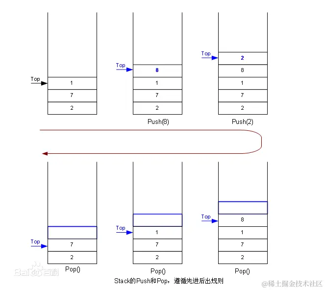
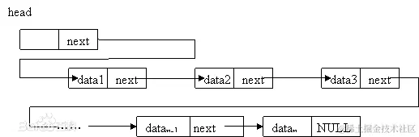
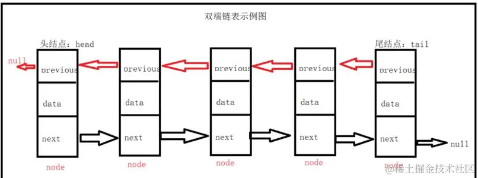

## 数据结构和算法的定义

- 数据结构（data structure） 数据在计算机中组织和存储的方式。
- 算法（algorithm）
  - 通常有输入
  - 通常产生输出
  - 最终会终止，不是死循环 解决某个问题所使用的方法（比如递归创建组件）。数据结构是通过算法实现的。

## 线性结构

一组有顺序的数据元素的集合。

### 数组(Array)

数组的优点在于通过下标值读取元素以及修改元素时，可以很快找到元素。

往数组里面插入新元素时。如果不是在最后插入，那么新插入元素后面原有的元素都要一个一个向后移动内存位置。删除操作也是，会让后面的元素一个一个的向前移动。所以插入和删除操作是比较消耗性能的。

JS中数组是动态的，不过在其它静态语言中数组在创建时指定好了数组大小的。数组是内存中一段连续的内存。对数组扩容时，只能申请一个更大的数组。把之前数组的元素克隆进来。所以数组的扩容操作是比较耗时的。

### 栈(Stack)

栈结构的特点是后进先出（LIFO）。例子：[函数调用栈](https://developer.mozilla.org/zh-CN/docs/Glossary/Call_stack)。

栈结构不能像数组那样随意在任何位置插入或删除数据，**只能在一端插入或删除元素**。比如从羽毛球盒子里拿出羽毛球。栈的顶部叫做栈顶，底部叫做栈底。添加元素叫进栈或者压栈。删除元素叫出栈。 

栈通常使用数组或者链表实现。

### 队列（Queue）

特点是先进先出（FIFO），和生活中排队打饭一样，先进的先出去。[异步队列](http://www.ruanyifeng.com/blog/2014/10/event-loop.html)。

- 优先级队列 队列中所有元素是有优先级的。插入新元素时，不会直接放后端而是考虑插入数据的优先级。和队列内其它数据比较优先级，然后将元素放入正确的位置。

### 链表(List)

链表也可以存储多个元素。链表创建时不用固定大小，可以无限延伸。链表中的元素在内存中不必是连续的空间。

链表在插入和删除数据时，效率比数组高。通过下标读取/修改元素时性能比数组低。

#### 单向链表

链表中的每个节点除了存储元素外还存储着下一个节点的引用。链表有一个头节点(head)，它引用第一个节点。下图来自百度百科：

由于单向链表是单向连接，所以只能从头部遍历到尾部，或者从尾部遍历到头部。

#### 双向链表

双向列表是每个节点存储着元素、上一个节点的引用和下一个节点的引用。双链表除了有头节点以外，还有一个尾（tail)。引用最后一个节点的next，也就是null。 

### 集合(Set)

集合是由一组**无序的**、**没有重复**的元素构成的数据结构。因为没有顺序，所以不能通过下标访问元素。ES6后是实现了的——[Set](https://developer.mozilla.org/zh-CN/docs/Web/JavaScript/Reference/Global_Objects/Set)。

### 字典(Map)

元素以`key:value`的形式存储，一个个键值对组成的**集合**。

一个键对应一个值，也可以说是映射关系。pyhton中的dict就是字典的实现，Java里叫Map(映射)。JS中的对象(`{}`)也可以当字典用。在ES6新增了 Map 对象,区别在于对象的key会自动转为字符串或者Symbol，Map是不转换的。

### 哈希表(Hash)

哈希表也是由键值对组成。通常使用数组实现。数组在插入和删除时如果后面还有元素所有元素都要位移。如果通过内容查找元素只能从头/尾遍历查找。但是哈希表经过一些封装使得插入、删除和查找都非常快。哈希表中的数据是**无序**的，key**不能重复**。
