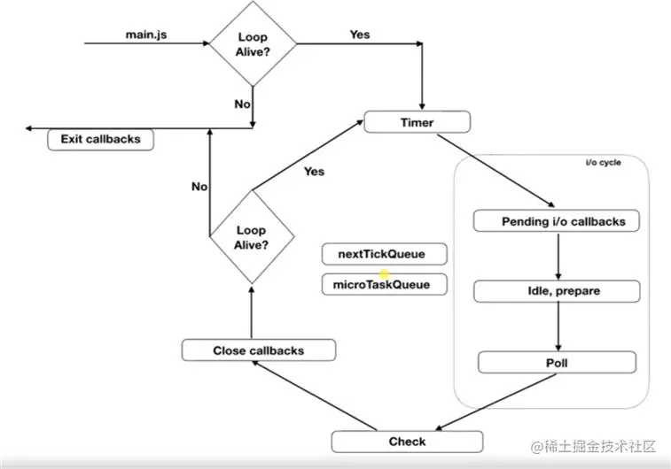
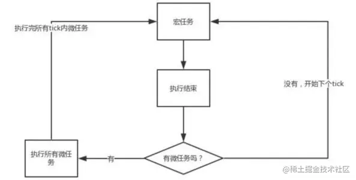

## 事件循环

JS是单线程的，当有异步任务时会交给系统内核。操作完成时内核会通知Node.js将任务添加到轮询队列中等待执行。

所有的同步代码都会优先在主线程中执行，执行完后才会开始执行异步任务。所以定时器的时间不是完全可靠的,如下面的代码：

```js
for (let i = 0; i < 10000000000; i++) {}
setTimeout(() => console.log('异步代码执行完了'), 0); // 可以看出定时器是在循环后执行，而不是0毫秒后执行
```

下图是代码执行的顺序：  同步代码都执行完毕后，会先看有没有定时器**到时间**，有就执行（`Timer`）。接着执行IO、文件读取、网络请求等（`I/O callback`s）。`idle,prepare`阶段是内部执行的，不用管。`poll`就是轮询等待前面的I/O任务执行结果，如果有新的I/O任务，将会继续进入`Pending`阶段。`setImmediate`中的回调会在这个阶段执行。`Close callbacks`阶段执行各种`close`事件的回调，如`socket.on('close',()=>...)`。接着查看是否还有异步任务，有就执行。一直循环到没有异步任务就完成脚本。顺序如下：

- setTimeout、setInterval
- I/O任务
- setImmediate
- close

## 宏任务、微任务

事件循环的过程中，先执行宏任务，执行宏任务过程中如果有可执行的微任务，就执行微任务，没有就继续执行新的宏任务。



宏任务：

- script( 整体代码)
- setTimeout、setInterval
- setImmediate
- I/O、UI 交互事件 微任务：
- Promise
- MutaionObserver、
- process.nextTick(Node.js 环境)
