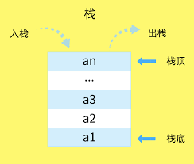
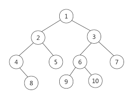

写代码的目的是什么？是用代码写出经过编译后机器可以执行的命令（二进制流），根本之处在于数据。代码都存放在代码区，数据存储在数据区。那么数据在内存中是怎么存储的呢？在`JavaScript`中数据分为基本类型和引用类型。基本类型存储在栈（stack）内存中，引用类型存储在堆（Heap）内存中。什么是栈，什么是堆？它们是计算机存储数据的方式，也就是数据结构。当用代码声明一个变量，其实就是向内存申请空间，给它赋值了那么就是存储数据。数据在内存中存放的形式，就是数据的结构。这两个结构是怎样存储的？栈内存在存储数据如：



栈就好比一个木桶，往里面一个一个放东西，往外面拿的时候最先放进去的因为在桶底（栈底）所以最后被拿出来。基本类型的数据存储的结构就是如此，在存储基本数据的栈内存中数据就是一个一个进去，后进先出。基本类型的数据直接存储在栈内存中。当理解存储结构后看到代码就可以这样理解：

```javascript
var a = 1;
var b = a; // b = 1
```

`"var a"`就是向内存申请空间，需要注意：`“a”`并没有直接存储在内存中，它只是与内存中的数据相关联的标识。`“a”`因为是基本类型所以**数据直接存储在栈内存**。这个 1 占多大？`JS`中所有任何数字都以 64 位浮点数形式存储。这 64 位才存一个“1”有点浪费，不过这不不是重点。将`“a”`赋值给`“b”`，实际上是将`“a”` 的数据直接拷贝过来，改变`“b”`的值，`”a“`不会变。当然，前提是“a”存储的数据是存储在栈空间中的基本类型数据。

引用类型就是由基本类型组合而成的，引用类型里面还可以放任意多个引用类型的数据。如下：

```javascript
var Person = {
    	age: 18,
    	profession: {
    		position: doctor
			experience: {
                ...
            }
        }
    	...
}
```

那么，引用类型就理所应当处于更大的空间中。假如设一个有很多属性的对象存储在栈内存，需要修改属性时，在需要修改的数据之后存储的数据一个一个被拿出来，修改好后再放回去。这多影响性能啊，所以引用类型存储在堆内存中。堆内存比栈内存要大，存储的方式如下图：



创建对象，就是在堆内存开辟空间。这个堆内存中又有两个部分，一个部分存储数据，一个部分存储这个空间所在内存中的地址，访问这个对象就是通过这个地址值。访问堆内存要通过栈内存，也就是说前面代码中将对象赋值给`Person`，并非直接存储堆内存中的对象。而是将这个对象的地址值存放在栈内存中，通过`Person`找到栈内存中的地址，通过这个地址找到对应的对象。

```javascript
var xiaoming = {
    age: 18
    gender: "male"
}
var xiaofang = xiaoming
xiaofang.gender = "female"
console.log(xiaoming.gender) //female
```

将`xiaoming`拷贝给`xiaofang`，其实是拷贝的栈内存中的地址值。与基本类型一样，赋值就是将存储在栈内存中的东西拷贝一份。不过，基本类型的数据直接存储在栈内存，因为拷贝的是数据，所以互不影响。引用类型在栈内存中存放的只是地址值，所以赋值后它们引用的同一个地址值。也就是说它们不止数据一样，如果修改一个，会影响其它相同地址值的对象。  
总结以下：JavaScript 中，基本类型的数据存放在栈内存中，引用类型的数据存放在堆内存中。访问对象要先通过标识符访问栈内存中的地址值，通过地址值访问对象。
