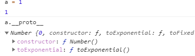

JavaScript是一个弱类型语言，不需要声明变量的类型，意为着一个变量可以存储任意类型的数据。代码执行的时候数据的类型由JS引擎自动确定。JS中数据分为基本类型和引用类型。基本类型有`number`、`string`、`boolean`、`null`、`undefined`_（新标准中增加了`symbol`和`BigInt`类型）_。引用类型有`object`、`function`、`array`，其实`function`和`array`本质上也是对象（`object`）。

怎样可以知道一个变量存储的数据是什么类型呢？通常使用`typeof`函数：

```javascript
var a = 1;
typeof a; //返回number		typeof a 与 typeof(a)等效
var b = 'data';
typeof b; //返回string
var c = true;
typeof c; //返回boolean
var t = null;
typeof t; //返回object
var d = [1, 'data', true];
typeof d; //返回object
```

是不是从第8行开始有点疑惑？前面不是说的`null`是基本类型吗，为什么返回的是`object`呢？或者说什么时候`typeof`会返回`object`？`null`与`undefined`的意思有点类似，它们有什么区别呢？其实这是历史遗留的问题，不用太过深究。声明了一个变量但是没有赋值，那么它初始值就是`undefined`，如果赋值一个对象，那么就是`object`。 `null`的定义是一个未设置对象的值的值。说白了，一个变量打算是对象，但是还未想好属性值。那么就给它赋值`null`，代表这个变量以后存储的是对象。第10行说明如果判断基本类型，`typeof`够用。但是引用类型如果要判断具体类型的话，不一定。复杂类型应该使用`instanceof`，如：

```javascript
var a = {};
var b = [1, 2];
var c = function () {};
var d = 1;
var e = new Number(1);
a instanceof Object; //返回true
b instanceof Array; //返回true
c instanceof Function; //返回true
d instanceof Number; //返回false
e instanceof Number; //返回true
```

用它同样可以判断基本类型的数据，那为什么先用`typeof`举例子引出`instanceof`呢？因为`instanceof`在判断基本类型时，不是用new声明的类型，就返回`false`，`null`和`undefined`都是返回`false`。综上所述，判断一个变量是什么类型时通常使用`typeof`，然后用`instanceof`。基本类型用`typeof`，引用类型用`instanceof`。

JS可以把基本类型临时转换成对象，于是偶然间发现



也就是说可以通过判断构造函数来判断数据类型了

```javascript
var a = 1;
a.constrructor === Number; //返回true
```

不过`undefined`和`null`不能用此方法。

通过某个对象调用`toString`方法也可以判断，如下：

```javascript
var a = 1;
var b = {};
var c = [];
var d = function () {};
toString.call(a); //返回[object Number
toString.call(b); //返回[object Object]
toString.call(c); //返回[object Array]
toString.call(d); //返回[object Function]
//用apply效果自然也是一样的
```
