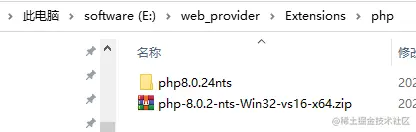
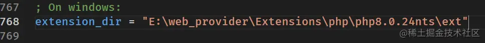
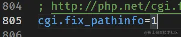
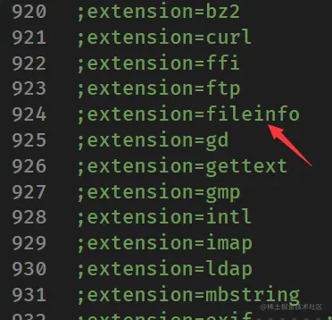
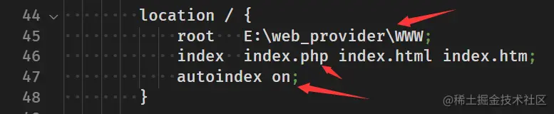
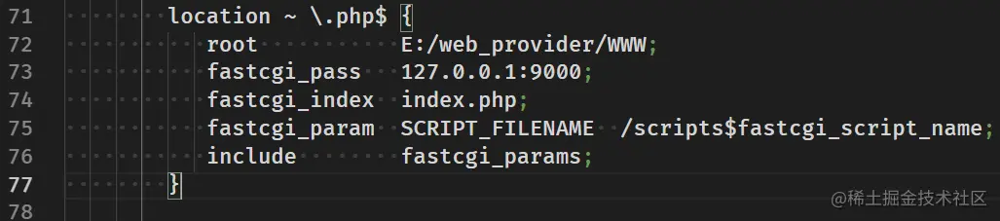
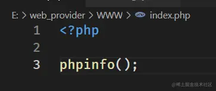
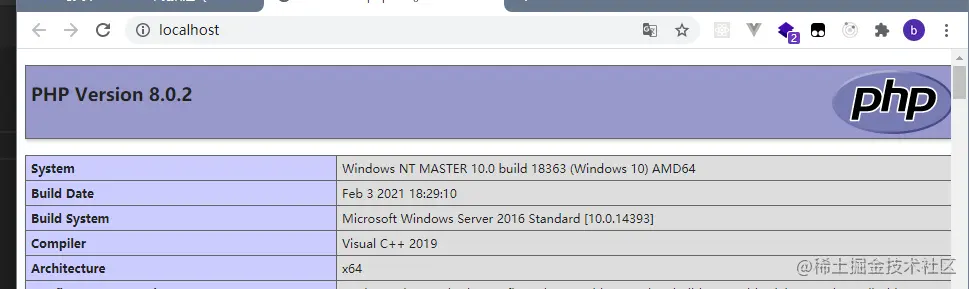

## 一、安装PHP

（一）下载PHP，建议使用7.4以上版本。如果服务器使用Fast CGI的话可以选择nts版本（非线程安全版）。

> [windows.php.net/downloads/r…](https://windows.php.net/downloads/releases/)

（二）解压到一个不带中文，不包含空格的目录。  （三）进入目录，将`php.ini-development`文件复制一份并改名为`php.ini`。

- 将`php.ini`中的`extension_dir`找到，去掉`;`注释并将目录修改为自己的目录。指定php的扩展库目录。 
- 将`cgi.fix_pathinfo`注释去掉。使得nginx可以以Fast CGI整合。 
- 需要什么扩展就添加`extension=` + `库名`（这个库要放在ext目录下）。这里我将`fileinfo`（猜测文件内容类型和编码）、`mbstring`(编码和字节处理)和`openssl`（对称/非对称加解密）模块开启了。 

（四）命令行在php目录执行`php -v`可以查看php版本。为了方便，可以将目录添加到环境变量中（包含php.exe的目录）。

## 二、安装composer

可以直接去官网下载安装器，一直下一步。命令行输入composer 有正常反馈就就是安装好了。

> [getcomposer.org/download/](https://getcomposer.org/download/)

为了下载依赖能更快，用下面命令换源：

```bash
# 禁用默认源
composer config -g secure-http false
# 换成阿里源
composer config -g repo.packagist composer https://mirrors.aliyun.com/composer/
# 查看配置信息
composer config -g -l
```

## 三、安装laravel

安装laravel安装器：

```bash
# composer 下载laravel安装器
composer global require "laravel/installer"
# 查看安装器版本
laravel -V
```

## 四、安装nginx

- 下载[nginx](http://nginx.org/en/download.html)。
- 解压到没有中文没有空格的目录。
- 配置nginx.conf,如下操作：  更改资源目录，增加php文件支持，如果没有匹配的就显示目录。接下来将下面片段的注释去掉并将`/script`替换为root目录。  在资源目录创建index.php文件，然后启动，访问[localhost](http://localhost)查看是否成功（同时启动php-cgi与nginx）。



成功会显示如下。 

- 启动nginx。
  - start nginx
- 关闭所有nginx进程。
  - taskkill /im nginx.exe /f
- 启动php-cgi。
  - php-cgi -b 9000 -c php.ini
