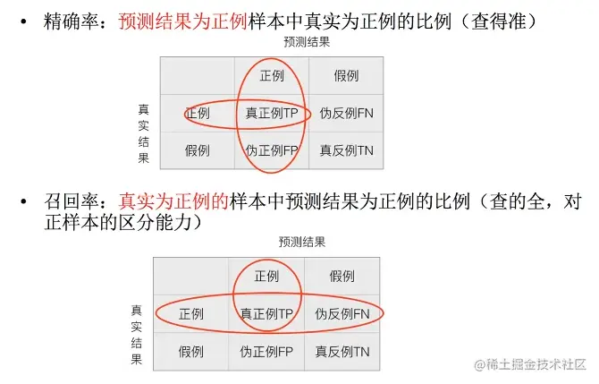
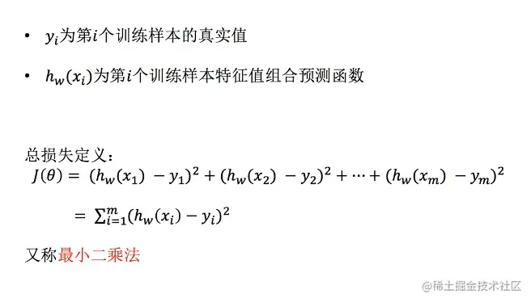

## 一、概述

机器学习是人工智能的实现 方式之一。通过大量数据（数据集）进行建模来辅助决策。重要的过程如下面的公式：

> y=f(x)

x代表测试集，y表示预测的结果，f就是建立的模型。y越接近实际情况说明模型越好。可以理解成f是一个函数，x是输入，y是输出，编写一个函数，要求是通过输入x（已知数据）得出接近真实情况的y。

## 二、基础

### 数据集

几乎没有用数据库存储的数据集，最常见的数据集文件是.csv格式的。数据集由特征值和目标值组成，特征值是一个一个列字段，比如：单价、品牌等等,目标值是要预测的值，比如：销量。有些数据集可以没有目标值。通常使用pandas读取数据并做基本处理。

### 特征工程

指的是把原始数据转变为模型的训练数据的过程，它的目的就是获取更好的训练数据特征，提高预测的准确性。

#### 数值型数据预处理

**归一化**：通过对原始数据进行变换把数据映射到（默认\[0,1\]）之间。使某一特征不会对最终数据造成比其它特征更大的影响。

> X' = x-min/max-min X'' = X'\*(mx-mi)+mi

**标准化**：通过对原始数据进行变换把数据变换到均值为0，方差为1范围内。相对归一化，计算结果不容易受异常点（离群值）的影响。

> X'=x-mean/θ **缺失值处理（填补）** Imputer(missing\_values='NaN',strategy='mean',axis=0) /\* sklearn API \*/

对空值填补列平均值。axis=1的话就是行。

#### 类别型数据

One-Hot编码

#### 事件类型

时间的切分。

#### 数据降维（减少特征数量）

**特征选择**：选出部分特征，删除低方差的特征。（方差低说明大部分值是差不多的）。sklearn API:

> sklearn.feature\_selection.VarianceThreshold(threshold = 0.0) # 默认值，将相同的值删除

**PAC主成分分析**：在不尽量少损失信息的情况下，尽可能降低原数据的维度。sklearn API:

> PCA(n\_components=0.95) # 代表信息损失比例，小数或者百分数都可，通常90%~95%之间。

### 算法分类

算法是核心，数据和计算是基础。机器学习里数据类型分为两种：离散型数据、连续型数据。

离散型数据是可以用整数表示且能列举的变量，连续性数据是在一个区间内可以连续不断取值的变量。

网上看到一个很形象的例子：一个寻呼台一个小时接到的电话,虽然是受随机因素影响的变量,而且很大,但可以数清的,可以全部列举出来的,这是离散型随机变量,而一个人高度,因为精度的不同,所以不能列举出来的,这个是连续型变量,还有连续型随机变量也可以按一定顺序排列的,这好比一个人的身高1米5波动,而1个1米6波动,很明显哪个高哪个低。

#### 监督学习（预测）

有特征值和目标值，相当于老师给题目给答案让学生练题。目标值是离散型的就用分类算法，目标值是连续型的就用回归算法。

- 分类 k近邻、贝叶斯分类、决策树与随机森林、逻辑回归、神经网络
- 回归 线性回归、岭回归
- 标注 隐马尔可夫模型

#### 无监督学习

只有特征值

- 聚类 k-means

### 机器学习开发流程

获取数据 -> 明确做什么，建立模型（根据数据类型划分模型种类）-> 数据基本处理（缺失值、合并表）-> 特征工程（筛选特征、标准化、文本转化）-> 选择合适的算法进行预测 -> 模型的评估 -> 使用

## 转换器与估计器

### 转换器

- fit\_transform()

```scss
fit_transform() == fit(data) + transform(data)
fit(data) 输入数据
transform() 计算平均值、方差等。将数据转换成合适的数据。
```

### 估计器

估计器（estimator）是一类实现了算法的API

```
用于分类的估计器
sklearn.neighbors							knn
sklearn.naive_bayes							贝叶斯
sklearn.linear_model.LogisticRegression					逻辑回归
sklearn.tree								决策树与随机森林

用于回归的估计器
sklearn.linear_model.LinearRegression					线性回归
sklearn.linear_model.Ridge						岭回归

用于无监督学习的估计器
sklearn.cluster.KMeans 							聚类
```

## K-近邻（KNN）

用一个数据和K个邻居（接近的点），几个数据中多数邻居的类别是什么，它的类别iu是什么。判断相近是依靠距离，距离通过[距离公式](https://baike.baidu.com/item/%E6%AC%A7%E5%87%A0%E9%87%8C%E5%BE%97%E5%BA%A6%E9%87%8F/1274107?fromtitle=%E6%AC%A7%E5%BC%8F%E8%B7%9D%E7%A6%BB&fromid=2809635&fr=aladdin)得出。因为相似的样本，特征之间的值是相近的。

需要做标准化处理。

### sklearn API:

```ini
sklearn.neighbors.KNeighborsClassifier(n_neighbors=5,algorithm='auto')
```

n\_neighbors: K取值，int型,可选（默认5），k\_neighbors查询默认使用的邻居数。

algorithm：{'auto','ball\_tree','kd\_tree','brute'}，可选用于计算最近邻居的算法：'ball\_tree'会使用BallTree，'kd\_tree'会使用KDTree。'auto'将尝试根据传递给fit方法的值来决定最合适的算法。（不同实现方式影响效率）。

K值取小的话容易受异常点影响。K值取大也容易受类别波动。

- 优点

  - 简单，容易实现，不用训练，不用估计参数。

- 缺点

  - 计算量大，开销大。必须指定K值，K值选择不当则分类精度不能保证。适合数据量不大的场景（几千~几万）。

## 朴素贝叶斯

“朴素”的意思是，这个算法更适合特征独立时使用，常用的分类算法。如果训练集误差大，结果肯定不好。

### 概率基础

概率定义为一件事情发生的可能性。

- 联合概率 包含多个条件，且所有条件同时成立的概率。

> P(A,B)  
> P(A,B) = P(A)P(B)

- 条件概率 时间A在另一个时间B已经发生条件下的发生概率

> P(A|B)  
> P(A1,A2|B) = P(A1|B)P(A2|B)

- 贝叶斯公式(单纯调API了解就行)

> P(C|W) = P(W|C)P(C)/P(W)  
> P(C|F1,F2,...) = p(F1,F2,...|C)P(C)/P(F1,F2,...)

- 拉普拉斯平滑 有时计算概率为0，可能并不合理。为了解决这个问题，可以用拉普拉斯平滑系数。计算概率是在分子分母都加上一个数，保证结果不为0。

#### sklearn API:

```ini
sklearn.naive_bayes.MultinomialNB(alpha=1.0)
```

alpha就是拉普拉斯平滑系数，防止类别概率为0。

- 优点
  - 有稳定的分类效率。
  - 对确实数据不敏感，常用于文本分类。
  - 分类准确度高，速度快。
- 缺点
  - 使用了样本独立性的假设，如果特征之间有关联的话效果没那么好。

## 分类模型的评估

- 准确率 以二分类为例。评估的标准通常使用**准确率**，就是预测对的/所有。
- 召回率 预测结果为正例（预测为某一类为真实情况的概率）的比例，比如一个判断是否确诊的模型，一定要保证尽量不放过确诊的样本。 
- F1-score，反应模型稳健性。

### sklearn API

```ini
# 得到精确率（通常用不上）、准确率和召回率。
sklearn.metrics.classification_report(y_true,y_pred,target_names=None)
```

x\_true：真实目标值

y\_pred：估计器预测目标值

target\_names：目标类别名称

## 交叉验证和网格搜索

### 交叉验证

将所有数据分成n等份，相当于所有数据都当过训练集和测试集。分成n份，就叫n折交叉验证。这样可以保证准确率的可信度。它们的准确率的平均值就是模型结果。

### 网格搜索

很多算法有需要手动设定的参数（比如K近邻的K值），这种参数叫超参数。通常对模型预设几种超参数组合。每组超参数都采用交叉验证进行评估。最后选出最优参数组合建立模型。

### sklearn API

```ini
sklearn.model_selection.GridSearchCV(estimator,param_grid=None,cv=None)
# 对估计器的指定参数值进行搜索
```

estimator：估计器对象

param\_grid：估计器参数(dict){"n\_neighbors":\[1,3,5\]}

cv：指定几折交叉验证

fit：输入训练数据

score：准确率。

best\_score\_：交叉验证当中最好的结果。

best\_estimator\_：最好的模型。

cv\_results\_：每个超参数每次交叉验证的结果。

## 决策树

类似if-then结构。一颗树的顶点是最能帮助消除不确定性的问题。再往下延伸节点，每个节点都使问题更接近结果。越下面的节点能消除的不确定性越少。

### 信息熵

- 不确定性越大，信息熵越大。
- 信息熵只反映内容的随机性，与内容本身无关。
- 信息熵越大，表示占用的二进制位越长，可以表达更多的符号。
- [阮一峰老师文章](http://www.ruanyifeng.com/blog/2014/09/information-entropy.html)

### 信息增益

那么哪个特征作为树顶点，以及在某个特征之上还是之下？其中一个依据是通过信息增益决定。得知一个特征条件后，减少的信息熵的大小就是信息增益。

### sklearn API

> sklearn.tree.DecisionTreeClassifier(criterion='gini',max\_depth=None,random\_state=None)

criterion：默认是基尼系数，也可以选择信息增益的熵'entropy'。

max\_depth：树的深度大小。

random\_state：随机数种子。

decision\_path：返回决策树的路径

- 优点
  - 易于理解，数目可视化
  - 不需要花大量时间在数据预处理
- 缺点
  - 数据过于复杂的话容易过度拟合（测试集准确率高，其它数据准确率没那么高）

## 随机森林

### 集成学习方法

生成多个分类器/模型，说白了就是用多种算法混合在一起各自独立的做预测。最后结合成一个预测。

### 随机森林定义

包含多个决策树的分类器，最终预测结果由每个树得出结果的众数决定。

### 建立多个决策树的过程

- 单个树的建立过程：
  - 在N个样本中随机选择一个样本，重复N次。样本有可能重复。
  - 随机在M个特征中选出m个特征

### sklearn API

> sklearn.ensemble.RandomForestClassifier(n\_estimators=10,criterion='gini',max\_depth=None,bootstrap=True,random\_state=None)

n\_estimators：森林里的树木数量，默认是10.（通常：120、200、300、500、800、1200）

max\_depth：树的最大深度。（通常：5、8、15、25、30）

max\_features="auto",每个决策树的最大特征数量。

bootstrap：是否在建立决策树的时候使用bootstrap抽样（随机有返回的抽样。随机是为了避免每次建立的决策树都一样，放回是为了样本被抽取完。）。

- 优点
  - 准确率高
  - 适合在样本数和特征数多的数据集运行
  - 适合处理高维特征的输入样本，不需要降维
  - 能够评估每个特征的重要性

## 线性回归

通过多个特征和目标值之间的关系进行建模的回归分析，**找出每个特征对结果影响的权重**。在二维中是直线关系，三维中是平面关系。比如预测成绩，给出3个成绩预测出最终成绩。求出每个成绩的权重就很容易算出最终成绩。

> f(x) = w1_x1 + w2_x2 + ··· + wd\*xd + b # b 是偏置，单个特征的情况下更通用。

一元线性回归指的是只有一个特征，一个目标值。多元线性回归指两个或者多个特征的。

### 矩阵

大多数算法的计算基础。必须是二维的。为了满足特定运算需求而存在。最大运算需求就是矩阵乘法。推荐看\[阮一峰老师文章\]。([www.ruanyifeng.com/blog/2015/0…](http://www.ruanyifeng.com/blog/2015/09/matrix-multiplication.html))

> (m行,1列) \* （1行,n列） = （m行，n列）

## 损失函数

 就是将每个预测值与真实值的误差的平方和，最终就是总损失。优化损失函数就是为了找到能造成最小误差的w（每个特征的权重）。
