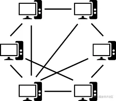
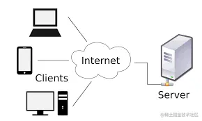
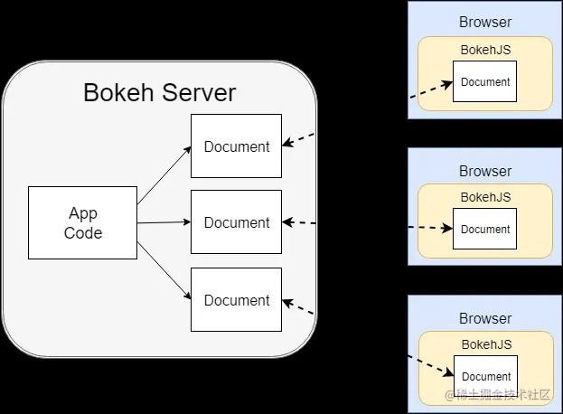

多人游戏相比单人游戏，多了一个网络通信达到数据信息共享的问题。比如一个玩家移动了位置，就需要将他移动位置的信息发送给多人游戏中的其它玩家，其它玩家来更新那个玩家移动后的位置。

## 点对点（P2P）

最简单的方式，两个机器直接连接，直接将信息发送给另一方。如果只有两个玩家，是一中简单高效的方式。但是它的弊端有两点：

- 玩家数量多时会有大量的数据在网络上传输
- 游戏版本不可控制

假设游戏中存在的玩家大于 _2_ 个，一个玩家信息变化，需要将变更位置的信息同时给其它玩家发送。比如说 _玩家1_ 向北移动了 _100_ 米， _玩家1_ ，就要 _依次_ 给每个玩家的机器发送一遍信息。如果玩家数量较多时，这样频繁的 _建立链接_ 、_发送数据_ 显得并不是很适合。

数据的传输需要时间，一台机器信息变更后，其它机器接收到信息之前还是原版本。_玩家1_ 移动后，_玩家1_ 自己机器上是动了，但是数据发送到其它机器之前，其它机器还是认为 _玩家1_ 没有移动。因为是 _依次_ 发送数据，每台机器都要单独发送一次，那么先接收到数据的机器和后接受到的又存在一定延迟。最终导致每个机器上的游戏实例，信息差距很大，无法判断谁的版本是正确的。下图为 _p2p_ 网络模式构架图。

## 客户端/服务器模型（C/S）

一台机器作为服务器（ _Server_ ）其它机器作为客户端（ _Client_ ）。每个客户端只和服务器通信，不直接将信息发给其它客户端。服务器可以限制客户端需要满足发送数据和接收数据的带宽（网速）要求才能通信。_玩家1_ 移动时，将移动的信息发给服务器，服务器再将 _玩家1_ 移动过的信息发给其它客户端。这样一来，所有数据信息都是由服务器接管，也意味着只有服务器运行的游戏版本才是正确的版本，它上面的信息才是客户端运行游戏的依据。下图为 _C/S_ 架构的架构图。

上面 _玩家1_ 移动的例子，信息由服务器分发到客户机的 _数据分布形式_ 称为复制（ _replication_ ）。实现 _C/S_ 模型有多种方式。

- 监听服务器（ _Listen-Server_ ）。

一个玩家充当服务器，可以接收远程客户端的连接。但是他这个 _服务器_ 中也存在着他操控的游戏角色。很多能够局域网联机的游戏，譬如红警、CS 1.6 等的局域网联机，就是由房主作为服务器。

- 专用服务器

一台独立的机器专门被指定为服务器，只用作数据信息的传输交换，不需要音效、输入、渲染图像等。所以更加高效、稳定。

_Unreal Engine_ 使用 权威主机模型（ _Authoritative_ _Server_ /_Client_ ）。始终有一个机器作为服务器，其它服务器作为客户端。服务器版本是权威版本，任何时候都只用服务器上的数据。 _Unreal Engine_ 中运行单人游戏，依然使用的 _C/S_ 模型，客户端和服务器都是一台机器。

## 浏览器/服务器模型（B/S）

客户端不专门安装一个应用程序运行游戏，使用浏览器来作为客户端。_B/S_ 模型更新游戏版本时，只需要要升级服务器即可，无需用户重新下载。缺点是浏览器性能有限。下图为 _B/S_ 架构图。

