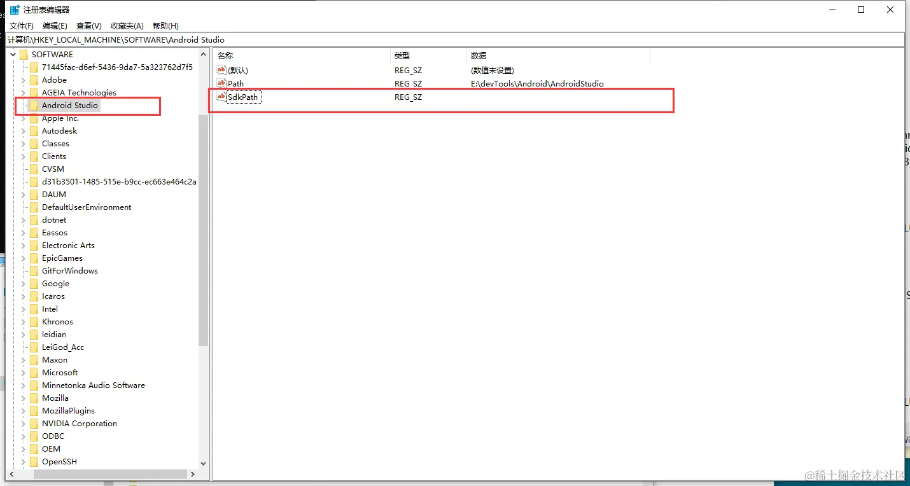
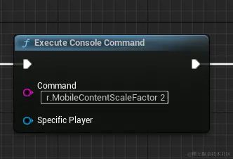

在使用 _UE_ 前我的电脑里已经装过 _Android Studio_ ，所以就没有按照官方文档的做。安装 _Android Studio_ 主要就是用它的 _SDK Manager_ 去安装 _3_ 样东西：_API、NDK、cmdline-tools_ ，我确定我是装好了的（_API Level 30、NDK 25.1.8937393、cmdline-tools latest_）。但是打包失败，提示没有安装 _Android Studio_ 。如果按照官方文档从零安装，或许不会遇上我这个问题，但我能承受自己瞎折腾的后果，所以开始折腾。

## 改注册表

根据官方文档，总是提到 _SetupAndroid.bat_ ，那就先找找这个文件，它在引擎安装目录下（我的目录为 _J:\\Epic Games\\UE\_5.1\\Engine\\Extras\\Android_ ）。先双击运行，它提示如下内容：

```sh

Android Studio not installed, please download Android Studio 3.5.3 from https://developer.android.com/studio

```

我非常确信我已经安装了，所以我猜测是不是因为我没有配环境变量的原因，先在系统里配置了环境变量（变量名是 _ANDROID\_HOME_ ，变量值是 _E:\\devTools\\Android\\Sdk_ ，在 Path 变量添加 _%ANDROID\_HOME%\\bin_ ）。再次执行，依然提示没有安装。于是我用编辑器打开这个脚本，好在这个脚本看起来并不复杂，很快我就发现了原因，在控制台输出未安装的脚本内容如下：

```sh
FOR /F "tokens=2*" %%A IN ('REG.exe query "%KEY_NAME%" /v "%VALUE_NAME%"') DO (set STUDIO_PATH=%%B)

IF EXIST "%STUDIO_PATH%" (
	echo.
	) ELSE (
	echo Android Studio not installed, please download Android Studio 3.5.3 from https://developer.android.com/studio
	%PAUSE%
	exit /b 1
)
```

往上看，它企图在注册表里找键为 _KEY\_NAME%_ 值为 _VALUE\_NAME_ 的东西，再往上看就可以看出来，解决这个问题的办法就是在注册表中如下图加入脚本中提到的键值对：



这里 \* Path \* 就是 _Android Studio_ 存放的位置，_SdkPath_ 没有给值，那为什么要加它？因为脚本中会根据这个键去找东西，内容如下：

```sh

set VALUE_NAME=SdkPath
set STUDIO_SDK_PATH=
FOR /F "tokens=2*" %%A IN ('REG.exe query "%KEY_NAME%" /v "%VALUE_NAME%"') DO (set STUDIO_SDK_PATH=%%B)

set ANDROID_LOCAL=%LOCALAPPDATA%\Android\Sdk

if "%STUDIO_SDK_PATH%" == "" (
	IF EXIST "%ANDROID_LOCAL%" (
		set STUDIO_SDK_PATH=%ANDROID_LOCAL%
	) ELSE (
		IF EXIST "%ANDROID_HOME%" (
			set STUDIO_SDK_PATH=%ANDROID_HOME%
		) ELSE (
			echo Unable to locate local Android SDK location. Did you run Android Studio after installing?
			%PAUSE%
			exit /b 2
		)
	)
)

echo Android Studio SDK Path: %STUDIO_SDK_PATH%

```

简而言之，它先假设注册表里 _Android Studio_ 这一项里有 _SdkPath_ 这个东西，它为空字符串就给它赋值为 _ANDROID\_HOME_。所以如果不添加 _Path_ ，这个脚本会说你没安装 _Android Studio_ ，如果没有 _SdkPath_ 它会说你没有安装 _SDK_ 。同时，你也必须配有 _ANDROID\_HOME_ 这个环境变量（当时挺无语的，Epic 为啥认为用户一定得按照它官方文档的方式来安装 _Android Studio_，不给自定义安装的机会呢？转念一想，我要是开发人员可能会说“为什么这些用户就是不肯按照文档傻瓜式操作呢！”。🧐）。

## 配置 Path 环境变量

实际上，根据脚本内容，还是要给 _Path_ 这个环境变量追加值的。内容就是 _%ANDROID\_HOME%\\platform-tools;%ANDROID\_HOME%\\tools;_ ，脚本中对应的部分如下：

```sh

# 你可以直接复制然后搜索
set PLATFORMTOOLS=%STUDIO_SDK_PATH%\platform-tools;%STUDIO_SDK_PATH%\tools

```

此时，执行 _SetupAndroid.bat_ 依然有问题，控制台输出如下：

```sh

Unable to locate sdkmanager.bat. Did you run Android Studio and install cmdline-tools after installing?

```

又和我说我装了的东西不存在？反正现在也算看的懂 _bat_ 脚本了，看呗！找到输出这个报错的部分：

```sh

set SDKMANAGER=%STUDIO_SDK_PATH%\tools\bin\sdkmanager.bat
IF EXIST "%SDKMANAGER%" (
    echo Using sdkmanager: %SDKMANAGER%
) ELSE (
    set SDKMANAGER=%STUDIO_SDK_PATH%\cmdline-tools\latest\bin\sdkmanager.bat
    IF EXIST "%SDKMANAGER%" (
        echo Using sdkmanager: %SDKMANAGER%
    ) ELSE (
        echo Unable to locate sdkmanager.bat. Did you run Android Studio and install cmdline-tools after installing?
        pause
        exit /b 1
    )
)

```

看起来问题出在了 _SDKMANAGER_ 上面。但是蹊跷的是，我手动根据目录，是可以在找到 _sdkmanger.bat_ 的。好在我在 _stackoverflow_ 上找到了相关的帖子，解决方法是用 _SDKMANAGER=%STUDIO\_SDK\_PATH%\\cmdline-tools\\latest\\bin\\sdkmanager.bat_ 代替上面的 _set SDKMANAGER=%STUDIO\_SDK\_PATH%\\tools\\bin\\sdkmanager.bat_。原因是批处理脚本变量覆盖的问题，想查看具体原因的[点这里](https://stackoverflow.com/questions/71563864/unable-to-locate-sdkmanager-bat-did-you-run-android-studio-and-install-cmdline)。

## JDK 版本问题

此时试图执行 _SetupAndroid.bat_，可能依然存在问题。我这里报错显示的是 _JDK_ 版本低了，我想不是在 _UE_ 里配置的用 _Android Studio_ 的 _JRE_ 吗？按道理不该说这个问题呀，转念一想，是这个脚本的问题，打开一看，果然：

```sh

if DEFINED JAVA_HOME (set a=1) ELSE (
	set JAVA_HOME=%STUDIO_PATH%\jre
	setx JAVA_HOME "%STUDIO_PATH%\jre"
)

```

于是去看了下 _Android Studio_ 的版本，是 _11_ 的，我现在 _JAVA\_HOME_ 存的是 _JDK8_ 的路径。还好我同时有 _JDK17_ （我不会说我想做全栈的），切换变量值后再执行，脚本成功执行了。切换回 _UE_ ，打包到安卓成功了。

我用的 _API Level_ 是 _30_ 的，所以运行在安卓系统版本为 _11_ 的手机上没有问题，但是在 _9_ 上会存在解析安装包错误的问题，这个就需要改 _SDK_ 版本了。

## UE 中的版本设置

在 _UE_ 的设置中，要设置正确版本，否则可能存在打出包来了，但是安装时提示解析安装包错误的问题。首先是 _Project Setting -> Platforms -> Android_ 有两个设置 _Minimum SDK Version_、_Target SDK Version_ ，都设置为 _30_ （跟你想兼容的系统有关，我是安卓 _11_ ）。然后是 _Project Setting -> Platforms -> Android SDK_ ，_SDK API Level_ 设置为 _matchndk_ ，_NDK API Level_ 设置为 _android-25_（取决于你 _NDK_ 的版本）。

## 画质优化

我想过打包成安卓画质会变差，但默认情况下打包出来的画质也太差了，在 BeginPlay 节点添加设置后，好多了，而且帧率并没有下降很多。设置如下：



它用于缩放设备上的内容，决定了像素密度。
