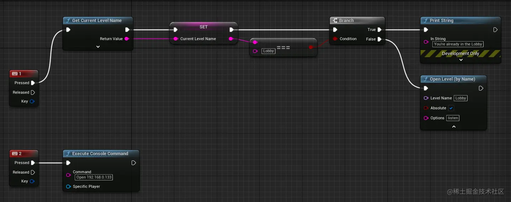
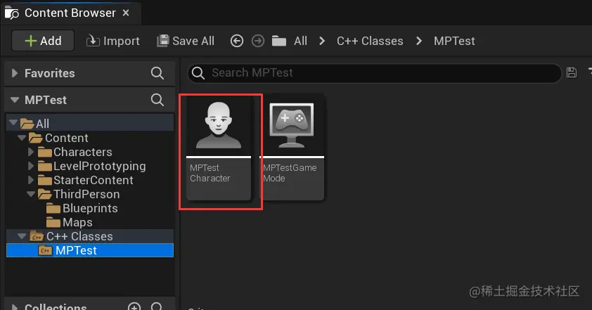
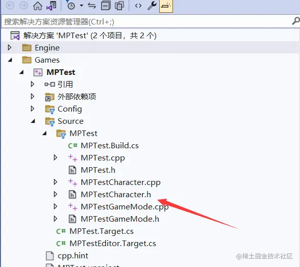
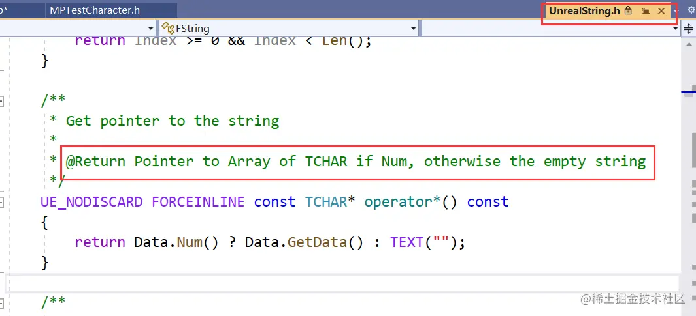
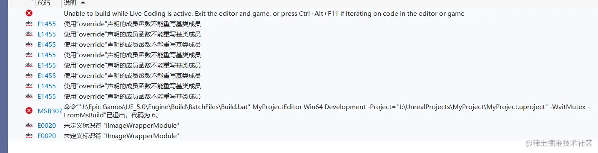
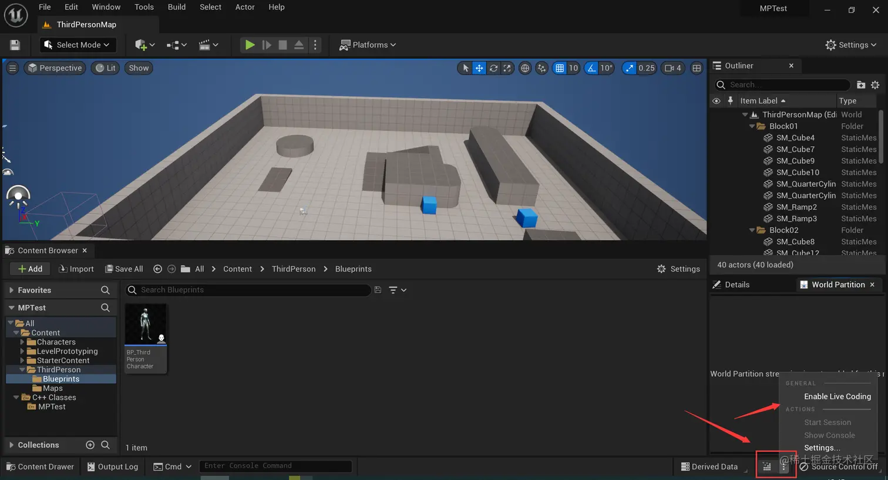
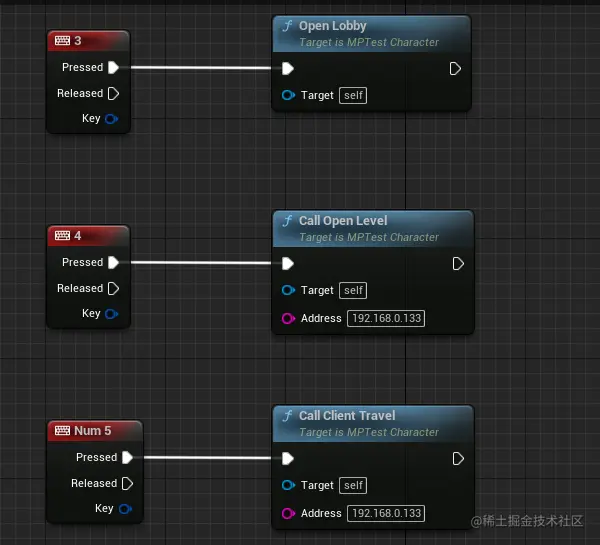

本文记录通过蓝图以及 _cpp_ 的方式建立局域网连接。

## 蓝图实现

Unreal Engine 建立局域网（Lan）连接

使用 _Open Level_ 节点可以切换到其它关卡， _Level Name_ 为关卡的名字，_Options_ 如果填 _listen_ 则让这个实例作为 _Listen Server 。使用_ _Execute Console Command_ 可以执行控制台命令，使用下面的命令可以打开 _ip_ 地址为 _192.168.0.133_ 的关卡（显然这是一个内网地址，也就是局域网内的地址）。



将人数设置为 _2_ 人后，将网络模式设置为 _Play As Listen Server_ ，接着打包。本地运行两个打包后的 _exe_ 文件，其中一个按 _1_ ，切换到新建地图并设为 _Listen Server_，另一个按 _2_ 即可访问过去。

## C++ 实现

### 编码

_Content Browser_ 中找到 _C++ Classes_ ，从中找到 _Character 对应的_ _C++_ 文件。双击后 _Visual Stduio_ 会启动。



同时在 _解决方案资源管理器_ 窗口中找到 _Character.cpp_ 的头文件，如下图：



将这两个文件进行修改，添加三个方法的声明与实现。首先是 _MPTestCharacter.h_ 。

```cpp
// MPTestCharacter.h

#include "CoreMinimal.h"
......

UCLASS(config=Game)
class AMPTestCharacter : public ACharacter
{
	// ......

protected:
	// ......

public:
	// ......

	UFUNCTION(BlueprintCallable)   // 这一行的作用是让这个函数能够在 Unreal Engine 的蓝图编辑器中调用
	void OpenLobby();

	UFUNCTION(BlueprintCallable)
	void CallOpenLevel(const FString& Address);

	UFUNCTION(BlueprintCallable)
	void CallClientTravel(const FString& Address);
};

```

接着是 _AMPTestCharacter.cpp_ ：

```cpp
// Copyright Epic Games, Inc. All Rights Reserved.

......
#include "Kismet/GameplayStatics.h"   // 使用 UGameplayStatics 则需要引入

AMPTestCharacter::AMPTestCharacter()
{
	// ......

// 打开 Lobby 关卡
void AMPTestCharacter::OpenLobby() {
	UWorld* World = GetWorld();
	if(World){ // 如果获取到了游戏世界，则通过 ServerTravel 跳转到 Lobby 关卡
		// 路径中 一直到 Content 都可以用 /Game/ 代替。
		// 省略了 Lobby 的后缀
		// ?listen 让它作为 Listen Server
		World->ServerTravel("/Game/ThirdPerson/Maps/Lobby?listen");
	}
}

// 通过 UGameplayStatics::OpenLevel 打开关卡
void AMPTestCharacter::CallOpenLevel(const FString& Address) {
	// 打开关卡， this 代表世界上下文
	// Address 是一个字符串引用，OpenLevel 要求的第二个参数是 FName，直接传入 Address 会提示错误
	// *Address 结果是一个 C 风格字符串
	// 打开传入的关卡
	UGameplayStatics::OpenLevel(this, *Address);
}

// 通过 APlayerController 实例的 ClientTravel 打开关卡
void AMPTestCharacter::CallClientTravel(const FString& Address) {
	// 获取一个 PlayerController
	APlayerController* PlayerController = GetGameInstance()->GetFirstLocalPlayerController();
	if (PlayerController) {
		// 如果存在，则使用ClientTravel 打开传入的关卡
		PlayerController->ClientTravel(Address, ETravelType::TRAVEL_Absolute);
	}
}

// ......

```

前面使用 _UGameplayStatics::OpenLevel_ 时，第二个参数使用的方式是 \*_Address_ 。此时就产生疑惑，怎么传入引用字符串，使用时要加个 \* 呢？它的用法和我理解的好像不太一样。首先想到这是 _FString_ 类型，先看下它有没有重载运算符。果然，通过查看定义可以看到重写了 \* 运算符，它返回一个 _C_ 风格字符串。



### 编译

在 _Visual Studio_ 中编写代码后，要编译代码，使用 _Ctrl + Shift + B_ ，它是编译（生成解决方案）的快捷键。接着，我得到了一堆错误提示，如下图：



如此简单的操作，怎么会报错，而且报的感觉错和我做过的事情毫无关联呢？经过一番检索，我在 [reditt](https://www.reddit.com/) 找到了 [相关帖子](https://www.reddit.com/r/unrealengine/comments/uadj3s/ue5_brand_new_c_project_has_several_coreneth/) 。解决这个问题，首先打开 _Unreal Engine_ ，取消 _Enable Live Coding_ 的勾选。



此时，打开 _Visual Studio_ ，再次使用_Ctrl + Shift + B_ ，就不报错了。

### 在 Unreal Engine 中使用编写的 Cpp 函数

直接挂到 _BP\_ThirdPersonCharacter_ 上面，打开蓝图编辑器如下配置：



最后，可以打包测试了。
