## 基础

插件有以下特性：

- 插件是为特定目的而设计的代码和数据的集合。
- 容易启用或禁用。
- 适用于多个项目。
- 可用于添加运行时、游戏玩法或者添加编辑器功能。
- _Unreal Engine_ 的插件可以从引擎中的插件编辑器中启用。
- 由一个或者多个模块组成。
- _\[YourProjectName\].uproject_ 中的 _Plugins_ 会记录启用的插件。
- 插件本身可以依赖其它插件。
- _Unreal engine_ 支持相互依赖的模块和插件。

## 创建插件

窗口顶部左上角的 _Edit -> Plugins_ ，找到 _Add_ 创建一个空项目，添加项目名称以及描述，步骤如下：

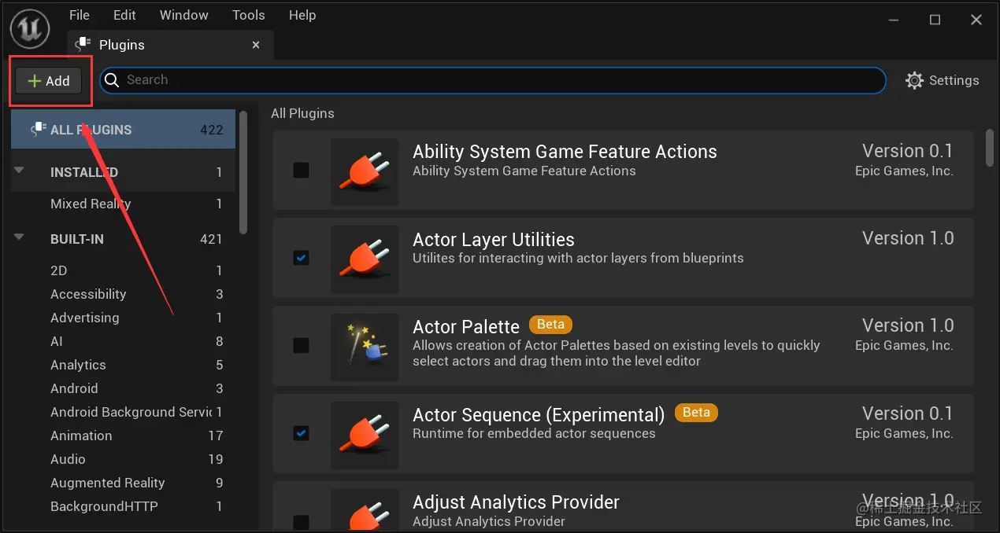

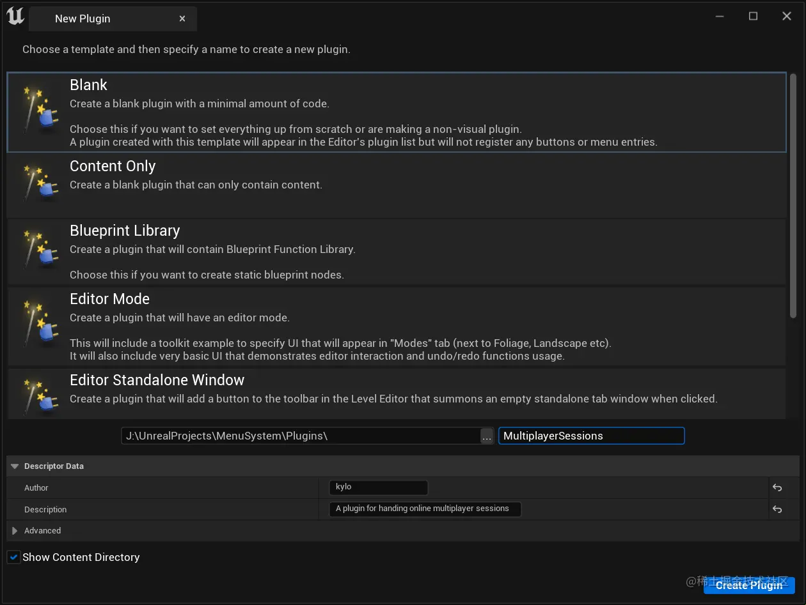

插件创建好了后，_Content Browser_ 中会出现插件文件夹，在 _Visual Studio_ 中重新加载代码，项目目录下会多出一个 _Plugins_ 的目录，里面包含和创建时同名的目录。打开自己的插件目录，找到 _\[yourPluginName\].uplugin_ ，修改如下：

```json
// MultiplayerSessions.uplugin

{
  // ......
  // 添加 OnlineSubsystem 与 OnlineSubsystemSteam 插件
  "Plugins": [
    {
      "Name": "OnlineSubsystem",
      "Enabled": true
    },
    {
      "Name": "OnlineSubsystemSteam",
      "Enabled": true
    }
  ]
}
```

接着在 _MultiplayerSessions.Build.cs_ 修改如下：

```json
// MultiplayerSessions.Build.cs

public class MultiplayerSessions : ModuleRules
{
	public MultiplayerSessions(ReadOnlyTargetRules Target) : base(Target)
	{
	// ......

        // 这两个模块添加到当前位置或者 PrivateDependencyModuleNames 都行
        // 添加到 PrivateDependencyModuleNames 则模块只能在私有源文件中使用
        PublicDependencyModuleNames.AddRange(
			new string[]
			{
				"Core",
				"OnlineSubsystem",
				"OnlineSubsystemSteam",
				// ... add other public dependencies that you statically link with here ...
			}
			);
	// ......
	}
}

```

保存好配置后，_rebuild_ 项目即可。

## 创建自己的子系统

将 _Session_ 操作汇总到一个类中，由于它用于处理多人会话，所以需要让拥有几个特性：

- 游戏创建时生成实例。
- 直到游戏关闭，才销毁实例。
- 在不同关卡中持续存在。

_Game Instace_ 刚好符合这些特性，但是它已经有很多功能，在这个类上添加并不合适。所以需要创建一个 _Game Instace_ _Subsystem_ ，它拥有这些特点，与 _Game Instance_ 共存。一个类继承了 _UGameInstanceSubsystem_ 后，它就是 _Game Instace_ _Subsystem_ 。_Game Instace_ 与 _Game Instace_ _Subsystem_ 的关系如下：

1.  _Game Instace_ 创建后，它的子系统（_Game Instace_ _Subsystem_）的实例也会被创建。
2.  当 _UGameInstance_ 初始化时，将调用子系统的 _Initialize() 函数。_
3.  当 UGameInstance 关闭时，将调用子系统的 _Deinitialize()_ 函数。
4.  此时，对子系统的引用将被删除，如果不再有对子系统的引用，则该子系统将被垃圾回收。

接着，开始创建。在引擎窗口找到 _C++ Classes/\[yourProjectName\]/_ 路径下右击鼠标，新建 _C++_ 类。如下图配置：

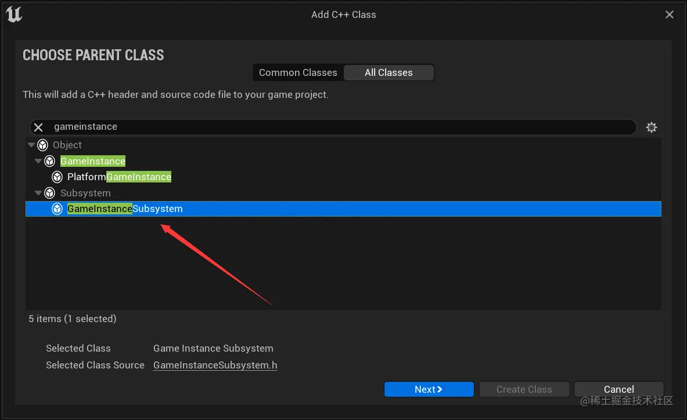

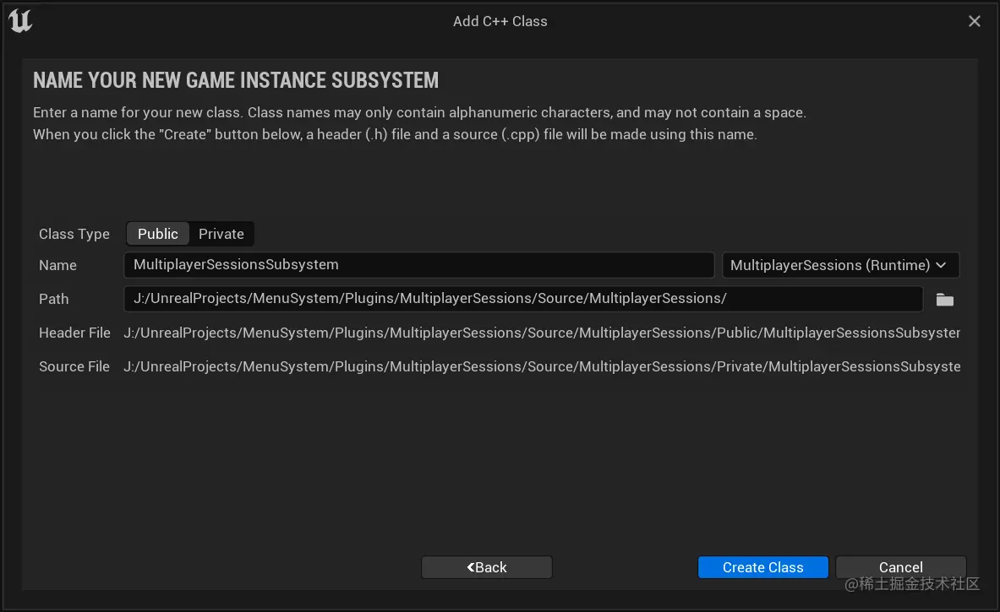

创建成功后，会提示是否查看日志（否），_Visual Studio_ 会提示重新加载（重新加载全部）。接着 _Plugis/MultiplayerSessions/Sourece/MultiplayerSession_ 下面的 _Private_ 与 _Public_ 下面会多出刚刚创建的类的声明与实现。添加一些基础代码：

```cpp
// MultiplayerSessionsSubsystem.h

#include "CoreMinimal.h"
#include "Subsystems/GameInstanceSubsystem.h"
#include "Interfaces/OnlineSessionInterface.h" // SessionInterface 依赖

#include "MultiplayerSessionsSubsystem.generated.h"

UCLASS()
class MULTIPLAYERSESSIONS_API UMultiplayerSessionsSubsystem : public UGameInstanceSubsystem
{
	GENERATED_BODY()

public:
	UMultiplayerSessionsSubsystem(); // 声明构造函数

protected:


private:
	IOnlineSessionPtr SessionInterface; // 用于存储子系统中获取到的 SessionInterface

};

```

```cpp
// MultiplayerSessionsSubsystem.cpp

#include "MultiplayerSessionsSubsystem.h"
#include "OnlineSubsystem.h" // 子系统需要的依赖

UMultiplayerSessionsSubsystem::UMultiplayerSessionsSubsystem() {
	IOnlineSubsystem* Subsystem = IOnlineSubsystem::Get(); // 获取在线子系统
	if (Subsystem) { // 如果存在，则获取 SessionInterface
		SessionInterface = Subsystem->GetSessionInterface();
	}

}

```

## 添加 Session 操作函数和委托

在 _MultiplayerSessionsSubsystem.h_ 中添加函数以及委托的定义：

```cpp
// MultiplayerSessionsSubsystem.h


// ......

UCLASS()
class MULTIPLAYERSESSIONS_API UMultiplayerSessionsSubsystem : public UGameInstanceSubsystem
{
	GENERATED_BODY()

public:
	UMultiplayerSessionsSubsystem();

	// 处理 Session 的函数，让其它类也可以调用

	/**
	 * 创建 Session
	 *
	 * int32 NumPublicConnections 公开连接数
	 * FString MatchType 匹配类型
	 */
	void CreateSession(int32 NumPublicConnections, FString MatchType);

	/**
	 * 查找 Session
	 *
	 * int32 MaxSearchResults 最大搜索结果数
	 */
	void FindSessions(int32 MaxSearchResults);

	/**
	 * 加入 Session
	 *
	 * const FOnlineSessionSearchResult& 查找到的 Session 结果中的某个 Session
	 */
	void JoinSession(const FOnlineSessionSearchResult& SessionResult);

	/**
	 * 销毁 Session
	 */
	void DestroySession();

	/**
	 * 开始 Session
	 */
	void StartSession();

protected:
	// 内部回调函数，用于添加到 Online Session Interface 委托列表
	// 这个 Class 之外不可调用

	// 创建 Session 后的回调
	void OnCreateSessionComplete(FName SessionName, bool bWasSuccessful);
	// 查找 Sessions 后的回调
	void OnFindSessionsComplete(bool bWasSuccessful);
	// 加入 Session 后的回调
	void OnJoinSessionComplete(FName SessionName, EOnJoinSessionCompleteResult::Type Result);
	// 销毁 Session 后的回调
	void OnDestroySessionComplete(FName SessionName, bool bWasSuccessful);
	// 开始 Session 后的回调
	void OnStartSessionComplete(FName SessionName, bool bWasSuccessful);


private:
	IOnlineSessionPtr SessionInterface;

	// 添加到 Online Session Interface 委托列表
	// MultiplayerSessionsSubsystem 内部回调绑定到这些委托上
	FOnCreateSessionCompleteDelegate CreateSessionCompleteDelegate;
	FDelegateHandle CreateSessionCompleteDelegateHandle;

	FOnFindSessionsCompleteDelegate FindSessionsCompleteDelegate;
	FDelegateHandle FindSessionsCompleteDelegateHandle;

	FOnJoinSessionCompleteDelegate JoinSessionCompleteDelegate;
	FDelegateHandle JoinSessionCompleteDelegateHandle;

	FOnDestroySessionCompleteDelegate DestroySessionCompleteDelegate;
	FDelegateHandle DestroySessionCompleteDelegateHandle;

	FOnStartSessionCompleteDelegate StartSessionCompleteDelegate;
	FDelegateHandle StartSessionCompleteDelegateHandle;

};
```

在 _MultiplayerSessionsSubsystem.cpp_ 中添加函数实现，以及在构造函数中绑定委托对应的函数：

```cpp
// MultiplayerSessionsSubsystem.cpp


UMultiplayerSessionsSubsystem::UMultiplayerSessionsSubsystem():
CreateSessionCompleteDelegate(FOnCreateSessionCompleteDelegate::CreateUObject(this, &ThisClass::OnCreateSessionComplete)),
FindSessionsCompleteDelegate(FOnFindSessionsCompleteDelegate::CreateUObject(this, &ThisClass::OnFindSessionsComplete)),
JoinSessionCompleteDelegate(FOnJoinSessionCompleteDelegate::CreateUObject(this,&ThisClass::OnJoinSessionComplete)),
DestroySessionCompleteDelegate(FOnDestroySessionCompleteDelegate::CreateUObject(this,&ThisClass::OnDestroySessionComplete)),
StartSessionCompleteDelegate(FOnStartSessionCompleteDelegate::CreateUObject(this, &ThisClass::OnStartSessionComplete))
{
	IOnlineSubsystem* Subsystem = IOnlineSubsystem::Get();
	if (Subsystem) {
		SessionInterface = Subsystem->GetSessionInterface();
	}

}

void UMultiplayerSessionsSubsystem::CreateSession(int32 NumPublicConnections, FString MatchType) {
}

void UMultiplayerSessionsSubsystem::FindSessions(int32 MaxSearchResults) {
}

void UMultiplayerSessionsSubsystem::JoinSession(const FOnlineSessionSearchResult& SessionResult) {
}

void UMultiplayerSessionsSubsystem::DestroySession() {
}

void UMultiplayerSessionsSubsystem::StartSession() {
}

void UMultiplayerSessionsSubsystem::OnCreateSessionComplete(FName SessionName, bool bWasSuccessful) {
}

void UMultiplayerSessionsSubsystem::OnFindSessionsComplete(bool bWasSuccessful) {
}

void UMultiplayerSessionsSubsystem::OnJoinSessionComplete(FName SessionName, EOnJoinSessionCompleteResult::Type Result) {
}

void UMultiplayerSessionsSubsystem::OnDestroySessionComplete(FName SessionName, bool bWasSuccessful) {
}

void UMultiplayerSessionsSubsystem::OnStartSessionComplete(FName SessionName, bool bWasSuccessful) {
}
```

## 菜单类

创建一个 _UI_ ，用于调用函数。在 _Plugins/MultiplayerSessions C++ Classes/MultiplayerSessions/Public_ 目录下右击鼠标创建一个新的类，如下：

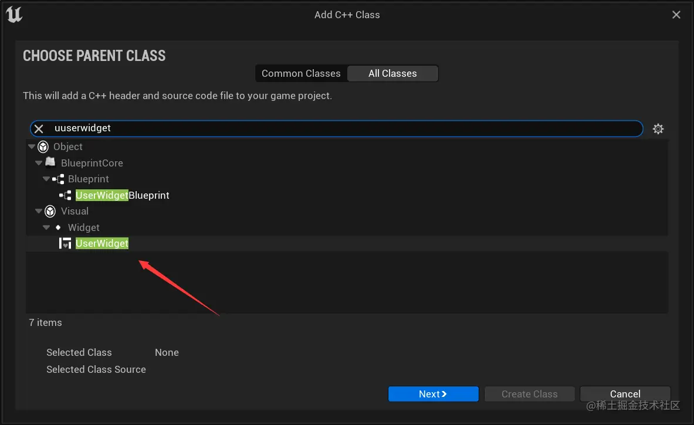

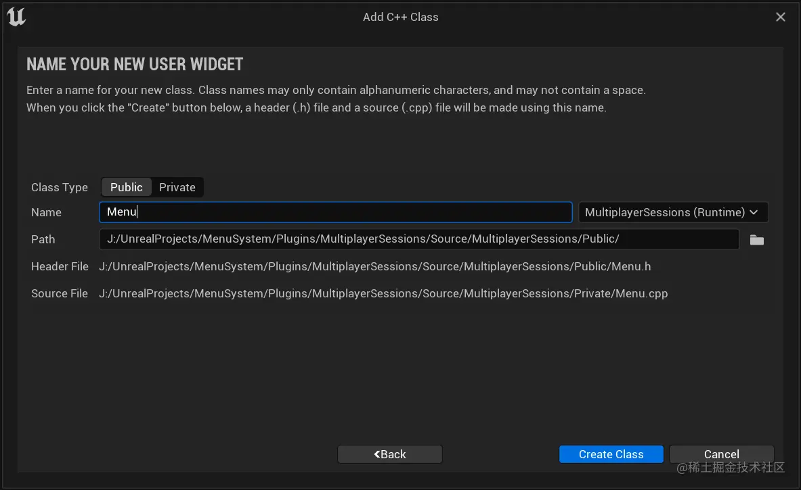

创建好后，引擎会提示是否查看日志（否），_Visual Studio_ 会提示是否重新加载（全部重新加载）。接着，因为要创建 _UI_ ，需要引入 _UMG、Slate、SlateCore_ 模块。在 _MultiplayerSessions.Build.cs_ 中添加如下内容：

```csharp
// MultiplayerSessions.Build.cs

PublicDependencyModuleNames.AddRange(
		new string[]
		{
			// ......
			"UMG",
			"Slate",
			"SlateCore"
			// ... add other public dependencies that you statically link with here ...
		}
		);

```

在 _Visual Studio_ 中，对 _Menu.h_ 和 _Menu.cpp_ 的修改如下：

```cpp
// Menu.h

// ......

UCLASS()
class MULTIPLAYERSESSIONS_API UMenu : public UUserWidget
{
	GENERATED_BODY()

public:
	// 声明一个蓝图可调用的，菜单安装函数
	UFUNCTION(BlueprintCallable)
	void MenuSetup();
};

```

```scss
// Menu.cpp

void UMenu::MenuSetup() {
	AddToViewport(); // 添加到视口
	SetVisibility(ESlateVisibility::Visible); // 设置为可见
	bIsFocusable = true; // 允许此小部件在单击或导航到时接受焦点
	UWorld* World = GetWorld();
	if (World) {
		// 如果世界对象存在则获取玩家控制器
		APlayerController* PlayerController = World->GetFirstPlayerController();
		if (PlayerController) {
			FInputModeUIOnly InputModeData; // 输入模式对象
			InputModeData.SetWidgetToFocus(TakeWidget()); // 设置聚焦
			InputModeData.SetLockMouseToViewportBehavior(EMouseLockMode::DoNotLock); // 不将鼠标光标锁定到视口
			PlayerController->SetInputMode(InputModeData); // 将设置应用输入模式
			PlayerController->SetShowMouseCursor(true); // 显示鼠标指针
		}
	}
}

```

在引擎界面，_Plugins/MultiplayerSessions Content_ 目录下新建一个 _User Interface/Widget Blueprint ，_ 命名为 _WBP\_Menu_ 。如下图配置（让这个接口继承自 _Menu_ ）：

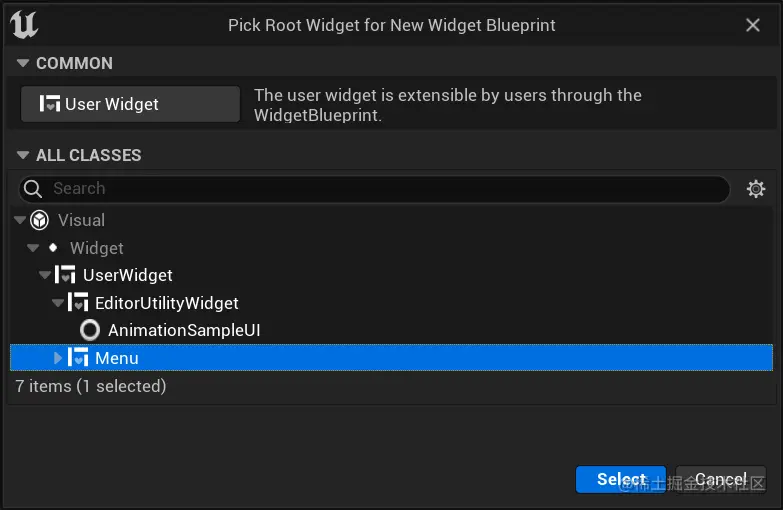

编辑这个 _Widget_ 内容如下：

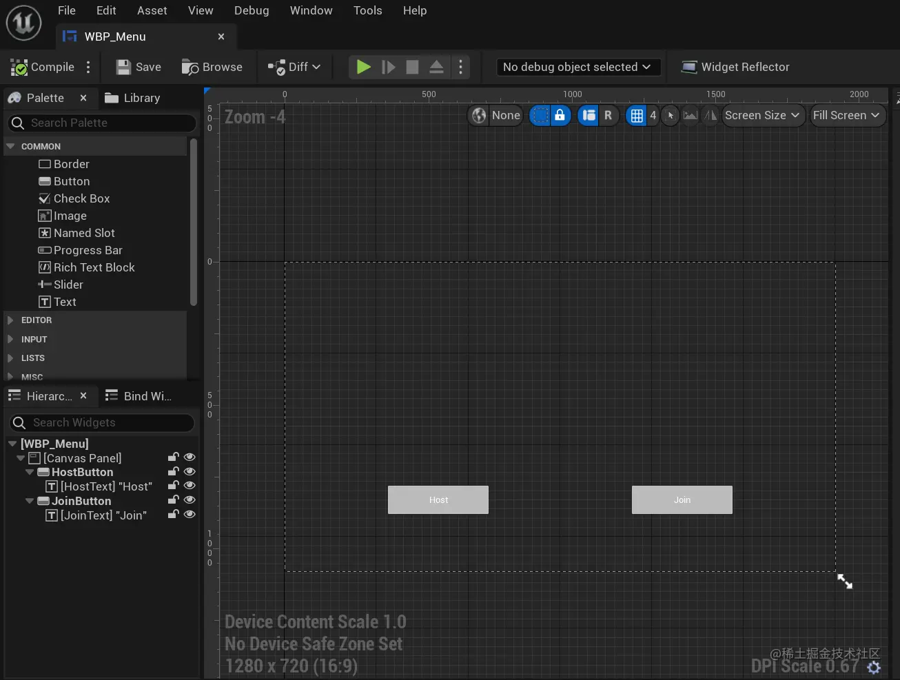

接着在关卡蓝图中设置，当游戏开始后创建 _WBP\_Menu_ 并调用它继承的 _MenuSetup_ 方法，如下图：

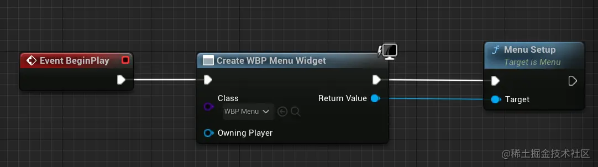

## 为菜单按钮添加点击事件

在 _Menu.h_ 中获取 _Button_ ，声明单击事件，声明处理会话的子系统变量：

```cpp
// Menu.h

UCLASS()
class MULTIPLAYERSESSIONS_API UMenu : public UUserWidget
{
	// ......

protected:
	virtual bool Initialize() override; // 重写初始化函数，它执行时间比构造函数还早

private:

	UPROPERTY(meta = (BindWidget))
	class UButton* HostButton; // 获取引擎中的 HostButton ，必须和 Unreal Engine 中的名字对应

	UPROPERTY(meta = (BindWidget))
	UButton* JoinButton; // 获取引擎中的 JoinButton

	UFUNCTION()
	void HostButtonClicked(); // 声明 HostButton 单击后触发的事件

	UFUNCTION()
	void JoinButtonClicked(); // 声明 JoinButton 单击后触发的事件

	// 用于处理所有 Online Session 功能的子系统
	class UMultiplayerSessionsSubsystem* MultiplayerSessionsSubsystem;
};

```

在 _Menu.cpp_ 中给按钮绑定单击后触发的函数：

```cpp
// Menu.cpp

#include "Components/Button.h"  // 引入 Button 依赖
#include "MultiplayerSessionsSubsystem.h" // 引入子系统依赖

void UMenu::MenuSetup() {

	// ......

	UGameInstance* GameInstance = GetGameInstance();
	if (GameInstance) { // 通过 GameInstance 获取 MultiplayerSessionsSubsystem
		MultiplayerSessionsSubsystem = GameInstance->GetSubsystem<UMultiplayerSessionsSubsystem>();
	}

}

bool UMenu::Initialize() {
	if (!Super::Initialize()) {
		return false;
	}

	// 初始化时给两个按钮绑定当前类中的方法
	if (HostButton) {
		HostButton->OnClicked.AddDynamic(this, &ThisClass::HostButtonClicked);
	}
	if (JoinButton) {
		JoinButton->OnClicked.AddDynamic(this, &ThisClass::JoinButtonClicked);
	}

	return true;
}

void UMenu::HostButtonClicked() {
// 打印信息，测试是否绑定成功
	if (GEngine) {
		GEngine->AddOnScreenDebugMessage(
			-1,
			15.f,
			FColor::Yellow,
			FString(TEXT("Host Button clicked"))
		);
	}

	// HostButton 单击时执行 MultiplayerSessionsSubsystem 的中创建 Session 的方法
	if (MultiplayerSessionsSubsystem) {
		MultiplayerSessionsSubsystem->CreateSession(4, FString("FreeForAll");
	}

}

void UMenu::JoinButtonClicked() {
	// 打印信息，测试是否绑定成功
	if (GEngine) {
		GEngine->AddOnScreenDebugMessage(
			-1,
			15.f,
			FColor::Yellow,
			FString(TEXT("Join Button clicked"))
		);
	}

}


```

## 实现创建 Session

首先在子系统的类中实现创建 _Session_ 的逻辑。现在 _MultiplayerSessionsSubsystem.h_ 中添加一个私有变量，用于存储 _Session_ 设置：

```cpp
// MultiplayerSessionsSubsystem.h

#include "Interfaces/OnlineSessionInterface.h" // FOnlineSessionSettings 的头文件
#include "MultiplayerSessionsSubsystem.generated.h" // 放在最后的

UCLASS()
class MULTIPLAYERSESSIONS_API UMultiplayerSessionsSubsystem : public UGameInstanceSubsystem
{
	// ......

private:
	TSharedPtr<FOnlineSessionSettings> LastSessionSettings; // 存储 Session 设置

	// ......
};

```

接着在 _MultiplayerSessionsSubsystem.cpp_ 中实现 _CreateSession_ 方法：

```cpp
// MultiplayerSessionsSubsystem.cpp

#include "MultiplayerSessionsSubsystem.h"
#include "OnlineSubsystem.h"
#include "OnlineSessionSettings.h"

void UMultiplayerSessionsSubsystem::CreateSession(int32 NumPublicConnections, FString MatchType) {
	if (!SessionInterface.IsValid()) {
		return;
	}

	// 检查是否已经存在一个正在使用的名称的会话
	auto ExistingSession = SessionInterface->GetNamedSession(NAME_GameSession);
	if (ExistingSession != nullptr) {
		SessionInterface->DestroySession(NAME_GameSession);
	}

	// 创建完 Session 后执行的函数，绑定为 CreateSessionCompleteDelegate 绑定的函数。
	// 将绑定后的结果存储下来，用于后面移除委托列表中的委托
	CreateSessionCompleteDelegateHandle = SessionInterface->AddOnCreateSessionCompleteDelegate_Handle(CreateSessionCompleteDelegate);

	// 创建一个存放 Session 设置的对象指针
	LastSessionSettings = MakeShareable(new FOnlineSessionSettings());
	// 如果获取的子系统名字是 "NULL" 则启用局域网匹配，否则不启用
	LastSessionSettings->bIsLANMatch = IOnlineSubsystem::Get()->GetSubsystemName() == "NULL" ? true : false;
	LastSessionSettings->NumPublicConnections = NumPublicConnections; // 设置最大公开连接数
	LastSessionSettings->bAllowJoinInProgress = true; // 允许加入进行中的游戏
	LastSessionSettings->bAllowJoinViaPresence = true; // 允许区域玩家加入
	LastSessionSettings->bShouldAdvertise = true; // 在在线服务上公开发布
	LastSessionSettings->bUsesPresence = true; // 显示用户状态信息
	LastSessionSettings->Set(FName("MatchType"), MatchType,  EOnlineDataAdvertisementType::ViaOnlineServiceAndPing); // 设置 MatchType

	const ULocalPlayer* LocalPlayer = GetWorld()->GetFirstLocalPlayerFromController();
	// 设置网络 ID 、SessionName 以及上面的配置，如果设置失败则移除委托
	if (!SessionInterface->CreateSession(*LocalPlayer->GetPreferredUniqueNetId(), NAME_GameSession, *LastSessionSettings)) {
		SessionInterface->ClearOnCreateSessionCompleteDelegate_Handle(CreateSessionCompleteDelegateHandle);
	}
}
```

在 _Menu.h_ 中设置两个私有变量存储最大连接数和匹配类型，添加销毁时触发的函数定义，修改 _MenuSetup_ 的定义：

```cpp
// Menu.h


UCLASS()
class MULTIPLAYERSESSIONS_API UMenu : public UUserWidget
{
	GENERATED_BODY()

public:
	// 修改为最大连接数和匹配类型可由外部传入
	UFUNCTION(BlueprintCallable)
	void MenuSetup(int32 NumberOfPublicConnections = 4, FString TypeOfMatch = FString(TEXT("FreeForAll")));

protected:

	virtual bool Initialize() override;

	// 移动到另一个关卡，当前关卡会被摧毁和移除
	// 此时，所有 User Widgets 都会调用这个函数
	virtual void OnLevelRemovedFromWorld(ULevel* InLevel, UWorld* InWorld) override;

private:

	// ......

	void MenuTearDown(); // 销毁 Menu 的函数

	// 用于处理所有 Online Session 功能的子系统
	class UMultiplayerSessionsSubsystem* MultiplayerSessionsSubsystem;

	int32 NumPublicConnections{4}; // 用于存储最大连接数，初始化为 4
	FString MatchType{TEXT("FreeForAll")}; // 用于存储匹配类型，初始化为 "FreeForAll"
};

```

在 _Menu.cpp_ 中实现 _MenuTearDown 、OnLevelRemovedFromWorld_ 并修改原来 _HostButtonClicked_ 中写死的参数：

```cpp
// Menu.cpp

void UMenu::MenuSetup(int32 NumberOfPublicConnections, FString TypeOfMatch) { // 参数改为外部传入
	NumPublicConnections = NumberOfPublicConnections;
	MatchType = TypeOfMatch;

	// ......
}

void UMenu::OnLevelRemovedFromWorld(ULevel* InLevel, UWorld* InWorld) {
	MenuTearDown();
	Super::OnLevelRemovedFromWorld(InLevel, InWorld);
}

void UMenu::HostButtonClicked() {
	// ......

	if (MultiplayerSessionsSubsystem) {
		// 修改参数为外部传入的参数
		MultiplayerSessionsSubsystem->CreateSession(NumPublicConnections, MatchType);

		// ......
	}

}

void UMenu::MenuTearDown() {
	RemoveFromParent(); // 移除自己
	UWorld* World = GetWorld();
	if (World) {
		APlayerController* PlayerController = World->GetFirstPlayerController();
		if (PlayerController) {
			FInputModeGameOnly InputModeData;
			PlayerController->SetInputMode(InputModeData); // 设置输入模式为游戏模式
			PlayerController->SetShowMouseCursor(false); // 设置鼠标不显示
		}

	}

}

```

接着，_rebuild_ 项目，可以发现关卡蓝图中的 _MenuSetup_ 函数多了两个可修改的参数。

## 为菜单与子系统解耦

目前的代码，点击 _Menu_ 实例的 _HostButton_ 后，存在以下两个问题：

1.  在 _Menu_ 无法判断 _Session_ 是否创建成功了。
2.  无论 _Session_ 是否创建成功，都会跳转到 _Lobby_ 关卡。

第二个问题就是第一个问题引起的，所以只需要处理第一个问题就迎刃而解了。造成第一个问题的原因是：_SessionInterface->CreateSession()_ 它执行需要时间，因为它要先链接 _Steam_ ，等 _Steam_ 相应创建的结果。也就是说 _Session_ 是否创建成功，这个结果有延迟（对于这种因为 _网络请求_ 或 _I/O操作_ 等外部因素导致的的延迟，运行结果非即时得到的代码，叫做 _异步_ 代码。平时写的代码叫做 _同步_ 代码，异步代码即使写在前面，也会后执行，因为它们因为外部原因导致了延迟）。只有在 _MultiplayerSessionsSubsystem.cpp_ 中使用它时才能判断这个 _Session_ 是否创建成功了。

也就是说，跳转关卡的逻辑可以放到自己创建的子系统中。但是这样的话，代码耦合度就高了，为什么说耦合度高了？ _Menu_ 类是 _Menu_ ，_MultiplayerSessionsSubsystem_ 是 _MultiplayerSessionsSubsystem ，Menu_ 里要做的事情，却放到 _MultiplayerSessionsSubsystem_ （后面称为会话子系统）中。把它们比作两个齿轮，当把跳转关卡的逻辑放到子系统中时，这两个齿轮之间的间隙就更小了，也可以说耦合度越来越高，这是必须避免的事情。要尽量做到每个类只做自己的事，保证每个功能模块的独立性。

为解决这个问题的思路是：在会话子系统类上声明一个公开的变量，它用来存储函数。其它类在使用会话子系统时，访问这个公开变量，将一个函数绑定到这个变量上。会话子系统在得到 _CreateSession_ 结果后，执行存储的函数。因为是其它类赋予的函数，这个函数是在其它类中实现的逻辑，也就是说，_CreateSession_ 后执行什么操作，会话子系统根本不在乎。这种函数并非即使调用，前面放置的，在后面才调用，所以称之为回调函数。下面是具体实现，首先是定义一个委托变量来存储函数：

```cpp
// MultiplayerSessionsSubsystem.h


//
// 使用 Unreal Engine提供的宏来创建自定义委托，用它来存储函数
// DYNAMIC 表示它是动态委托，它支持序列化，可以给蓝图绑定调用
// MULTICAST 表示它是一个多播委托，可以存储多个函数
// OneParam 表示它存储的函数得有一个参数
// FMultiplayerOnCreateSessionComplete 是创建的委托类型的名字
// bool 表示那一个参数是 bool型
// bWasSuccessful 指定形参的名字
//
DECLARE_DYNAMIC_MULTICAST_DELEGATE_OneParam(FMultiplayerOnCreateSessionComplete, bool, bWasSuccessful);


UCLASS()
class MULTIPLAYERSESSIONS_API UMultiplayerSessionsSubsystem : public UGameInstanceSubsystem
{
	GENERATED_BODY()

public:

	// ......

	//
	// 创建一个上面自定义的委托 FMultiplayerOnCreateSessionComplete 类型的变量
	// 用它来存储创建 Session 后执行的函数
	//
	FMultiplayerOnCreateSessionComplete MultiplayerOnCreateSessionComplete;
};

// ......

```

接着，在 _MultiplayerSessionsSubsystem.cpp_ 中，在合适的时候（ 创建 Session 后 ）调用 _MultiplayerOnCreateSessionComplete_ 这个委托变量所绑定的函数，如下：

```cpp
// MultiplayerSessionsSubsystem.cpp

// ......

void UMultiplayerSessionsSubsystem::CreateSession(int32 NumPublicConnections, FString MatchType) {
	 // ......

	const ULocalPlayer* LocalPlayer = GetWorld()->GetFirstLocalPlayerFromController();
	if (!SessionInterface->CreateSession(*LocalPlayer->GetPreferredUniqueNetId(), NAME_GameSession, *LastSessionSettings)) {
		// 移除创建后执行的函数（本类中的 OnCreateSessionComplete ）
		SessionInterface->ClearOnCreateSessionCompleteDelegate_Handle(CreateSessionCompleteDelegateHandle);

		// 因为创建失败，所以触发这个委托中绑定的所有函数，并传入false
		MultiplayerOnCreateSessionComplete.Broadcast(false);
	}
}

// ......

// 之前绑定过的函数，当创建完 Session 后调用的函数
// 按照前面的代码，预期中执行这个函数时 bWasSuccessful 总是为 true
void UMultiplayerSessionsSubsystem::OnCreateSessionComplete(FName SessionName, bool bWasSuccessful) {
	if (SessionInterface) { // 如果创建成功则清空之前绑定的回调
		SessionInterface->ClearOnCreateSessionCompleteDelegate_Handle(CreateSessionCompleteDelegateHandle);
	}

	// 调用外部类设置的函数，传入 bWasSuccessful
	MultiplayerOnCreateSessionComplete.Broadcast(bWasSuccessful);
}

// ......


```

在 _Menu.h_ 中声明创建 _Session_ 后执行的函数：

```cpp
// Menu.h

UCLASS()
class MULTIPLAYERSESSIONS_API UMenu : public UUserWidget
{
	// ......

protected:

	// ......

	//
	// 下面的函数将会绑定到 MultiplayerSessionsSubsystem 中的自定义委托
	//
	UFUNCTION()
	void OnCreateSession(bool bWasSuccessful);

	// ......
};

```

在 _Menu.cpp_ 中，实现创建 _Session_ 后执行的函数 _OnCreateSession_ ，并将它绑定到会话子系统暴露出来的公开委托变量 _MultiplayerOnCreateSessionComplete_ 。代码如下：

```cpp
// Menu.cpp


void UMenu::MenuSetup(int32 NumberOfPublicConnections, FString TypeOfMatch) {
	// ......

	if (MultiplayerSessionsSubsystem) {
		// 将本类中的 OnCreateSession 函数绑定到会话子系统中的自定义委托中
		MultiplayerSessionsSubsystem->MultiplayerOnCreateSessionComplete.AddDynamic(this, &ThisClass::OnCreateSession);
	}
}


// 当关卡从世界移除后执行的逻辑
void UMenu::OnLevelRemovedFromWorld(ULevel* InLevel, UWorld* InWorld) {
	MenuTearDown(); // 销毁 当前 Menu 实例
	Super::OnLevelRemovedFromWorld(InLevel, InWorld); // 执行父类的销毁逻辑
}

// 创建 Session 后的逻辑，它绑定到了会话子系统公开的委托上，会话子系统会在何时的时机（得到创建 Session 结果后）调用这个逻辑
void UMenu::OnCreateSession(bool bWasSuccessful) {
	if (bWasSuccessful) {
		if (GEngine) {
			GEngine->AddOnScreenDebugMessage(
				-1,
				15.f,
				FColor::Yellow,
				FString(TEXT("Session created successfully!"))
			);
		}

		UWorld* World = GetWorld();
		if (World) {
			World->ServerTravel("/Game/ThirdPerson/Maps/Lobby?listen");
		}
	} else {
		if (GEngine) {
			GEngine->AddOnScreenDebugMessage(
				-1,
				15.f,
				FColor::Red,
				FString(TEXT("Failed to create session!"))
			);
		}
	}
}

void UMenu::MenuTearDown() {
	RemoveFromParent(); // 从父类移除当前 UWidget
	UWorld* World = GetWorld();
	if (World) {
		APlayerController* PlayerController = World->GetFirstPlayerController();
		if (PlayerController) {
			FInputModeGameOnly InputModeData;
			PlayerController->SetInputMode(InputModeData); // 修改游戏模式为仅游戏
			PlayerController->SetShowMouseCursor(false); // 设置鼠标指针不显示
		}

	}

}

```

_rebuild_ 后启动游戏即可测试效果。

## 子系统添加更多委托

上面给创建 _Session_ 添加了委托和回调，会话插件中定义了 _5_ 个功能，所以继续创建更多委托。首先是在 _MultiplayerSessionsSubsystem.h_ 补充其它几个 _Session_ 操作的委托：

```cpp
// MultiplayerSessionsSubsystem.h

//
// 创建自定义委托用于菜单类绑定回调
//

// 用于存储创建 Session 后的回调函数
DECLARE_DYNAMIC_MULTICAST_DELEGATE_OneParam(FMultiplayerOnCreateSessionComplete, bool, bWasSuccessful);

// 用于存储查找 Session 后的回调函数
// 绑定的函数要求有两个参数
// 有一个参数是装载 FOnlineSessionSearchResult 的 TArray 类型
// 这个 FOnlineSessionSearchResult 已经提前内置的，不是一个新的 Class 或者新的 Struct ，所以不能用动态委托，所以没有使用带 DYNAMIC 的宏创建委
// 这种情况，参数类型与参数名的写法与动态委托的写法不一样
DECLARE_MULTICAST_DELEGATE_TwoParams(FMultiplayerOnFindSessionsComplete, const TArray<FOnlineSessionSearchResult>& SessionResult, bool bWasSuccessful);

// 用于存储加入 Session 后的回调函数
// 没有用带 DYNAMIC 的宏创建动态委托，所以参数写法与上面一样
DECLARE_MULTICAST_DELEGATE_OneParam(FMultiplayerOnJoinSessionComplete, EOnJoinSessionCompleteResult::Type Result);

// 用于存储销毁 Session 后的回调函数
DECLARE_DYNAMIC_MULTICAST_DELEGATE_OneParam(FMultiplayerOnDestroySessionComplete, bool, bWasSuccessful);
// 用于存储开始 Session 后的回调函数
DECLARE_DYNAMIC_MULTICAST_DELEGATE_OneParam(FMultiplayerOnStartSessionComplete, bool, bWasSuccessful);

UCLASS()
class MULTIPLAYERSESSIONS_API UMultiplayerSessionsSubsystem : public UGameInstanceSubsystem
{
	GENERATED_BODY()

public:
	UMultiplayerSessionsSubsystem();

	// ......

	//
	//创建自定义委托用于菜单类绑定回调
	//
	FMultiplayerOnCreateSessionComplete MultiplayerOnCreateSessionComplete;
	FMultiplayerOnFindSessionsComplete MultiplayerOnFindSessionsComplete;
	FMultiplayerOnJoinSessionComplete MultiplayerOnJoinSessionComplete;
	FMultiplayerOnDestroySessionComplete MultiplayerOnDestroySessionComplete;
	FMultiplayerOnStartSessionComplete MultiplayerOnStartSessionComplete;

	// ......

}

```

接着是在 _Menu.h_ 中声明回调：

```cpp
// Menu.h

#include "OnlineSessionSettings.h"
#include "Interfaces/OnlineSessionInterface.h"

// ......

UCLASS()
class MULTIPLAYERSESSIONS_API UMenu : public UUserWidget
{
	GENERATED_BODY()

	// ......

protected:

	// ......

	//
	// 下面的函数将会绑定到 MultiplayerSessionsSubsystem 中的自定义委托
	//
	UFUNCTION()
	void OnCreateSession(bool bWasSuccessful);

	// 不是动态委托所以不能用 UFUNCTION
	void OnFindSession(const TArray<FOnlineSessionSearchResult>& SessionResults, bool bWasSuccessful);
	void OnJoinSession(EOnJoinSessionCompleteResult::Type Result);

	UFUNCTION()
	void OnDestroySession(bool bWasSuccessful);

	UFUNCTION()
	void OnStartSession(bool bWasSuccessful);

	// ......
}
```

在 _Menu.cpp_ 中添加几个函数的实现，以及将它们绑定到会话子系统的委托上。

```cpp
// Menu.cpp

// ......

void UMenu::MenuSetup(int32 NumberOfPublicConnections, FString TypeOfMatch) {

	// ......

	if (MultiplayerSessionsSubsystem) { // 将本类中的 OnCreateSession 函数绑定到子系统中的自定义委托中
		MultiplayerSessionsSubsystem->MultiplayerOnCreateSessionComplete.AddDynamic(this, &ThisClass::OnCreateSession);

		// 因为不是动态委托，所以使用 AddUObject
		MultiplayerSessionsSubsystem->MultiplayerOnFindSessionsComplete.AddUObject(this, &ThisClass::OnFindSessions);
		MultiplayerSessionsSubsystem->MultiplayerOnJoinSessionComplete.AddUObject(this, &ThisClass::OnJoinSession);

		MultiplayerSessionsSubsystem->MultiplayerOnDestroySessionComplete.AddDynamic(this, &ThisClass::OnDestroySession);
		MultiplayerSessionsSubsystem->MultiplayerOnStartSessionComplete.AddDynamic(this, &ThisClass::OnStartSession);
	}
}

//
// 几个绑定在会话子系统的回调的实现
//
void UMenu::OnFindSessions(const TArray<FOnlineSessionSearchResult>& SessionResults, bool bWasSuccessful) {
}

void UMenu::OnJoinSession(EOnJoinSessionCompleteResult::Type Result) {
}

void UMenu::OnDestroySession(bool bWasSuccessful) {
}

void UMenu::OnStartSession(bool bWasSuccessful) {
}

// ......
```

## 从菜单中加入 Session

加入 _Session_ 有有两个步骤：首先查找所有 _Session_，然后再加入匹配的 _Session_ 。首先在 _MultiplayerSessionsSubsystem.h_ 中添加搜索 _Session_ 设置的成员变量：

```cpp
// MultiplayerSessionsSubsystem.h

UCLASS()
class MULTIPLAYERSESSIONS_API UMultiplayerSessionsSubsystem : public UGameInstanceSubsystem
{
	// ......
private:
	IOnlineSessionPtr SessionInterface;
	TSharedPtr<FOnlineSessionSettings> LastSessionSettings;
	TSharedPtr<FOnlineSessionSearch> LastSessionSearch;

	// ......

}


```

然后在 _MultiplayerSessionsSubsystem.cpp_ 中实现查找 _Session_ 和加入 _Session_ 的逻辑：

```cpp
// MultiplayerSessionsSubsystem.cpp

#include "OnlineSubsystem.h"

// 查找 Session
void UMultiplayerSessionsSubsystem::FindSessions(int32 MaxSearchResults) {
	if (!SessionInterface.IsValid()) {
		return;
	}
	// 添加查找 Session 后，要执行的回调的委托
	FindSessionsCompleteDelegateHandle = SessionInterface->AddOnFindSessionsCompleteDelegate_Handle(FindSessionsCompleteDelegate);

	LastSessionSearch = MakeShareable(new FOnlineSessionSearch()); // 创建搜索设置对象
	LastSessionSearch->MaxSearchResults = MaxSearchResults; // 设置最大搜索结果
	LastSessionSearch->bIsLanQuery = IOnlineSubsystem::Get()->GetSubsystemName() == "NULL" ? true : false;
	// 如果在线子系统名不是 NULL 则为 false
	LastSessionSearch->QuerySettings.Set(SEARCH_PRESENCE, true, EOnlineComparisonOp::Equals); // presence 为 true 的限制

	const ULocalPlayer* LocalPlayer = GetWorld()->GetFirstLocalPlayerFromController();
	if (!SessionInterface->FindSessions(*LocalPlayer->GetPreferredUniqueNetId(), LastSessionSearch.ToSharedRef())) {
		// 此时查找 Sessions 的操作失败， 清除 FindSessionsCompleteDelegateHandle 委托
		SessionInterface->ClearOnFindSessionsCompleteDelegate_Handle(FindSessionsCompleteDelegateHandle);
		// 调用绑定的回调函数，因为失败了，所以传入空数组和 false
		MultiplayerOnFindSessionsComplete.Broadcast(TArray<FOnlineSessionSearchResult>(), false);
	}

}

// 加入 Session 后，要执行的回调的委托
void UMultiplayerSessionsSubsystem::JoinSession(const FOnlineSessionSearchResult& SessionResult) {
	if (!SessionInterface.IsValid()) {
		// 会话接口无效则调用回调，传入 UnknownError ，并结束当前函数
		MultiplayerOnJoinSessionComplete.Broadcast(EOnJoinSessionCompleteResult::UnknownError);
		return;
	}

	// 添加加入 Session 后绑定了要执行的回调的委托
	SessionInterface->AddOnJoinSessionCompleteDelegate_Handle(JoinSessionCompleteDelegate);

	const ULocalPlayer* LocalPlayer = GetWorld()->GetFirstLocalPlayerFromController();
	if(!SessionInterface->JoinSession(*LocalPlayer->GetPreferredUniqueNetId(), NAME_GameSession, SessionResult)){
		// 此时加入 Sessions 的操作失败， 清除 JoinSessionCompleteDelegateHandle 委托
		SessionInterface->ClearOnJoinSessionCompleteDelegate_Handle(JoinSessionCompleteDelegateHandle);

		// 调用绑定的回调，传入 UnknownError
		MultiplayerOnJoinSessionComplete.Broadcast(EOnJoinSessionCompleteResult::UnknownError);
	}

}

// 查找 Session 后执行的回调，因为前面的逻辑，成功查找 Session 才执行它
void UMultiplayerSessionsSubsystem::OnFindSessionsComplete(bool bWasSuccessful) {
	if (SessionInterface) {
		// 已经执行了查找 Session 的操作，会话接口有效则清除 FindSessionsCompleteDelegateHandle 委托
		SessionInterface->ClearOnFindSessionsCompleteDelegate_Handle(FindSessionsCompleteDelegateHandle);
	}

	if (LastSessionSearch->SearchResults.Num() <= 0) {
		// 没有找到相关会话，则直接调用绑定的回调，传入空数组和 false ，结束当前函数
		MultiplayerOnFindSessionsComplete.Broadcast(TArray<FOnlineSessionSearchResult>(), false);
		return;
	}
	// 调用外部类绑定的回调，传入搜索结果和是否成功
	MultiplayerOnFindSessionsComplete.Broadcast(LastSessionSearch->SearchResults, bWasSuccessful);
}

// 加入 Session 后执行的回调，因为前面的逻辑，成功加入 Session 才执行它
void UMultiplayerSessionsSubsystem::OnJoinSessionComplete(FName SessionName, EOnJoinSessionCompleteResult::Type Result) {
	if (SessionInterface) {
		// 已经执行了加入 Session 的操作，会话接口有效则清除 JoinSessionCompleteDelegateHandle 委托
		SessionInterface->ClearOnJoinSessionCompleteDelegate_Handle(JoinSessionCompleteDelegateHandle);
	}
	// 调用外部类绑定的回调，传入加入的结果
	MultiplayerOnJoinSessionComplete.Broadcast(Result);
}


```

最后在 _Menu.h_ 中实现查找 _Session_ 和加入 _Session_ 的回调：

```cpp
// Menu.h

// 查找 Session 的回调
void UMenu::OnFindSessions(const TArray<FOnlineSessionSearchResult>& SessionResults, bool bWasSuccessful) {
	if (MultiplayerSessionsSubsystem == nullptr) {
		return;
	}

	// 遍历搜索结果，如果 MatchType 和前面自定义的一样则加入
	for (auto Result: SessionResults) {
		FString SettingsValue;
		Result.Session.SessionSettings.Get(FName("MatchType"), SettingsValue);
		if (SettingsValue == MatchType) {
			// 只要找到了，就不继续遍历，直接加入 Sesssion 并结束循环
			MultiplayerSessionsSubsystem->JoinSession(Result);
			return;
		}
	}

}

// 加入 Session 的回调
void UMenu::OnJoinSession(EOnJoinSessionCompleteResult::Type Result) {
	IOnlineSubsystem* Subsystem = IOnlineSubsystem::Get();
	if (Subsystem) {
		IOnlineSessionPtr SessionInterface = Subsystem->GetSessionInterface();
		if (SessionInterface.IsValid()) {
			FString Address;
			SessionInterface->GetResolvedConnectString(NAME_GameSession, Address);

			APlayerController* PlayerController = GetGameInstance()->GetFirstLocalPlayerController();
			if (PlayerController) {
				PlayerController->ClientTravel(Address, ETravelType::TRAVEL_Absolute);
			}

		}

	}

}


```

打包后，在两台不同的机器上，登录 _Steam_ 账号测试即可。

## 显示玩家数量

下面，创建一个游戏模式（ _Game Mode_ ），以便跟踪加入的玩家数。通过游戏状态来（ _Game State_ ）实现根据玩家数决定是否应该从大厅过渡到实际的游戏中。

_Game Mode_ 的的存在，是为了保留游戏的所有规则。它自带很多功能，其中有个 _PostLoging_ ，它是一个继承的虚函数，每当玩家加入游戏时就会自动调用。还有一个 _Logout_ 函数在玩家离开游戏时调用。

_Game State_ 用于保存关于游戏的状态信息，客户端可以访问它并获取关于游戏的信息。与某个玩家相关的信息，保存在 _Player State_ 中，游戏状态包含一组 _Player State_ 。游戏模式可以访问游戏状态，所以它可以获得 _Player State_ 的数组，通过查看数组大小来判断玩家数量。

下面，在 _C++ Classes/MenuSystem_ 下创建一个游戏模式，命名为 _LobbyGameMode_ ，如下图：

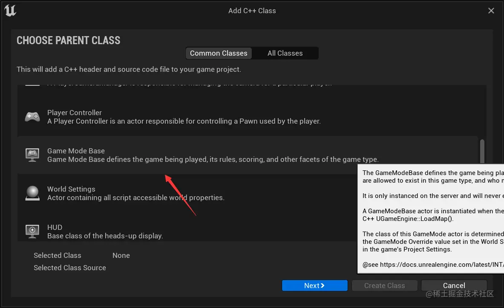

_Visual Studio_ 重新加载代码后，编辑 _LobbyGameMode.h_ ，声明重写 _PostLogin、Logout ：_

```cpp
// LobbyGameMode.h

#pragma once

#include "CoreMinimal.h"
#include "GameFramework/GameModeBase.h"
#include "LobbyGameMode.generated.h"


UCLASS()
class MENUSYSTEM_API ALobbyGameMode : public AGameModeBase
{
	GENERATED_BODY()

public:
	virtual void PostLogin(APlayerController* NewPlayer) override;
	virtual void Logout(AController* Exiting) override;

};
```

接着在 _LobbyGameMode.cpp_ 中实现两个方法：

```cpp
// LobbyGameMode.cpp

#include "LobbyGameMode.h"
#include "GameFramework/GameStateBase.h"
#include "GameFramework/PlayerState.h"

// 有玩家加入是时执行的函数
void ALobbyGameMode::PostLogin(APlayerController* NewPlayer) {
	Super::PostLogin(NewPlayer); // 执行父类中原有函数的代码

	// GameState 是游戏中预置的，存储玩家的数组
	// 它的类型是 TObjectPtr ，它是一个包装器
	if (GameState) {
		// Get() 获取 GameState 基本指针后获取玩家总数
		int32 NumberOfPlayers = GameState.Get()->PlayerArray.Num();

		if (GEngine) {
			// 打印玩家总数
			GEngine->AddOnScreenDebugMessage(
				1,
				60.f,
				FColor::Yellow,
				FString::Printf(TEXT("Player in game %d"), NumberOfPlayers)
			);

			APlayerState* PlayerState = NewPlayer->GetPlayerState<APlayerState>(); // 获取玩家状态对象指针
			if (PlayerState) {
				 FString PlayerName = PlayerState->GetPlayerName(); // 获取玩家名
				 GEngine->AddOnScreenDebugMessage(
					 -1,
					 60.f,
					 FColor::Yellow,
					 FString::Printf(TEXT("%s has joined the game!"), *PlayerName)
				 );
			}


		}
	}

}

void ALobbyGameMode::Logout(AController* Exiting) {
	Super::Logout(Exiting); // 执行父类中原有函数的代码


	APlayerState* PlayerState = Exiting->GetPlayerState<APlayerState>(); // 获取玩家状态对象指针
	if (PlayerState) {
		if (GEngine) {
			int32 NumberOfPlayers = GameState.Get()->PlayerArray.Num();
			GEngine->AddOnScreenDebugMessage(
				1,
				60.f,
				FColor::Yellow,
				FString::Printf(TEXT("Player in game %d"), NumberOfPlayers)
			);

			FString PlayerName = PlayerState->GetPlayerName(); // 获取玩家名
			GEngine->AddOnScreenDebugMessage(
				-1,
				60.f,
				FColor::Yellow,
				FString::Printf(TEXT("%s has exited the game!"), *PlayerName)
			);
		}
	}
}


```

为了使游戏能有更多人加入，修改项目根目录下 _Config_ 目录中的 _DefaultGame.ini_ ，新增以下内容：

```ini
;设置这个游戏项目最大可以有 100 个玩家
;与前面创建 Session 时的 NumPublicConnections 不同，上面是会话最大连接数，这个是这个游戏项目最大玩家数
[/Script/Engine.GameSession]
MaxPlayers=100

```

接着，将新建的 _LobbyGameMode_ 应用到游戏中，首先在 _ThirdPerson/Blueprints_ 下面新建一个蓝图，选择 _LobbyGameMode_ 类，命名为 _BP\_LobbyGameMode_ ，如下图：

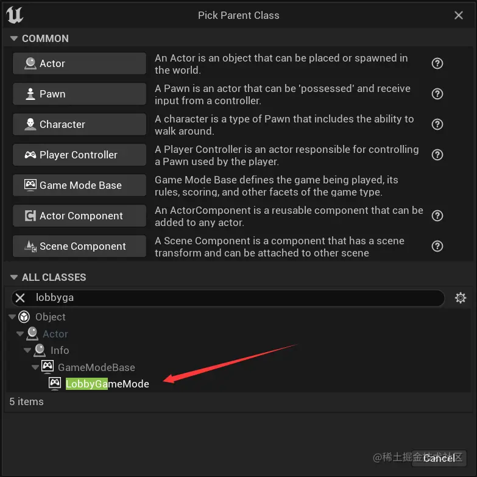

双击新建的蓝图，修改 _Default Pwan Class_ ，不能让它的值为默认的 _DefaultPwan_ ，应该是 _ThirdPersonCharacter_ 。因为默认的 _DefaultPwan_ 不会将移动信息发送到服务器。

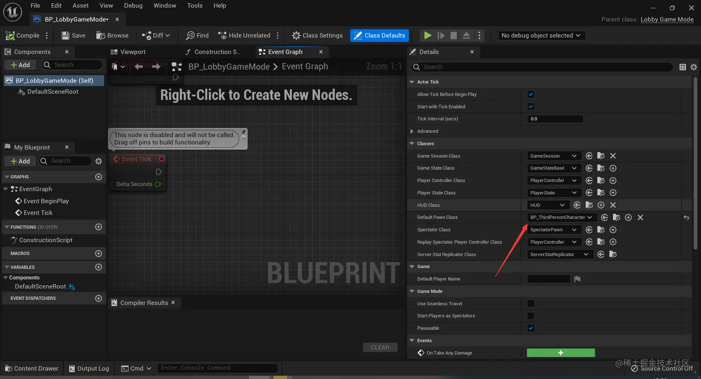

在 _ThirdPerson/Maps_ 下找到前面创建的 _Lobby_ ，双击打开编辑器，在 _World Settings_ 中修改 _GameMode Override_ 为_BP\_LobbyGameMode_ 。

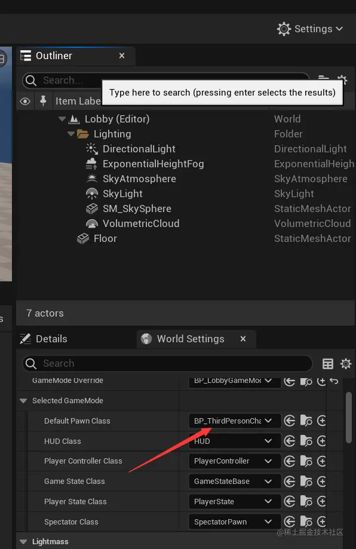

最后，打包然后用两台登有同账号 _Steam_ 的电脑测试。

## 将关卡路径改为变量

为了插件的通用性，现在需要将关卡路径修改为变量，这个变量值由菜单设置的蓝图传入。首先在 _Menu.h_ 中添加一个存储关卡路径的成员变量，并修改 _MenuSetup_ 方法，如下：

```cpp
// Menu.h

UCLASS()
class MULTIPLAYERSESSIONS_API UMenu : public UUserWidget
{
	GENERATED_BODY()

public:
	UFUNCTION(BlueprintCallable)
	void MenuSetup(int32 NumberOfPublicConnections = 4, FString TypeOfMatch = FString(TEXT("FreeForAll")), FString LobbyPath = FString(TEXT("/Game/ThirdPerson/Maps/Lobby"))); // 新增路径参数，传入一个默认关卡地址


	// ......

private:
	// ......
	FString PathToLobby{TEXT("")}; // 默认值为空
}

```

然后在 _Menu.cpp_ 中，修改关卡路径为变量：

```cpp
// Menu.cpp

// ......
void UMenu::MenuSetup(int32 NumberOfPublicConnections, FString TypeOfMatch, FString LobbyPath) {
	NumPublicConnections = NumberOfPublicConnections;
	MatchType = TypeOfMatch;
	PathToLobby = LobbyPath+ "?listen"; // 将成员变量的值赋为外部传入的值

	// ......
}

// ......

void UMenu::OnCreateSession(bool bWasSuccessful) {
	if (bWasSuccessful) {
		// ......

		UWorld* World = GetWorld();
		if (World) {
			World->ServerTravel(PathToLobby); // 不再写死
		}
	} else {
		// ......
	}
}

// ......
```

当项目 _rebuild_ 后，打开关卡蓝图，可以看到 _MenuSetup_ 函数多了一个参数，如下图：

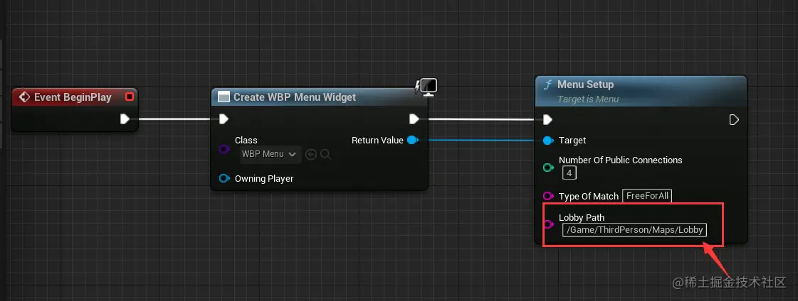

可以新建一个关卡，将 _MenuSetup_ 的路径修改为新建的关卡路径来测试。

## 完善菜单子系统

目前的代码存在一些问题：

1.  如果存在一个 _Session_ 时，在短时间内再次创建可能创建不成功。
2.  没有退出游戏按钮。
3.  只要界面没有切换，按钮可以点击很多次，对应的逻辑也会执行很多次。

首先解决 _Session_ 创建可能不成功的问题，造成问题的原因是：最开始的代码中，销毁 _Session_ 后面马上跟着创建 _Session_ ，但是销毁 _Session_ 是一个异步操作。它会把要求销毁 _Session_ 操作的要求发给服务器，与外部通讯就会造成一定的延迟。后面立马更上创建 _Session_，可能存在一种情况：_Session_ 创建好后，才执行销毁 _Session_。为了解决这个问题，需要通过委托的方式，将创建 _Session_ 的逻辑延后，保证其在销毁 _Session_ 后才执行。首先在 _MultiplayerSessionsSubsystem.h_ 中添加几个成员变量，记录创建 _Session_ 时的一些状态：

```cpp
// MultiplayerSessionsSubsystem.h

// ......


UCLASS()
class MULTIPLAYERSESSIONS_API UMultiplayerSessionsSubsystem : public UGameInstanceSubsystem
{
// ......

private:
	// ......
	bool bCreateSessionOnDestroy{ false }; // 表示是在创建 Session 时是否已经销毁了 Session
	int32 LastNumPublicConnections; // 记录上次创建 Session 时设置的最大连接数
	FString LastMatchType; // 记录上次创建 Session 时设置的 MatchType
}

```

接着是 _MultiplayerSessionsSubsystem.cpp_ ，将一些逻辑通过委托回调延后执行：

```cpp
// MultiplayerSessionsSubsystem.cpp

// 创建 Session 逻辑原本销毁 Session 的代码改为本类中的 DestroySession
void UMultiplayerSessionsSubsystem::CreateSession(int32 NumPublicConnections, FString MatchType) {
	// ......

	// 检查是否已经存在一个正在使用的名称的会话
	auto ExistingSession = SessionInterface->GetNamedSession(NAME_GameSession);
	if (ExistingSession != nullptr) { // 如果存在
		bCreateSessionOnDestroy = true; // 需要在销毁时创建 Session
		LastNumPublicConnections = NumPublicConnections; // 记录当前的最大连接数
		LastMatchType = MatchType; // 记录当前的 MatchType
		DestroySession(); // 执行本类的销毁 Session 逻辑
	}

	// ......
}

// 销毁 Session 的逻辑
void UMultiplayerSessionsSubsystem::DestroySession() {
	if (!SessionInterface.IsValid()) { // 如果会话接口无效，则直接返回，触发销毁 Session 的回调
		MultiplayerOnDestroySessionComplete.Broadcast(false);
		return;
	}

	// 添加一个委托，在服务器执行销毁 Session 后调用 DestroySessionCompleteDelegate 绑定的回调
	// 也就是服务器销毁 Session 后会调用 OnDestroySessionComplete 函数
	DestroySessionCompleteDelegateHandle = SessionInterface->AddOnDestroySessionCompleteDelegate_Handle(DestroySessionCompleteDelegate);

	if (!SessionInterface->DestroySession(NAME_GameSession)) { // 销毁 Session
		// 如果销毁失败，则清除销毁 Session 后处理的委托
		SessionInterface->ClearOnDestroySessionCompleteDelegate_Handle(DestroySessionCompleteDelegateHandle);
		MultiplayerOnDestroySessionComplete.Broadcast(false); // 触发销毁 Session 后的回调
	}

}

// 服务器销毁 Session 后执行的逻辑
// 此时可以保证服务器已经执行了销毁的逻辑，这样就避免了创建 Session 比销毁 Session 先执行
void UMultiplayerSessionsSubsystem::OnDestroySessionComplete(FName SessionName, bool bWasSuccessful) {
	if (SessionInterface) { // 清除之前绑定的委托
		SessionInterface->ClearOnDestroySessionCompleteDelegate_Handle(DestroySessionCompleteDelegateHandle);
	}

	if (bWasSuccessful && bCreateSessionOnDestroy) { // 如果成功销毁已存在的 Session
		bCreateSessionOnDestroy = false; // 设置不需要在销毁时创建 Session
		CreateSession(LastNumPublicConnections, LastMatchType); // 根据上次创建的参数重新创建 Session
	}

	MultiplayerOnDestroySessionComplete.Broadcast(bWasSuccessful); // 触发销毁 Session 后的回调
}


```

接着添加一个退出游戏的按钮，在编辑器中添加一个按钮 _UI_ 并绑定单击事件即可，蓝图如下：

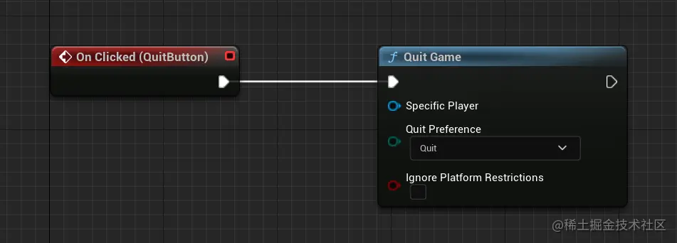

最后添加按钮点击限制，在点击时禁用两个按钮，在合适的时机（按钮没有被销毁，还要再次点击时）再接触禁用按钮的限制。_Menu.cpp_ 修改如下：

```cpp
// Menu.cpp

// ......

// HostButton 的单击事件
void UMenu::HostButtonClicked() {
	HostButton->SetIsEnabled(false); // 禁用当前按钮
	if (MultiplayerSessionsSubsystem) {
		MultiplayerSessionsSubsystem->CreateSession(NumPublicConnections, MatchType);
	}
}

// JoinButton 的单击事件
void UMenu::JoinButtonClicked() {
	JoinButton->SetIsEnabled(false); // 禁用当前按钮
	if (MultiplayerSessionsSubsystem) {
		MultiplayerSessionsSubsystem->FindSessions(10000);
	}
}

// 执行创建 Session 操作后，在创建失败后重新启用 HostButton
void UMenu::OnCreateSession(bool bWasSuccessful) {
	if (bWasSuccessful) {
		// ......
	} else {
		// ......
		HostButton->SetIsEnabled(true);
	}
}

// 执行查找 Session 操作后，如果查找 Session 失败，或者没有查找结果，则重新启用 JoinButton
void UMenu::OnFindSessions(const TArray<FOnlineSessionSearchResult>& SessionResults, bool bWasSuccessful) {
	// ......

	if (!bWasSuccessful || SessionResults.Num() == 0) {
		JoinButton->SetIsEnabled(true);
	}
}

// 加入 Session 操作后，如果加入的结果不是 Success ，则重新启用 JoinButton
void UMenu::OnJoinSession(EOnJoinSessionCompleteResult::Type Result) {

	if (Result != EOnJoinSessionCompleteResult::Success) {
		JoinButton->SetIsEnabled(true);
	}

}
```

最后，_rebuild_ 项目后即可打包，在两台登陆了不同 Steam 账号的电脑上测试了。
