## 物理引擎

物理引擎通过为刚性物体赋予真实的物理属性的方式来计算运行、旋转和碰撞反应。游戏引擎中的物理引擎的主要目的是为了解决物体在空间的状态信息。常规的物理引擎遵循物理定律，按照给定的算法，进行模拟物理运动。所以在没有多元因素影响的情况下，物理引擎的计算结果是一致的。尽量做到和现实世界基本一致。

_UE4_ 使用 _PhysX3.3_ 物理引擎驱动物理仿真以及碰撞运算（UE5 使用 _Chaos_ ）。物理引擎模拟物理计算，使玩家与场景之间能够进行基于物理的交互（撞击、发力等）。

## 物理交互

交互方式有两种：碰撞相应和追踪响应（射线），构成了 _UE4_ 在运行时处理碰撞和光线投射的基础。碰撞响应需要使用碰撞包裹（给物体添加碰撞体）。追踪响应的形体是在运行时确定的。_UE_ 中碰撞交互有三种方式：忽视（_Ignore_）、重叠(_Overlap_)、阻挡(_Block_)。它们的意思如下：

- 忽视（_Ignore_）
  - 物体和物体之间不产生任何物理结果，这使得物理引擎将两种物体不作为检查范本。
- 重叠(_Overlap_)
  - 物体与物体本身可以互相重叠，并产生事件通知。物理引擎时刻会关注物体之间的位置关系。
- 阻挡(_Block_)
  - 物体和物体之间不可以互相重叠，将产生阻挡效果。

在虚幻引擎中，能够被物理引擎计算的物体必须具备刚体。如果希望加入物理殷勤运动，还需要开启物理模拟。

## 物理碰撞

虚幻引擎中有两个编辑器：静态网格编辑器、物理资产编辑器。在静态网格编辑器中，有两个重要的操作：设置 _LOD_ 、添加碰撞信息。

### 添加静态网格碰撞

添加它，就是在添加一个包裹器，描述物理交互的轮廓。静态网格的碰撞形式分为两种：简单碰撞和复杂碰撞。复杂碰撞是给定对象的三角网格图。简单碰撞有以下选项：

- 简单碰撞
  - 方块
  - 球体
  - 胶囊
  - 凸包

虚幻 _4_ 默认在 _Physx_ 中创建简单和复杂两种形态，然后再基于用户需要（复杂查询 or 简单查询）使用相应形态。下图就是检查物体的简单碰撞数据是否添加的部分。

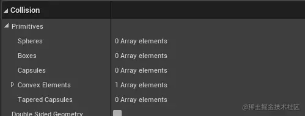

#### 添加简单形状

虚幻提供三种简单的形状碰撞器：球体、胶囊体、盒体。虚幻允许一个物体具备多个碰撞器。

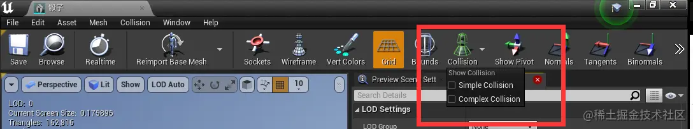

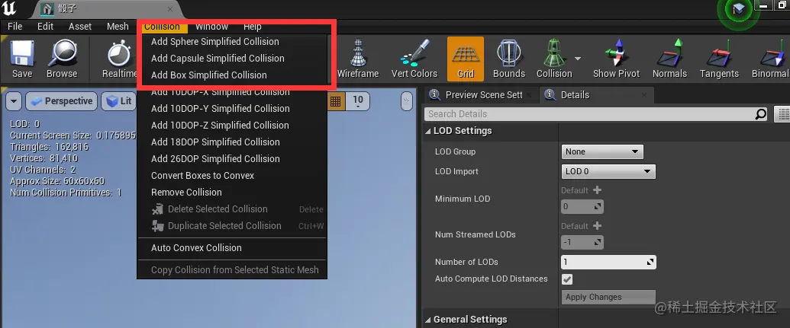

#### 添加 K-DOP 简单凸包碰撞

红框下的选项是 _K-DOP_ 凸包包裹，_K_ 离散导向多面体（_K discrete oriented polytope_）。它抓取轴对齐的平面，将其尽力推离网格体最近的位置。数字代表的是盒子的边数。

#### 自动凸包包裹

上图中的 _Auto Convex Collision_ 同样属于简单碰撞包裹，通过程序计算获得包裹数据信息。需要调整凸包顶点最大数量。凸包数量决定了包裹物体需要使用的凸包个数，越多越精确，消耗越大。最大外壳定点数指每个凸包最大允许使用多少个顶点。凸包精确度表示使用多少模型面做计算参考，数量越大精度越大。凸包包裹是可用于计算的，会生成物理资源的。它基于物体的形体轮廓。

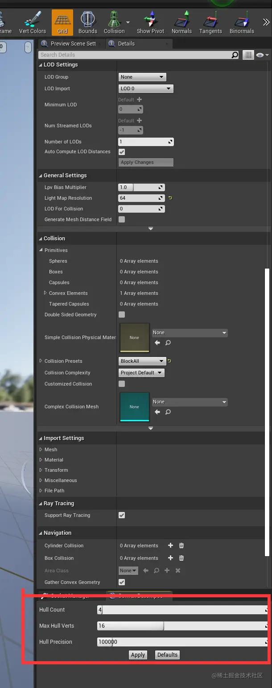

### 复杂碰撞

相比简单碰撞，它的精度高很多，它会按照模型的顶点与线的关系去生成碰撞关系。所以模型越复杂，生成碰撞的效率越低。凡是物体开启了复杂碰撞，就不能开启物理模拟了，因为它的交互复杂度会陡然增高。

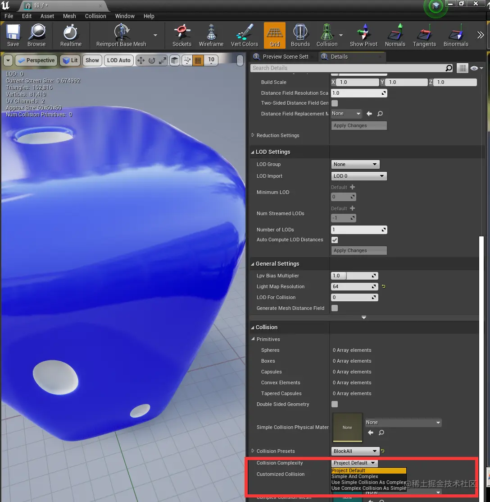

引擎默认的设置，就是 _Simple And Complex_ 。简单形状用于常规场景查询和碰撞测试，复杂形状用于复杂场景查询。_Use Simple Collision As Complex_ 非常高效，不会参与复杂碰撞，不论是否使用复杂碰撞，交互时都当作简单碰撞。它有助于节省内存，因为不需要烘焙三角网格图。_Use Complex As Simple_ 即使请求简单查询，引擎也会查询复杂形态，无视简单碰撞。它的性能要求是最高的。

#### 碰撞预设

虚幻引擎中有多种默认的碰撞预设，可以帮助快速确定场景中物体的物理碰撞关系。

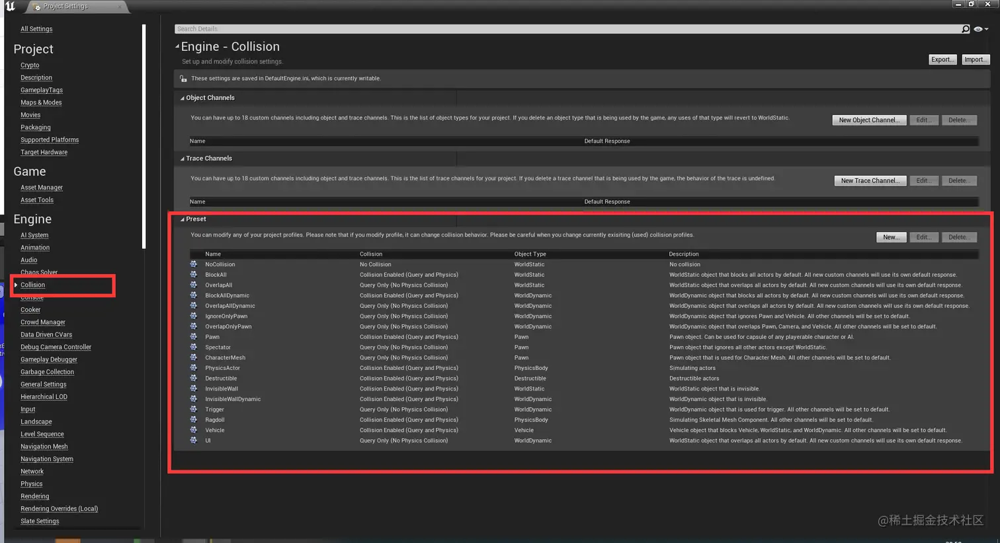

#### 物体类型

_Object Channels_ 可以用来表现物体对象类型，虚幻允许最多添加 _18_ 个对象通道。每加一个物体，都可以选择它与所有对象的交互关系。物体分类的多样性决定了物体在场景当中物理交互的复杂度。

#### 追踪类型

追踪类型用来响应和射线之间的交互关系。虚幻中默认提供两种踪迹类型。可以自定义添加更多追踪类型，虚幻最多允许额外添加18个追踪类型。

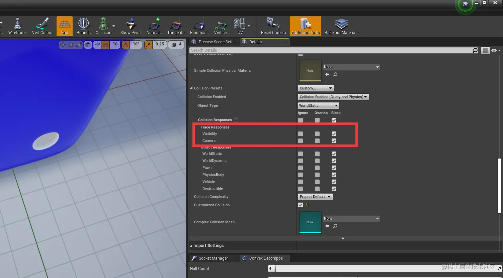

希望射线被物体挡住的就勾选 _Block_ ，否则就 _Overlap_ 或者 _Ignore_ 。在下图红框处添加新的追踪通道：

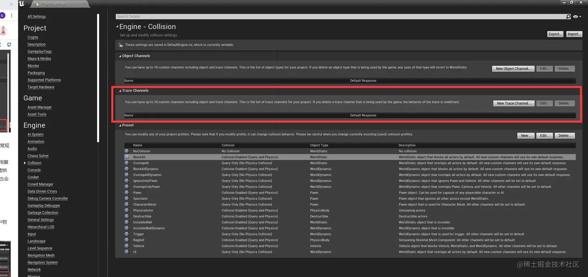

#### Collision Enabed

- _No Collision_ 没有任何碰撞信息产生，并且没有物理碰撞结果。
- _Query Only_ 只会产生碰撞通知（堆叠通知），但没有物理效果。
- _Physics Only_ 只会产生物理通知，不产生碰撞通知（堆叠通知）。
- _Collision Enabled_ 会产生碰撞通知，又会产生物理效果。

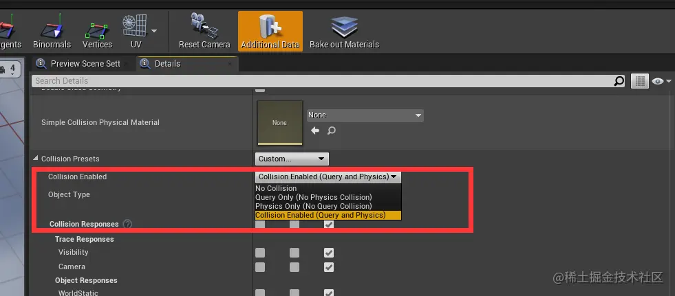

### 物理追踪

虚幻中的物理追踪是指引擎运行状态下，允许我们使用线或是形状与场景物体产生交互，并将交互结果进行反馈，以达到动态产生物理交互响应的目的。

- 线性的检测（射线检测）
- 形状检测（球、盒子、胶囊）

#### 射线检测

射线检测分三种方式：通道检测、预设检测、物体类型。检测的方式主要区别是用来筛选目标。

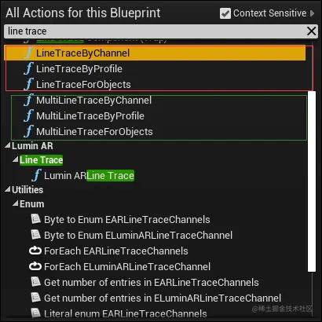

检测分为单检测（只能扫描到一个目标）和多个目标检测（返回多个目标）。

### 添加力

虚幻中，力的作用方式分为两种：冲力（_impulse_）、推进力（_force_）。冲力是瞬间力，作用结束后直接施加给物体，修正物体在物理引擎中的运动表现。推进力：单帧作用力，在当前帧中施加力效果，如果下一帧不存在推进力，则作用力无效果。推进力是持续增加力，随着时间推演作用力累加。只有开启了物理模拟的物体才能收到力的作用。

- 冲力

  - 直接将力作用在物体质心，给定一个向量，描述方向和力的大小。

- 推进力

  - 推进力需要持续发力，所以一般需要将力放到持续调用的逻辑节点中才能获得效果。

## 物理材质

物理材质描述的是物体表面的物理特性，例如摩擦力、弹性、密度等信息。

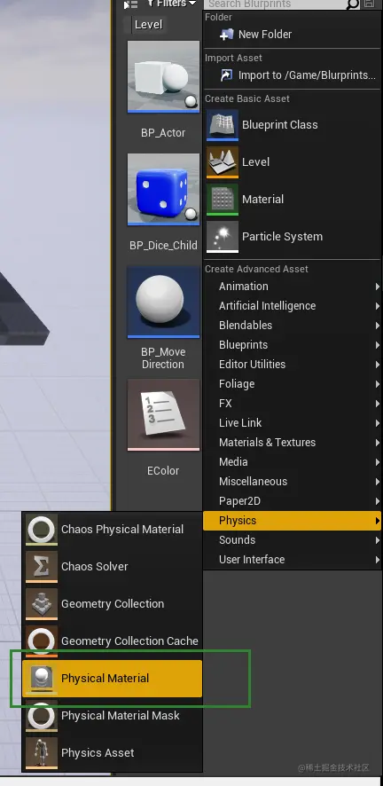

### 物理材质表面类型

在物理材质中，可以设置物体的物理表面类型，用于区分物体的表面主动响应逻辑交互方式。

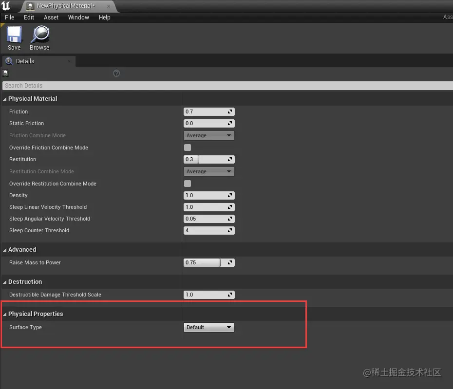

默认只有一个选项，需要在项目设置中添加表面类型。

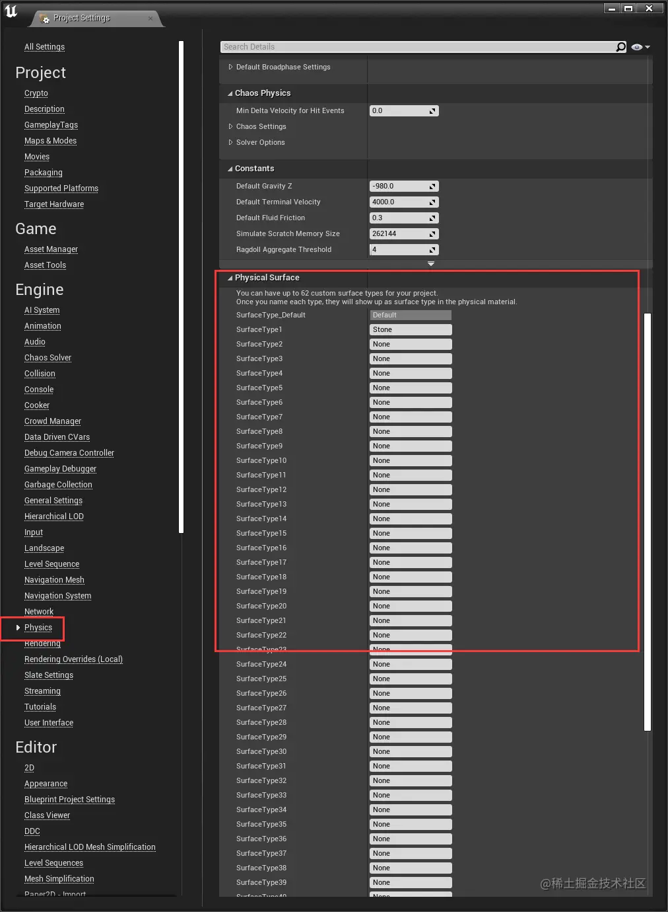

### 给物体赋予物理材质

在物体的细节面板的 _Collision_ 中选择。

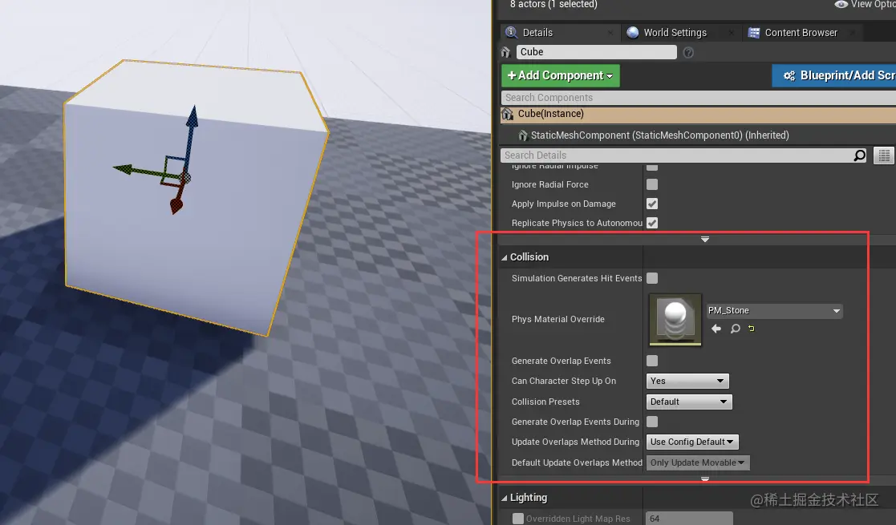
