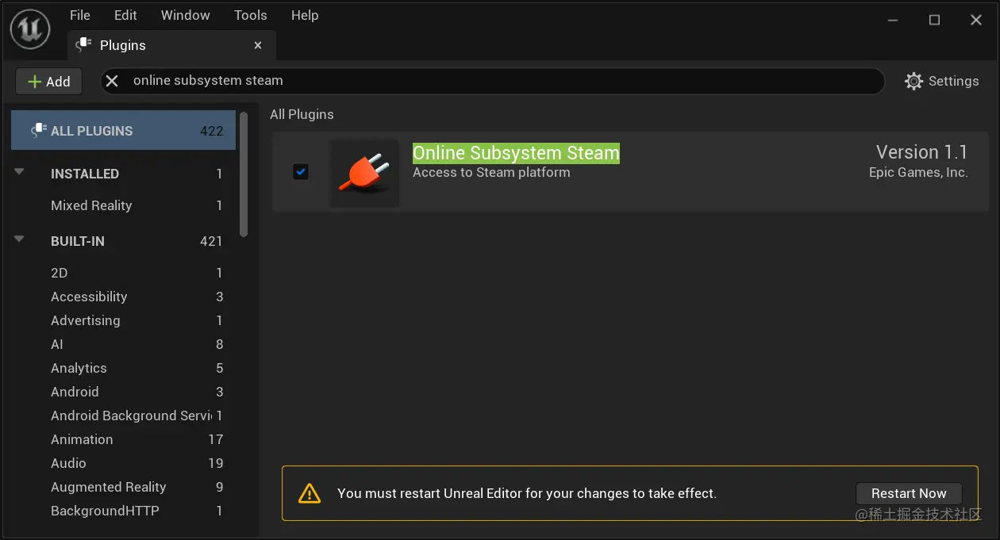
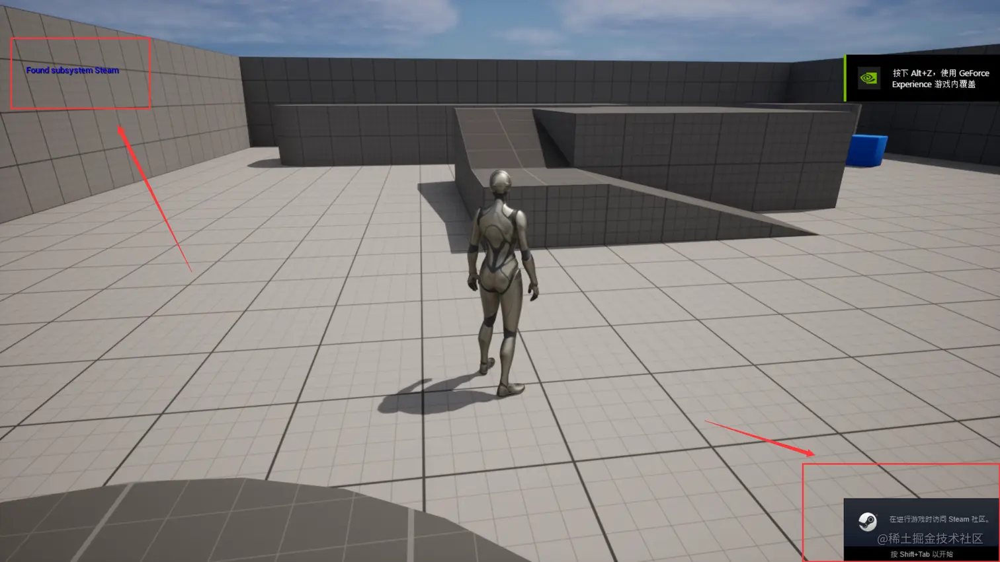
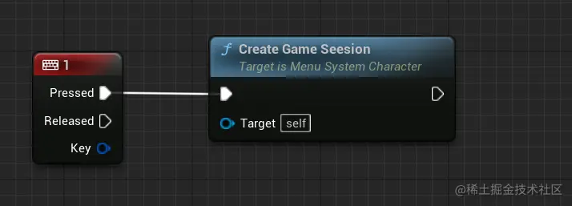
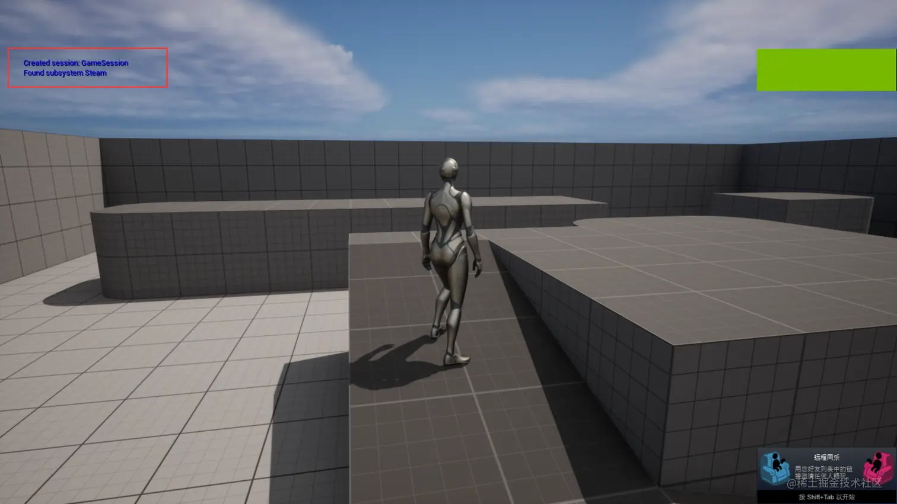
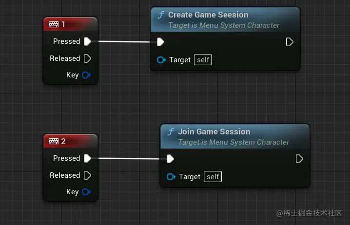
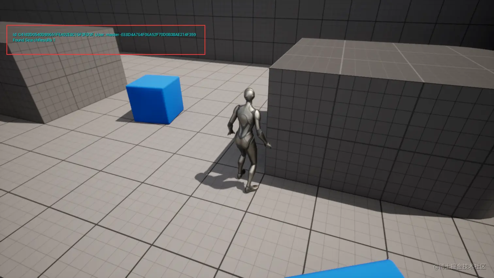

## 基础

游戏想要连接处于各地的玩家、查看好友列表等功能，可以使用_Stream_、_Xbox Live 、Facebook Game_ 提供的服务。但是它们之间是存在差异的，使用它们的服务可能要用到不同的代码。

_Unreal Engine_ 提供了一种只需使用一种方式，即可兼容各平台的代码库（ _Unreal Engine Code Base_）。使用它连接到一个服务，并运用它提供的服务。不同平台的差异，由 _Unreal Engine_ 去处理，开发者只需要写一次代码。这种用来连接到各种在线服务的系统，称为 _在线子系统（Online Subsystem）_。

## 会话接口（Session Interface）

会话接口是建立连接非常重要的接口，它负责创建、管理和销毁游戏会话、可以搜索 _Session_ 也可以配对。

_Session_ 可以看作一个游戏实例，运行在服务器上的一组属性和会话可以公开展示，以便其它玩家找到并加入。也可以是私人的 _Session_ ，之后被邀请的人可以加入游戏。

_Session_ 基本生命周期：

1.  创建 _Session_ 。
2.  等待玩家加入。
3.  玩家加入则注册进 _Session 。_
4.  开始一个 _Session_ 。
5.  每个玩家都在这个 _Session_ 中玩游戏。
6.  结束 _Session_ 。
7.  取消玩家的注册。
8.  更新 _Session_ 或者销毁 _Session_ 。

## 体验在线子系统

以第三人称模板创建一个新项目，名字为 _MenuSystem_ ，以此项目体验子系统。

### 启用 Steam 插件

窗口顶部的 _Edit -> Plugins_ 搜索 _online subsystem steam_ ，安装这个插件。勾选后重启生效。



### 启用 Steam 模块

模块只是存在于引擎中的一个代码包。打开 _Visual Studio_ ，找到 _MenuSystem.Build.cs_ 这个 _C#_ 文件，修改后内容如下：

```csharp
public MenuSystem(ReadOnlyTargetRules Target) : base(Target)
{
	PCHUsage = PCHUsageMode.UseExplicitOrSharedPCHs;
	// 新增了"OnlineSubsystemSteam", "OnlineSubsystem"
	PublicDependencyModuleNames.AddRange(new string[] { "Core", "CoreUObject", "Engine", "InputCore", "HeadMountedDisplay", "OnlineSubsystemSteam", "OnlineSubsystem" });
}
```

保存修改后 _Ctrl + Shift + B_ 给它 _rebuild_ 一下，此时如果报错，回头看一下 _Unreal Engine_ 中的 _Enable Live Coding_ 是否取消勾选了。

### 使用 Steam 作为在线子系统

找到项目文件夹，找到 _Config/DefaultEngine.ini_ ，在最后面添加这样一段内容：

```ini
;设置网络驱动，通过 SteamNetDriver 连接到 Steam 服务
[/Script/Engine.GameEngine]
+NetDriverDefinitions=(DefName="GameNetDriver",DriverClassName="OnlineSubsystemSteam.SteamNetDriver",DriverClassNameFallback="OnlineSubsystemUtils.IpNetDriver")

;设置默认服务平台为Steam
[OnlineSubsystem]
DefaultPlatformService=Steam

;设置 SteamDevAppId 为 480（这是通用测试 ID）
;要用Session，就要设置 bInitServerOnClient=true
[OnlineSubsystemSteam]
bEnabled=true
SteamDevAppId=480
bInitServerOnClient=true

; If using Sessions
; bInitServerOnClient=true
;设置连接类名
[/Script/OnlineSubsystemSteam.SteamNetDriver]
NetConnectionClassName="OnlineSubsystemSteam.SteamNetConnection"
```

关闭 _Visual Studio_ 和 _Unreal Engine_ ，删除项目目录下的一些目录（ _Saved、Intermediate、Binaries_ ）。接着右击 _.uproject_ 文件，选择 _Generate Visual Studio project files_ 。刚刚删除的目录又出现了，接着点击 _.uproject_ ，会弹窗提示 "_Would you like to rebuild them now ？_ "，选择是，配置完成。

### 访问代码中的在线子系统

为了省事，处理 _Session_ 相关的代码直接写在 _MenuSystemCharacter_ 的类里。首先在 _MenuSystemCharacter.h_ 中添加一个公共属性：

```cpp
public:

	// Pointer to online session interface
	// 这个成员变量用于存储 在线会话接口
	// GetSessionInterface 返回的是一个 IOnlineSessionPtr。（ MenuSystemCharacter.cpp 中用到）
	// IOnlineSessionPtr OnlineSessionInterface; 这是下面类型的别名，所以此处直接写原本的类型，否则需要头文件引入
	TSharedPtr<class IOnlineSession, ESPMode::ThreadSafe> OnlineSessionInterface;
};
```

接着在 _MenuSystemCharacter.cpp_ 的构造函数中，在最后面添加下面的代码：

```cpp
AMenuSystemCharacter::AMenuSystemCharacter(){
	// ......

	// 获取在线子系统
	IOnlineSubsystem* OnlineSubsystem = IOnlineSubsystem::Get();
	if (OnlineSubsystem) {
		OnlineSessionInterface = OnlineSubsystem->GetSessionInterface();

		// GEngine 是 Unreal Engine 自带的一个指针，提供了一系列方法
		// 格式化输出文字到屏幕
		if (GEngine) {
			GEngine->AddOnScreenDebugMessage(
				-1, // 不会替换之前打印的消息
				15.f, // 打印的内容停留 15 秒
				FColor::Blue, // 文字颜色为蓝色
				FString::Printf(TEXT("Found subsystem %s"), *OnlineSubsystem->GetSubsystemName().ToString()) // 获取子系统名字
			);
		}
	}
}
```

因为是直接写在角色类的构造函数中，所以游戏启动就会执行上面的代码。在 _Editor_ 中启动后，左上方屏幕输出的是 _NULL_， 这个 _NULL_ 不是空指针，而是一个专为局域网（ _Lan_ ）设计的子系统。打包后就可以看了，如果打包后目录中没有输出 _exe_ 文件，则删除项目目录下的 _Saved、Intermediate、Binaries_ 这三个目录。_rebuild_ 项目后打包。接着确定 _Steam_ 在后台运行，打开打包后的程序，可以看到打印出来的效果如下：



### 创建 Session

主要三个步骤，在 _MenuSystemCharacter.h_ 中进行创建 _Session_ 的函数声明。_MenuSystemCharacter.cpp_ 中实现函数声明。在蓝图中绑定什么时候执行条件。首先是 _MenuSystemCharacter.h_ ：

```cpp
	// MenuSystemCharacter.h

// 后面代码中的 IOnlineSessionPtr FOnCreateSessionCompleteDelegate 的头文件为 OnlineSessionInterface.h
#include "Interfaces/OnlineSessionInterface.h"

#include "MenuSystemCharacter.generated.h" // generated.h 要放在最后面

UCLASS(config=Game)
class AMenuSystemCharacter : public ACharacter
{
	......

public:

	// Pointer to online session interface
	// TSharedPtr<class IOnlineSession, ESPMode::ThreadSafe>
	// 引入了 OnlineSessionInterface.h ，所以直接用 IOnlineSessionPtr
	IOnlineSessionPtr OnlineSessionInterface;

protected:
	// 这个函数执行创建 Session 的逻辑，设为蓝图可调用的
	UFUNCTION(BlueprintCallable)
	void CreateGameSeesion();

	// 成功创建 Session 后执行的函数
	void OnCreateSessionComplete(FName SessionName, bool bWasSuccessful);

private:
	// 委托变量，存放 OnCreateSessionComplete
	FOnCreateSessionCompleteDelegate CreateSessionCompleteDelegate;
};

```

接着，在 _MenuSystemCharacter.cpp_ 中给委托赋值、实现头文件中的函数声明。

```cpp
// MenuSystemCharacter.cpp

// 构造函数中给 CreateSessionCompleteDelegate 绑定一个函数
// FOnCreateSessionCompleteDelegate 来自 OnlineSessionSettings.h
// &ThisClass 代表本类的名字，
// 构造函数中给 CreateSessionCompleteDelegate 赋值为本类中的 OnCreateSessionComplete函数
AMenuSystemCharacter::AMenuSystemCharacter():
	CreateSessionCompleteDelegate(FOnCreateSessionCompleteDelegate::CreateUObject(this, &ThisClass::OnCreateSessionComplete))
{
	// ......
}


// 实现创建 Session 的逻辑
void AMenuSystemCharacter::CreateGameSeesion() {
	// OnlineSessionInterface 无效时直接返回
	if (!OnlineSessionInterface.IsValid()) {
		return;
	}

	// NAME_GameSession 是个常量，表示当前会话名
	// 判断当前会话名判断是否存在于在线会话中
	auto ExistingSession = OnlineSessionInterface->GetNamedSession(NAME_GameSession);
	if (ExistingSession != nullptr) {
		// 如果存在，则销毁 Session
		OnlineSessionInterface->DestroySession(NAME_GameSession);
	}

	// 添加 CreateSessionCompleteDelegate 到委托列表中
	// 当 Session 创建成功后，会调用 CreateSessionCompleteDelegate 绑定的函数 OnCreateSessionComplete
	OnlineSessionInterface->AddOnCreateSessionCompleteDelegate_Handle(CreateSessionCompleteDelegate);

	// 创建一个存放 Session 设置的对象指针
	TSharedPtr<FOnlineSessionSettings> SessionSettings = MakeShareable(new FOnlineSessionSettings());
	SessionSettings->bIsLANMatch = false; // 设置为 外部玩家可见的非局域网匹配
	SessionSettings->NumPublicConnections = 4; // 可以有 4 个玩家连接
	SessionSettings->bAllowJoinInProgress = true; // 允许加入正在运行的游戏
	SessionSettings->bAllowJoinViaPresence = true; // 允许区域玩家加入
	SessionSettings->bShouldAdvertise = true; // 在在线服务上公开发布
	SessionSettings->bUsesPresence = true;  // 显示用户状态信息
	SessionSettings->bUseLobbiesIfAvailable = true; // 支持 Lobbies Api，不开启可能无法找到 Session
	// 获取玩家控制器，用于获取玩家信息
	const ULocalPlayer* LocalPlayer = GetWorld()->GetFirstLocalPlayerFromController();
	// 创建 Session，传入网络ID 、Sesssion名、Session设置
	OnlineSessionInterface -> CreateSession(*LocalPlayer->GetPreferredUniqueNetId(), NAME_GameSession, *SessionSettings);
}

```

接着在蓝图中绑定触发事件：



此时打包后运行游戏，按 _1_ 触发绑定的事件。可以看到成功创建了 Session ，效果如下图所示：



### 寻找 Session

新增寻找 _Session_ 的代码，步骤与创建类似。首先在 _MenuSystemCharacter.h_ 中添加下面的内容：

```cpp
// MenuSystemCharacter.h

protected:
	// 加入游戏 Session 的逻辑
	UFUNCTION(BlueprintCallable)
	void JoinGameSession();

	// 找到 Session 后执行的函数
	void OnFindSessionsComplete(bool bWasSuccessful);

private:
	// 存放找到 OnFindSessionsComplete 的委托
	FOnFindSessionsCompleteDelegate FindSessionCompleteDelege;
	// 存放搜索对象
	TSharedPtr<FOnlineSessionSearch> SessionSearch;
};
```

接着是_MenuSystemCharacter.cpp_ :

```cpp
// MenuSystemCharacter.cpp

// 构造函数中给 FindSessionCompleteDelege 赋值为本类中的 OnFindSessionsComplete 函数
AMenuSystemCharacter::AMenuSystemCharacter():
	CreateSessionCompleteDelegate(FOnCreateSessionCompleteDelegate::CreateUObject(this, &ThisClass::OnCreateSessionComplete)),
	FindSessionCompleteDelege(FOnFindSessionsCompleteDelegate::CreateUObject(this, &ThisClass::OnFindSessionsComplete))
{
	// ......
}

// 加入游戏的逻辑
void AMenuSystemCharacter::JoinGameSession() {
	// Find game session
	if (!OnlineSessionInterface.IsValid()) {
		return;
	}

	// 将委托添加到 FindSessionsCompleteDelegate_Handle 委托列表
	// 找到 Session 后执行 FindSessionCompleteDelege 绑定的函数 OnFindSessionsComplete
	OnlineSessionInterface->AddOnFindSessionsCompleteDelegate_Handle(FindSessionCompleteDelege);

	SessionSearch = MakeShareable(new FOnlineSessionSearch()); // 创建 SessionSearch 对象
	SessionSearch->MaxSearchResults = 10000; // 最大搜索结果为 10000 条
	SessionSearch->bIsLanQuery = false; // 关闭局域网查询
	SessionSearch->QuerySettings.Set(SEARCH_PRESENCE, true, EOnlineComparisonOp::Equals); // 只查询 presence 值为 true 的

	// 获取玩家控制器，以供后面获取网络 ID
	const ULocalPlayer* LocalPlayer = GetWorld()->GetFirstLocalPlayerFromController();
	// 通过 网络ID、SessionSearch 搜索参数 来查找 Session
	OnlineSessionInterface->FindSessions(*LocalPlayer->GetPreferredUniqueNetId(), SessionSearch.ToSharedRef());
}

// 找到 Session 后执行的函数
void AMenuSystemCharacter::OnFindSessionsComplete(bool bWasSuccessful) {
	// 打印搜索结果数量
	GEngine->AddOnScreenDebugMessage(
		-1,
		15.f,
		FColor::Cyan,
		FString::Printf(TEXT("Found SearchResults %d"), SessionSearch->SearchResults.Num())
	);

	// 遍历结果，取出每条结果的 Id、User，打印它们
	for (auto Result : SessionSearch->SearchResults) {
		FString Id = Result.GetSessionIdStr();
		FString User = Result.Session.OwningUserName;
		if (GEngine) {
			GEngine->AddOnScreenDebugMessage(
				-1,
				15.f,
				FColor::Cyan,
				FString::Printf(TEXT("Id: %s, User: %s"), *Id, *User)
			);
		}
	}
}

```

接着，在蓝图中绑定事件：



最后将游戏打包，打开两个客户端，一个创建，另一个查找。最终查找到的效果如下：



### 加入 Session

首先是 _MenuSystemCharacter.h_ ：

```cpp
// MenuSystemCharacter.h

UCLASS(config=Game)
class AMenuSystemCharacter : public ACharacter
{
	// ......
protected:
	void OnJoinSessionComplete(FName SessionName, EOnJoinSessionCompleteResult::Type Result);
private:
	// ......
	FOnJoinSessionCompleteDelegate JoinSessionCompleteDelegate;

}
```

然后是 _MenuSystemCharacter.cpp_ :

```cpp
// MenuSystemCharacter.cpp

// 构造函数中给 JoinSessionCompleteDelegate赋值为本类中的 OnJoinSessionComplete函数
AMenuSystemCharacter::AMenuSystemCharacter():
	CreateSessionCompleteDelegate(FOnCreateSessionCompleteDelegate::CreateUObject(this, &ThisClass::OnCreateSessionComplete)),
	FindSessionCompleteDelege(FOnFindSessionsCompleteDelegate::CreateUObject(this, &ThisClass::OnFindSessionsComplete)),
	JoinSessionCompleteDelegate(FOnJoinSessionCompleteDelegate::CreateUObject(this, &ThisClass::OnJoinSessionComplete))
{
	// ......
}

// CreateGameSeesion 中添加 SessionSettings 设置
void AMenuSystemCharacter::CreateGameSeesion() {
	// ......

	// 设置 MatchType 为 "FreeForAll"
	SessionSettings->Set(FName("MatchType"), FString("FreeForAll"), EOnlineDataAdvertisementType::ViaOnlineServiceAndPing);

	// ......
}

// OnCreateSessionComplete 中添加成功创建 Session 后切换关卡的逻辑
void AMenuSystemCharacter::OnCreateSessionComplete(FName SessionName, bool bWasSuccessful) {
	if (bWasSuccessful) {
		// ......

		// 切换到名为 Lobby 的关卡
		UWorld* World = GetWorld();
		if (World) {
			World->ServerTravel(FString("/Game/ThirdPerson/Maps/Lobby?listen"));
		}
	} else {
		// ......
	}
}

//
void AMenuSystemCharacter::OnFindSessionsComplete(bool bWasSuccessful) {

	if (!OnlineSessionInterface.IsValid()) {
		return;
	}

	for (auto Result : SessionSearch->SearchResults) {

		FString Id = Result.GetSessionIdStr();
		FString User = Result.Session.OwningUserName;

		// 获取 MatchType
		FString MatchType;
		Result.Session.SessionSettings.Get(FName("MatchType"), MatchType);

		if (GEngine) {
			GEngine->AddOnScreenDebugMessage(
				-1,
				15.f,
				FColor::Cyan,
				FString::Printf(TEXT("Id: %s, User: %s"), *Id, *User)
			);
		}

		// 如果 MatchType 是前面 CreateGameSeesion 中设置的 "FreeForAll"，则打印并添加委托，同时加入 Session
		if (MatchType == FString("FreeForAll")) {
			if (GEngine) {
				GEngine->AddOnScreenDebugMessage(
					-1,
					15.f,
					FColor::Cyan,
					FString::Printf(TEXT("Joining Match Type %s"), *MatchType)
				);
			}

			OnlineSessionInterface->AddOnJoinSessionCompleteDelegate_Handle(JoinSessionCompleteDelegate);

			const ULocalPlayer* LocalPlayer = GetWorld()->GetFirstLocalPlayerFromController();
			OnlineSessionInterface->JoinSession(*LocalPlayer->GetPreferredUniqueNetId(), NAME_GameSession, Result);
		}
	}
}


```

最后打包，将 _.exe_ 在两台机器上运行，查看效果。
