蓝图是 `ue` 的可视化脚本，很多编程实现的效果，可以通过简单的图形化操作实现。

## 制作开关门效果

首先在项目中添加第三人称模板（或者直接通过第三人称模板创建项目），然后添加内容包中的初学者内容包。

### 场景准备

- 将门拖入场景中，此时人物是可以直接穿过门的。
- 在 `Content Browser` 中双击门的模型，进入编辑界面。
- `Collision` - `Add Shpere Simplified Colision`，方框保住的地方即可触发碰撞（如同有阻挡，不可穿过）。

### 添加盒触发器

- `Place Actors` - `Basic` - `Box Trigger` 拖入到场景中。调整大小，使其可以罩住门的模型。

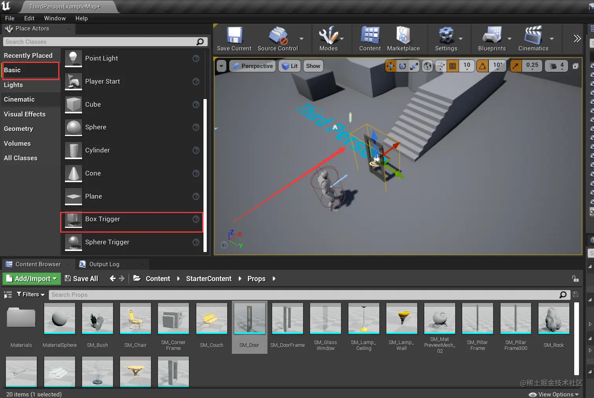

- 将逻辑在关卡蓝图中设置。
  - 选中场景中的门，移动性改为可移动的。
  - 选中触发盒子 - `Blueprints` - `Open Level Blueprint`。
  - 右击出现 `Add Event For Tigger Box1`，展开 `Collision` 添加 `OnActorBeginOverlap`（进入触发盒子范围时执行） 和 `OnActorEndOverlay` （离开触发盒子范围时执行）事件。
  - 返回界面选择门后再回到蓝图编辑界面，右击选择 `Create a Reference to SM_Door`。
  - 拖动SM\_Door右边的蓝点，选出 `SetActorRotation`。 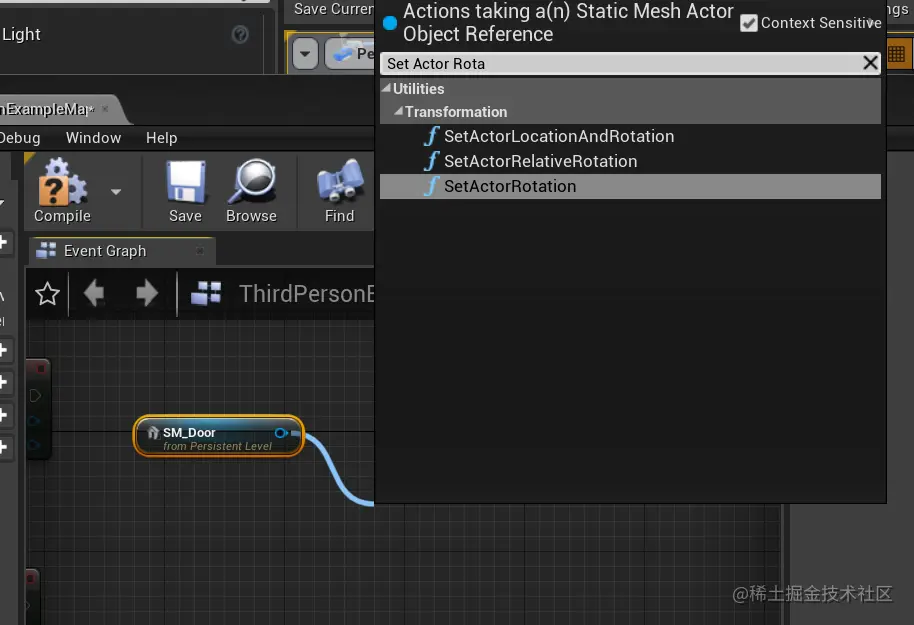
  - 让 `OnActorBeginOverlay` 指向 `SetActorRotation`，并修改 `SetActorRotation` 的`z` 值（哪个轴可以让门按预期旋转就设置哪个轴）。
  - 此时进入触发盒子的范围，门会打开，但是这个过程没有过渡效果，显得生硬。
  - 右击 `Add Timeline` 添加时间轴。 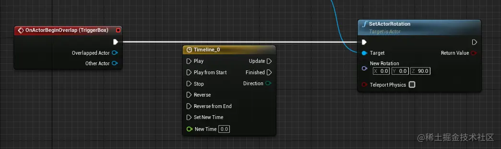
  - 双击时间轴后 `Add Float Track`。
  - 右击后点击 `Add key to CurveFloat_1` 添加关键帧，将它的数值都设置为 0。
  - 再右击后点击 `Add key to CurveFloat_1` 添加关键帧，此时 `Time` 设置为 2 ，`Value` 设置为 90。
  - 点击下图两个按钮： 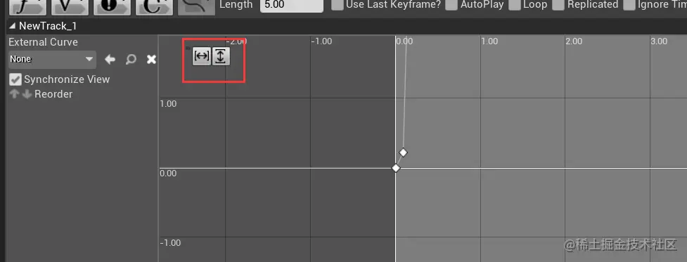
  - 点击第一个关键帧，选择 `Auto`，则直线变成了弧线。 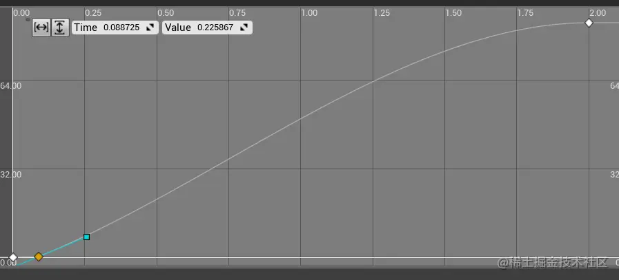
  - 时间轴的长度改为最后一个关键帧的长度（ 2s ）。
  - 连线，如下图： 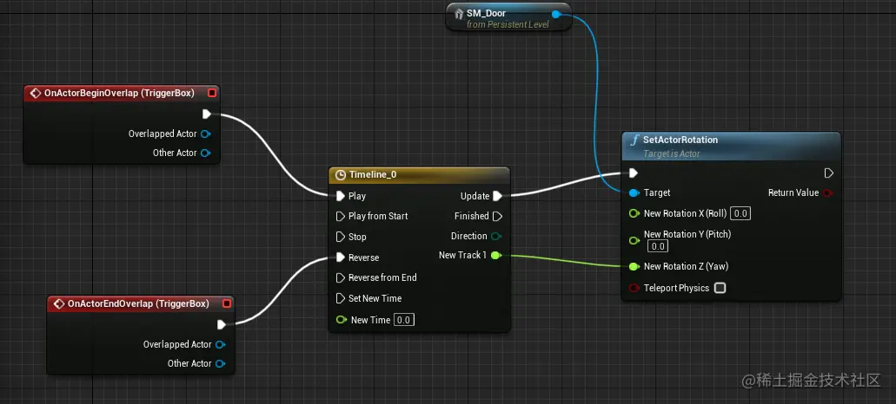

### 时间轴节点作用

- `Play` 正向播放时间轴。
- `Play from Start` 从时间轴设置的第一个关键帧开始播放。开关门不能使用，因为开关门的过程可能中断然后切换到另一个状态（开 or 关），导致画面闪烁。
- `Stop` 开门过程中要停止。
- `Reverse` 反向播放。
- `Reverse from End` 从最后一个关键帧反向播放。
- `Set new Time` 设置新时间，从新的时间开始播放。
- `New Time` 自定义的播放时间。
- `Update` 每帧每秒的更新，设置要设置的对象。
- `Finished` 当时间轴跑完后触发。
- `Direction` 时间轴当前是正向还是反向的。
- `New Track` 新建的轨迹。

## 创建门的蓝图类

前面门的交互逻辑是直接放置在关卡蓝图中。现在将它单独放在一个位置 —— `蓝图类`。

- 创建 `Actor`

  - 在 `Content Browser` 中右击空白处，选择 `Blueprints Class`，在弹出的新界面中选择 `Actor` (每个 `Actor` 就相当于传统编程中的一个函数、一个类)。
  - `Content Browser` 会多一个元素，将其改名为 `Door_BP` 然后双击打开。

- 为 `Actor` 添加组件，组合成门。

  - 左上角 `Component` - `Add Component` 添加静态网格体。改名为 `DoorFrame` ，细节面板的 `Static Mesh` 选择为门框。
  - 在 `DoorFrame` 下面添加静态网格体，改名为 `Door` ，细节面板的 `Static Mesh` 选择为门。

- 如果门的中心点在中间，希望旋转是绕一边旋转。

  - 添加一个 `Scene` 组件，它是一个空的。放到门的一侧，将门组件放到 `Scene` 下面，旋转 `Scene` 也会跟着旋转。

- 添加碰撞检测

  - `Add Compoent` 下面选择 `Box Colision`，它如同在外面添加的 `Box Trigger`。
  - 将 `Box Colision` 与门放在同一级。
  - 切换到 `Event Graph`。 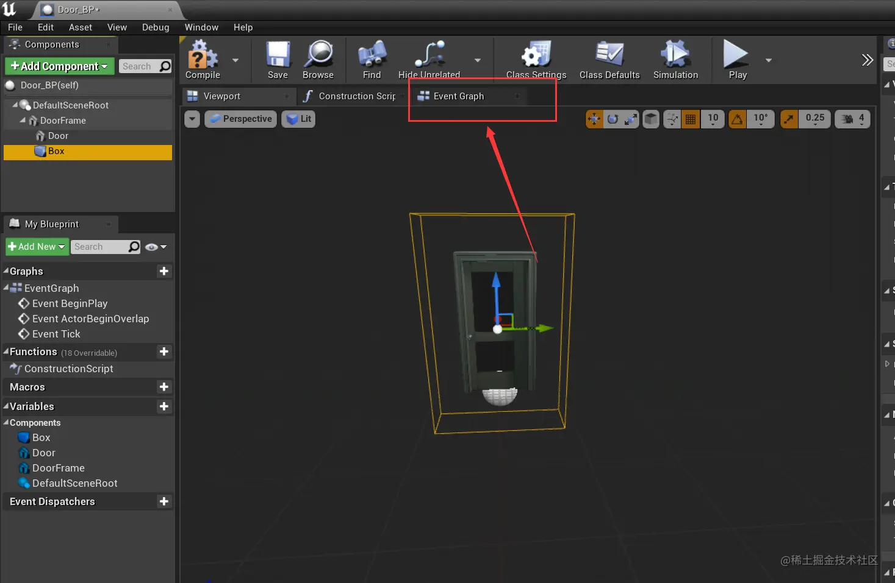
  - 选中`Box`，在右边细节窗口的 `Events`，添加 `On Component Begin Overlay` 与 `On Component End Overlay` 事件。
  - 添加时间轴（步骤与上面在关卡蓝图中的操作一样......）。 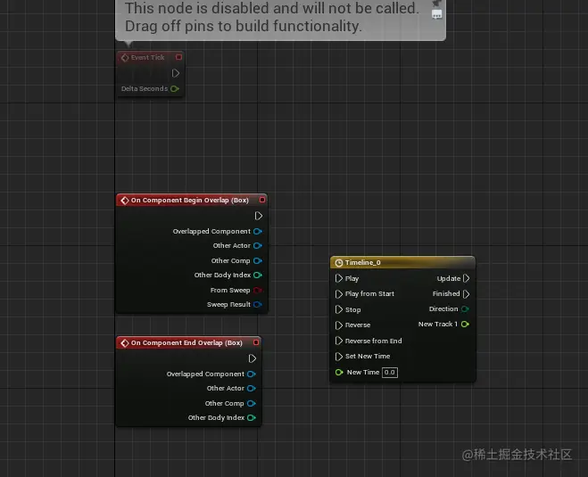

- 相对位置和世界位置

  - 世界坐标永远不会被改变，相对位置是相对物体的位置。
  - 在 `Component` 中，将 `Door` 拖入蓝图编辑框中，添加它的引用。
  - 为它添加 `SetRelativeRotation`，使用相对旋转，这样无论怎样拜访都是相对门自己旋转90度。 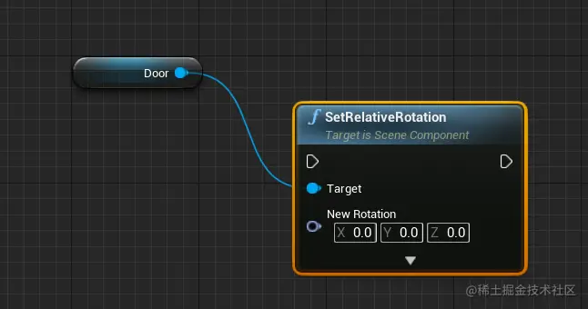
  - 连线，如下图： 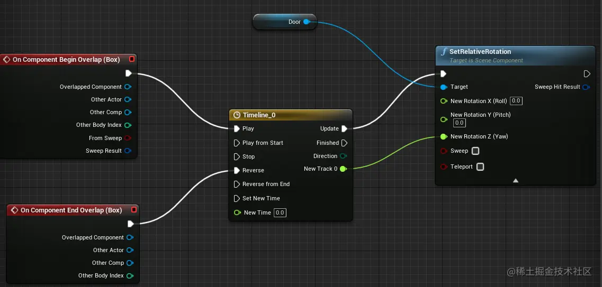

- `SetActorRotation` 、`SetRelativeRotation`、`SetWorldRotation` 的区别。

  - `SetActorRotation` 自己整个蓝图类都进行旋转。
  - `SetRelativeRotation` 与 `SetWorldRotation` 移动的是单个组件，所以需要设置一个目标组件。

### 通过按键控制开关门

- 在蓝图编辑框内右击添加 `Gate` ，专门用于流程控制，相当于 `if` 语句。

  - 下面的操作相当于 if 语句。 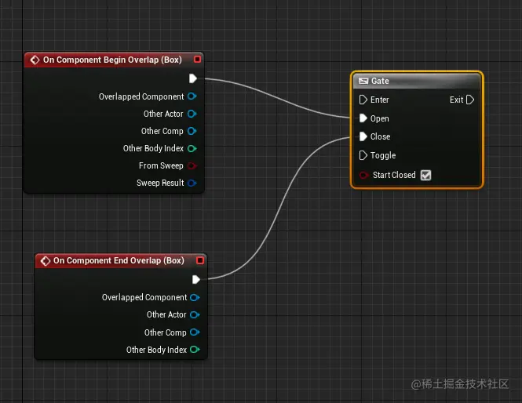

  ```ini
  if Begin then
      Open = true
  endif
  if End then
      Close = true
  endif
  ```

- 为 `E` 键添加事件，右击空白区域选择 `E`。
  - 开启/关闭玩家输入，右击空白区域选择 `Enable Input` 和 `Disable Input`。
  - `Enable Input` 点击 `Player Controller` 拖拽，点击 `Get Player Controller` 获取 `Player Controller`。
  - 连线，如下图： 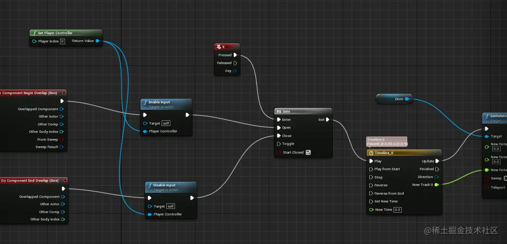
  - 此时门只能开不能关，因为 `Gate` 的 `Exit` 只连着 `Play`。但是它又只又一个 `Exit` ，只能连一个。右击空白区域选择 `FlipFlop`（第一次触发时走A连接的点，下一次走B，下下次走A......），然后连线，如下图。 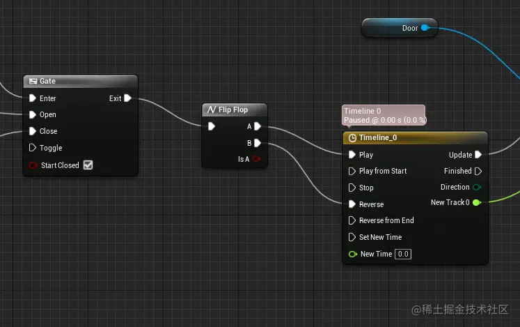
- 为 `Door` 组件添加单机事件
  - 选择 `Door`后，添加细节面板的 `Events` 下的 `On Clicked`。
  - 用`On Clicked` 代替 `E` 的连线位置。
  - 返回场景，在 `World Settings` 中在 `Game Mode` 下的 `GameMode Override` 设置为 `ThirdPersonGameMode`。
  - 展开`Selected GameMode`，在`Player Controller Class` 右边选择 `Create New Blueprints` 。
  - 在弹出的新界面中的 `Mouse Interface` 勾选 `Enable Click Events` 和 `Show Mouse Cursor`。
  - 连线，如下图： 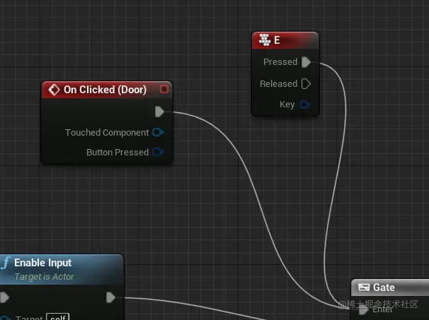
  - 此时单击和鼠标 `E` 键都可以触发开关门。
- 优化体验
  - 关闭 `Show Mouse Cursor` 。
  - 在蓝图中，拖动 `Player Controller` 的 `Return Value`，添加两个 `Show Mouse Cursor`，并如下图连线： 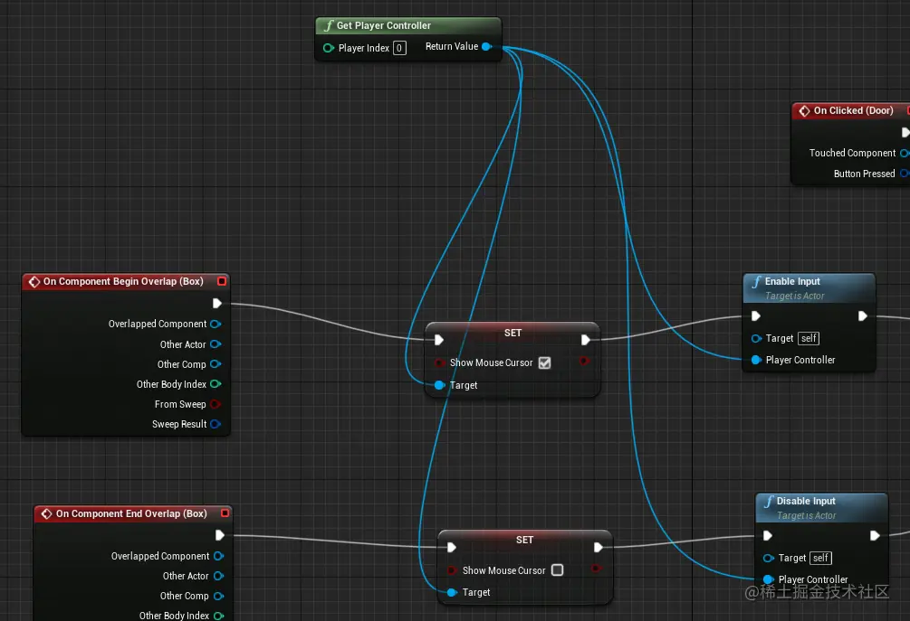
  - 此时只有在 `Box Colision` 范围鼠标才显示。
- 设置只有某个类型的组件才能触发 `Begin` 与 `End` 事件。
  - 拖动 `On Component Begin Overlap` 的 `Other Actor` ，选择 `Cast To ThirdPersonCharacter` ，然后连线，如下图（图片是最开始选错了，应选择 `Cast To ThirdPersonCharacter` ）： 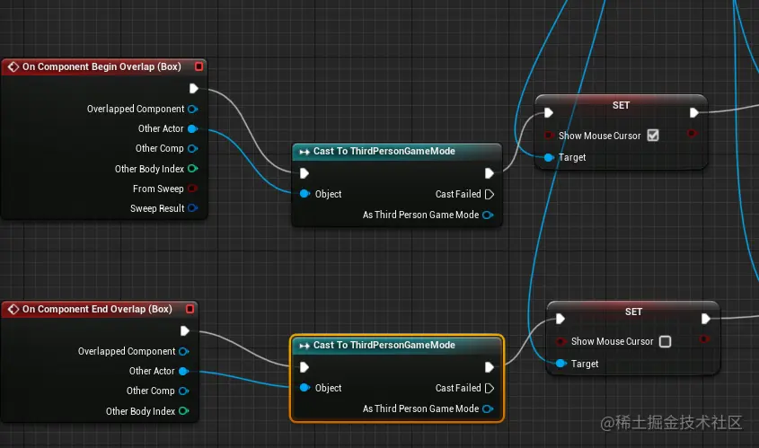
