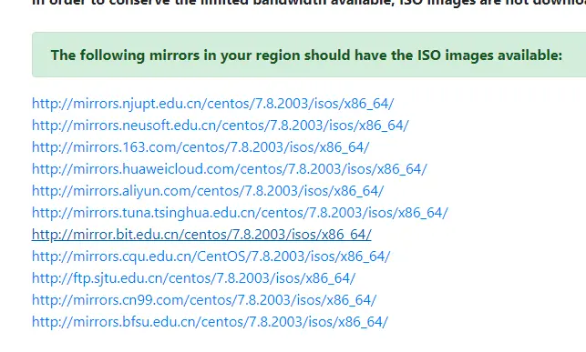
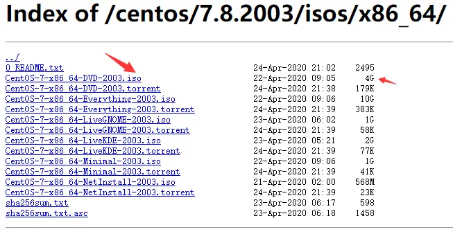
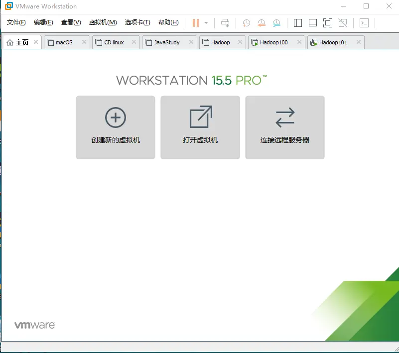
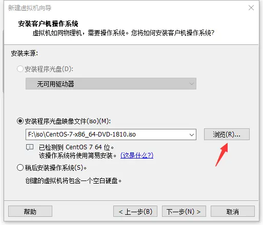
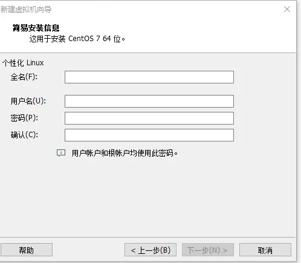
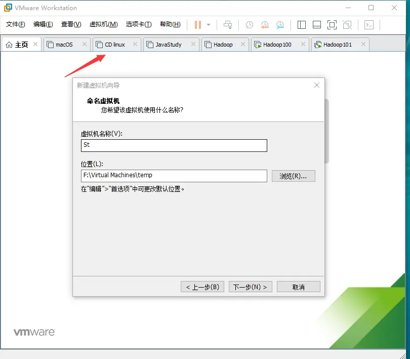
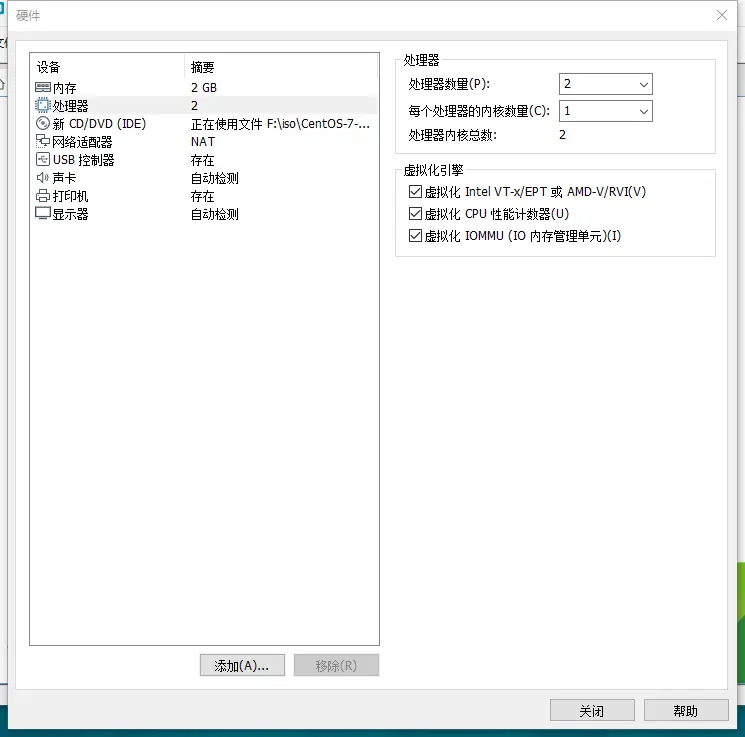
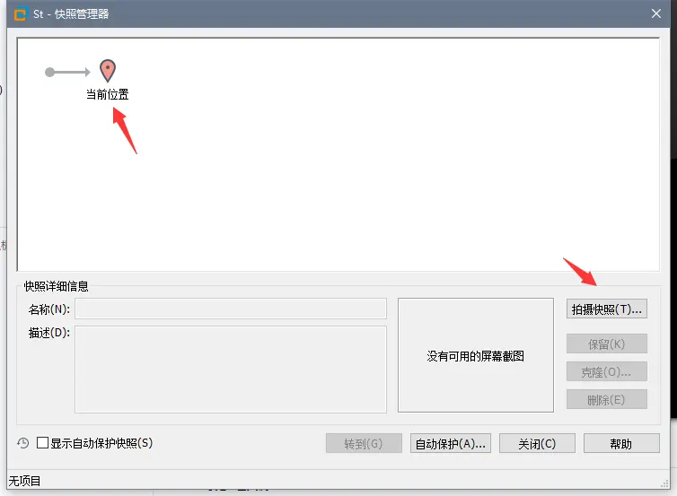

# 一、下载虚拟机软件和系统镜像

首先下载好VMware Workstation（下面简称VM）和CentOS 7的系统镜像文件。  
VM 下载地址：

> [国际站链接（免登录下载）](https://www.vmware.com/products/workstation-pro/workstation-pro-evaluation.html)  
> [中文站链接(登录后才能下载)](https://my.vmware.com/cn/web/vmware/downloads/details?downloadGroup=WKST-1556-WIN&productId=799&rPId=47859)

下载好后一直下一步即可（注意选择安装在那个盘符）。  
CentOS 7下载地址：

> [查看你所在位置适合的镜像站点](http://isoredirect.centos.org/centos/7/isos/x86_64/)

这个页面出现的所有链接都可以，随便点一个进去。

下载64-DVD-\*\*\*.iso大小4G左右的文件，点击它自动会下载。这是镜像站点，下载会快一点。

# 二、打开虚拟机安装系统

打开这个界面，点击创建虚拟机或者点击左上角文件，下拉菜单中选择新建虚拟机。然后在新弹出的窗口中选择 `典型` ,`下一步`。

点击`浏览`后在弹出的资源管理器窗口找到你下载好的`.iso`结尾的系统镜像文件。然后继续下一步。

`全名`是你的CentOS系统的主机名，`用户名`和`密码`就是下VM帮你创建的一个普通用户）。

`虚拟机名称`就是创建好后箭头处标签的名字，安装的这个虚拟及其对于VM的标识，与系统没有太大的关系。`位置`是你虚拟机存放的位置，建议放在系统之外的盘符专门创建一个目录保存。然后下一步，`磁盘大小`就是给这个虚拟系统的设置的硬盘空间，默认就好了;选择`将虚拟磁盘拆分成多个文件`然后下一步。这个时候就完成了VM的设置，可以直接点完成然后启动虚拟机。不过建议在新窗口中选择自定义硬件，将内存设置为2G，CPU如图设置。

VM 15版本默认是简易安装（帮助用户完成常用的系统设置），所以需要设置的部分很少。要等待一会儿，中途不要关闭虚拟机。  
安装好后关机。

单击箭头指向的图标。

单击`当前位置`然后点击`拍摄快照`。快照：系统当前是什么状态就记录下来，相当于拍了个照片。万一系统出了无法解决的问题，可以选择恢复到某个快照（恢复到那个快照被拍摄时的状态）。关机拍摄只会记录硬盘状态，如果是开机状态拍摄的快照会将内存也记录下来，简单的说就是它们没有太大的差别，但是开机拍摄的快照更占内存。
