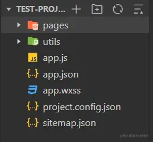

本文是我学习小程序的笔记。

## 基础

### 小程序与普通网页开发的区别

- 网页运行在浏览器环境中，小程序运行在微信环境中
- 小程序无法调用DOM、BOM的API。但是小程序可以调用微信环境的各种API，如地理定位、扫码、支付。
- 开发模式不同
  - 申请小程序开发账号
  - 安装小程序开发者工具
  - 创建和配置小程序项目

### 小程序的项目结构



- pages存放小程序所有页面
- utils存放工具模块
- app.js是小程序的入口文件
- app.json是小程序的全局配置文件
- app.wxss是小程序的全局样式文件
- project.config.json 项目的配置文件
- sitemap.json 配置小程序及其页面是否允许被微信索引

每个页面由4个基本文件组成`.js`是脚本文件;`.json`是配置文件;`.wxml`是页面的模板结构文件(类似HTML);`.wxss`是当前页面的样式文件（类似CSS）。

#### app.json 文件

小程序的全局配置文件。pages用来记录当前页面的路径，window全局定义小程序所有页面的颜色、文字颜色等，style全局定义小程序组件所使用的样式版本，sitemapLocation用来指定sitemap.json的位置。

#### project.config.json 文件

项目配置文件，setting设置编译相关的配置、projectname设置项目名称，appid设置小程序账号ID。

### WXML

类似HTML。

- 标签名称不同
  - HTML(div,span,img,a)
  - WXML(view,text,image,navigator)
- 属性节点不同
  - `<a href="#">首页</a>`
  - `<navigator url="/pages/home/home"></navigator>`
- 自带类似Vue的模板语法
  - 数据绑定。
  - 列表渲染。
  - 条件渲染。

### WXSS

类似CSS。

- 新增了rpx尺寸单位

  - CSS中rem需要手动进行像素单位换算。
  - WXSS的rpx在不同大小的屏幕上会自动进行换算。

- 提供了全局的样式和局部的样式

  - app.wxss是全局样式。
  - 页面中对应的.wxss文件时局部样式。

- WXSS仅支持部分CSS选择器

  - 类选择器、ID选择器、元素选择器、并集选择器、后代选择器、伪元素选择器。

### 小程序中的JS

- app.js
  - 整个小程序的入口文件，调用App()函数来启动整个小程序。
- 页面 .js 文件
  - 页面的入口文件，调用Page()函数来创建并运行页面。
- 普通的 .js 文件
  - 普通的模块文件，封装公共函数或属性供页面使用。

## 宿主环境

宿主环境(host environment)，程序运行所必须的依赖环境。手机微信是小程序的宿主环境，

### 通信模型

#### 通信主体（渲染层和模板层）

- WXML模板和WXSS样式工作在渲染层。
- JS脚本工作在逻辑层。

#### 通信模型

- 渲染层和逻辑层之间的通信。
  - 由微信客户端进行转发。
- 逻辑层和第三方服务器之间的通信。
  - 由微信客户端进行转发。

### 运行机制

#### 小程序启动的过程

将小程序代码包下载到本地 --> 解析 app.json 全局配置文件 --> 执行 app.js 小程序入口文件，调用App()创建小程序实例 --> 渲染小程序首页 --> 启动完成

#### 页面渲染过程

加载解析页面的 .json 配置文件 --> 加载页面的 .wxml 模板和 .wxss 样式 --> 执行页面的 .js 文件，调用Page()创建页面实例 --> 页面渲染完成

### 组件

微信小程序提供很多UI组件，比如（下面不是全部）：

- 视图容器
  - view (类似div)
  - scroll-view (可滚动的视图区)
  - swiper、swiper-item（轮播图容器组件和轮播图item组件）
- 基础内容
  - text (类似span，文字放入其中并带上 `selectable` 才可选中，放入其它标签中不行）
  - rich-text（富文本组件，`nodes` 属性中的HTML字符串可渲染为WXML结构）
- 表单组件
  - button (按钮组件，通过`open-type`可以调用微信提供的各种功能，如客服、转发、获取用户授权、获取用户信息等)
- 媒体组件
  - image （图片组件，组件默认宽度约300px、高度约240px）

### API

小程序官方将API分为3大大类：事件监听API、同步API、异步API。小程序中全局对象是`wx`，类似浏览器中的`window`。

## 模板语法

### 数据绑定

与Vue非常相似，两个步骤：

1.  在页面对应的 .js 文件中，在data对象中声明。
2.  {{ var }} ，小程序中叫做Mustache语法，与Vue 中的插值表达式类似。

与Vue中不同的是，它能直接在标签属性中使用，如:`<image src="{{ imgUrl }}">`。

## 事件绑定

### 小程序常用事件

- tap ，类似click事件
- input ，输入框中输入内容时触发
- change ，状态改变时触发

### 事件回调函数

#### 事件对象

事件回调触发后，会收到一个事件对象event，事件对象有以下属性：

| 属性           | 类型    | 说明                                       |
| -------------- | ------- | ------------------------------------------ |
| type           | String  | 事件类型                                   |
| timeStamp      | Integer | 页面打开到触发事件所经过的毫秒数           |
| target         | Object  | 触发事件的组件                             |
| currentTarget  | Object  | 当前组件                                   |
| detail         | Object  | 额外的信息                                 |
| touches        | Array   | 触摸事件，当前停留在屏幕中触摸点信息的数组 |
| changedTouches | Array   | 触摸事件，当前变化的触摸点信息的数组       |

#### 事件回调中为data中的数据赋值

使用`setData`函数，用法与React中的`setState`类似。

#### 事件传参

小程序中传参不能像Vue中直接函数名字跟小括号，因为引号中的字符串无论什么样都会认为是对应的函数名。使用 `data-*`，如 `data-id="{{2}}"`（如果不用Mustache语法，传过去就是字符串）。

## 条件渲染

#### wx:if

`if...elif...else`代码如下：

```html
<view wx:if="{{ type === 1 }}"> 男 </view>
<view wx:elif="{{ type === 2 }}"> 女 </view>
<view wx:else> 保密 </view>
```

同时控制多个显示隐藏：

```html
<!-- 使用block的话，block不会被渲染成任何组件 -->
<block wx:if="{{ true }}">
  <view> view1 </view>
  <view> view2 </view>
</block>
```

hidden，控制元素的显示与隐藏，如下：

```html
<view hidden="{{ true }}"> view2 </view>
```

`wx:if`是动态创建或移除元素，`hidden`是控制样式(`display:none/block;`)。频繁切换时使用`hidden`，需要控制的元素多的时候使用`wx.if`。

## 列表渲染

### wx:for

`wx:for`代码如下：

```html
<view wx:for="{{ arr }}"> 当前循环项的索引{{ index }} 当前循环项的内容 {{ item }} </view>
```

手动指定索引和当前项的变量名：

```html
<view wx:for="{{ arr }}" wx:for-index="idx" wx:for-item="curr">
  当前循环项的索引{{ idx }} 当前循环项的内容 {{ curr }}
</view>
```

类似Vue中列表渲染的`:key`，小程序也建议使用唯一值作为key值。

```html
<view wx:for="{{ arr }}" wx:key="id"> 当前循环项的索引{{ idx }} 当前循环项的内容 {{ curr }} </view>
```

## WXSS

WXSS具有大部分CSS特性，同时扩展了`rpx`、`@import`。

### rpx单位

小程序独有的，解决屏幕适配的尺寸单位。把所有设备的屏幕，在宽度上等分为750份（750rpx)。小程序在不同设备上运行的时候，会自动把rpx的样式单位换算成对应的像素单位来渲染，从而实现屏幕适配。

### 样式导入

```css
@import '/common/common.wxss';
```

### 覆盖规则

根目录下的`app.wxss`是全局样式，页面中的`*.wxss`是局部CSS。当两者冲突时：

- 就近原则，局部样式会覆盖全局样式。
- 局部样式权重大于或者等于全局样式的权重时，才会覆盖全局样式。

## 小程序全局配置

根目录下的`app.json`是全局配置文件。常用的有pages(存放小程序页面的存放路径)，window（全局设置小程序窗口的外观），tabBar（全局设置小程序底部的tabBar效果），style（是否启用新版的组件样式）。

### 上拉刷新

```html
<!-- window中的配置 -->
"enablePullDownRefresh": true 开启下拉刷新
```

### 下拉触底

```html
<!-- window中的配置 -->
"onReachBottomDistance": 50 默认值为50
```

### tabBar

tabBar就是顶部和底部用于切换页面的导航条。最少配置2个，最多配置5个。顶部的tabBar不显示icon只显示文本。由以下6个部分组成：

1.  backgroundColor，tabBar的背景色。
2.  selectedconPath，选中时所显示的图片路径。
3.  iconPath，未选中时的图片路径。
4.  borderStyle，tabBar上边框的颜色。
5.  selectedColor，tab上的文字选中时的颜色。
6.  color，tab上文字的默认（未选中）颜色。

```json
<!-- 与window同级 -->
"tabBar": {
    "list": [
      {
        "pagePath":"pages/test/test",   // tabBar的页面必须放在pages数组中的最前面
        "text": "test"
      },
      {
        "pagePath":"pages/index/index",
        "text": "index"
      }
    ]
  },
```

## 小程序中发起网络请求

为了安全，小程序官方对网络请求有两个限制：

1.  只能请求HTTPS类型的接口。
2.  必须将接口的域名添加到信任列表中。 小程序不是浏览器环境，所以不存在跨域问题，所以也不应该称为AJAX请求。与很多HTTP库的使用方法很像，代码如下：

```js
wx.request({
  url: 'https://www.huibox.xyz/api/get',
  method: 'GET',
  data: {
    name: 'jerry',
    age: 21,
  },
  success: (res) => {
    console.log(res.data);
  },
});
```

## 页面导航

- 声明式

```html
<!-- url最开始的url必须以 '/' 开头，如果要跳转到tabBar，必须openTab指定为 switchTab -->
<navigator url="/pages/home/home" open-type="switchTab"> 导航到首页 </navigator>
<!-- 跳转到非tabBar时，open-type默认为avigator，和普通a链接是一样的 -->
<navigator url="/pages/info/info" open-type="navigator"> 导航到info页面 </navigator>
<!-- 后退导航，open-type的值为navigateBack，delta的值就是返回的级数（默认为1，只返回上一级可以不写） -->
<navigator open-type="navigator" delta="1"> 返回上一级 </navigator>
<!-- 带参数跳转，与浏览器url传参写法一样。传递的参数在生命周期onLoad函数中第一个参数（对象）可以获取到。 -->
<navigator url="/pages/info/info?name=bob&age=21"> 导航到info页面 </navigator>
```

- 编程式

```js
gotoInfo(){
    wx.switchTab({  // 如果跳转到非tabBar的页面，使用 wx.navigateTo方法
        url: '/pages/info/info',  // 想要传参的话与浏览器url传参写法一样
        success: function(){
            // 成功后执行的代码
        },
        fail: function(){
            // 失败后执行的代码
        },
        complete: function(){
            // 无论成功还是失败都会执行的代码
        }
    })
}

gotoBack(){
    wx.navigateBack({
        delta: 2  // 后退两级，只后退一级的话不传参直接调用方法即可
    })
}
```

## 小程序的生命周期

### 生命周期的分类

- 应用生命周期（小程序启动 --> 运行 --> 销毁的过程）。
  - `onLaunch: function(){}`，小程序初始化完成时触发，全局只触发一次
  - `onShow: function(option){}`，小程序启动或从后台进入前台显示时触发
  - `onHide: function(){}`，小程序从前台进入后台时触发
- 页面生命周期（页面的加载 --> 渲染 --> 销毁的过程）。
  - `onLoad: function(options){}` // 监听页面加载，一个页面只调用一次
  - `onShow: function(){}` // 监听页面显示
  - `onReady: function(){}` // 监听页面初次渲染完成，一个页面只调用一次
  - `onHide: function(){}` // 监听页面隐藏
  - `onUnload: function(){}` // 监听页面卸载

## WXS

wxs（WeiXin Script）是小程序独有的脚本语言。wxml中无法调用在页面.js中定义的函数，但是可以调用wxs中定义的函数。wxs不支持ES6以及更高的语法。wxs遵循commonJS规范。由于限制挺多，通常用来写过滤器处理字符串（代替Vue中的过滤器）。wxs在IOS中的性能会比JS高很多倍。
